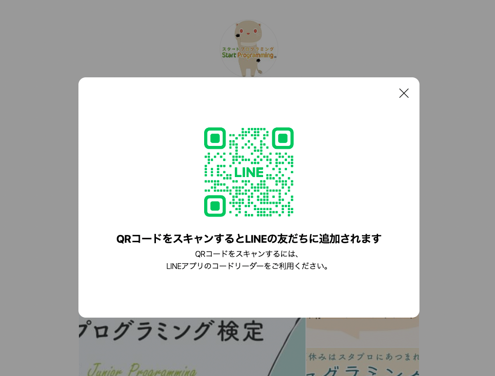

**```カリキュラム00```**

<!DOCTYPE html>
<html lang="ja">
<head>
    <meta charset="UTF-8">
    <meta http-equiv="X-UA-Compatible" content="IE=edge">
    <meta name="viewport" content="width=device-width, initial-scale=1.0">
    <link rel="stylesheet" href="../style.css">
    <title>01.JavaScriptとは</title>
</head>

<body>
    <h1>JavaScriptについて理解を深めましょう！
    <h2><b>JavaScriptとは？</b></h2>
    <p>JavaScriptとは、動的なウェブページを作成するための言語です。</p>
    <p>HTMLやCSSと一緒に使用することが多く、サイトの写真を動かすスライドショーやポップアップウィンドウ
    <br> （以下の画像のようなもの）など要素に動きを付けるために使用される言語になります。</p>

  
    <p>JavaScriptを使用すると、以下のようなタイピングゲームを作ることも出来ます！<br>
    JavaScriptの学習（前半12回）の最終目標は、このタイピングゲームを作れるようになることです！</p>
    <br>
    <h2><a rel="stylesheet" href="../タイピングゲーム/index.html"  target="_blank">タイピングゲームはこちら</a></h2>
    <br>
    <h2><b>それでは、次回カリキュラムよりJavaScriptを学習していきましょう！</b></h2>


</body>
</html>