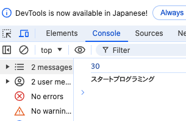
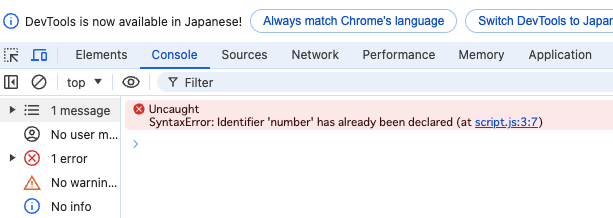
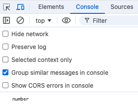
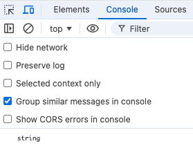
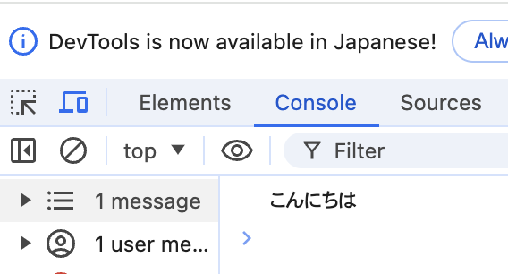
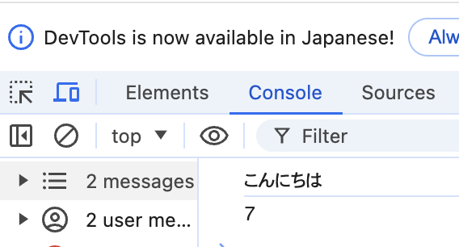

**```カリキュラム02```**

<!DOCTYPE html>
<html lang="ja">
<head>
    <meta charset="UTF-8">
    <meta http-equiv="X-UA-Compatible" content="IE=edge">
    <meta name="viewport" content="width=device-width, initial-scale=1.0">
    <link rel="stylesheet" href="../style.css">
    <title>02.カリキュラム</title>
</head>
<body>
    <h1>変数と定数について学習をしましょう！</h1>
    <h2><b>変数について</b></h2>
    <p>変数はスクラッチやマインクラフトの学習でも出てきたかと思います。<br>
    スクラッチでは、キャラクターのHPを変数で設定したり、マインクラフトでは穴を掘る回数を変数で設定したりしました。</p>
    
    <p>JavaScriptでも変数を使ってゲームやアプリの機能を作ることがよくあります。<br>
    タイピングゲームでは、タイマーの箇所で変数が使われています。</p>
    
 <p>それでは、実際の書き方や使い方を学習していきましょう！</p>
 <hr>
<h2><b>変数の書き方と使い方</b></h2>

``` js
// script.js
let number = 10;
```
<p>変数を定義するには、先頭に<code>let</code>を記述し、その後変数名を記述します。<br>
=（イコール）の右側には変数の中身を記述します。</p>

<p>変数名は意味のある名前にする必要があり、先頭に英語・アンダーバー・$のどれかが付かないといけません。</p>

<p><code>let number = 10;</code>は、10という数字を<code>number</code>という変数の中に代入するという意味になります。<br>
実際に変数に代入されているかどうかをチェックするためには、<code>console.log</code>を使います。</p>

<p>script.jsに<code>console.log（number）</code>と記述し、変数numberに代入されている数字を確認してみましょう。</p>

``` js
// script.js
console.log(number);
```
<p>コードが記述出来たら、index.htmlを開いて検証ツールを開きます。</p>
<p>検証ツールのConsoleの箇所に、先程代入した「10」という数字が表示されていれば上手く変数の定義が出来ています。</p>

<hr>

<h2><b>変数の値の入れ替え</b></h2>
<p>変数は値を入れ替えることが出来ます。<br>
変数に対して新たに代入したいもの（今回は30という数値）を記述することで変数の値を入れ替えることが出来ます。</p>

<p>先程のnumberという変数の値を入れ替えてみましょう。</p>

``` js
// script.js
number = 30;
console.log(number);
```
<p>コードが記述出来たら、index.htmlを開いて検証ツールを開きます。</p>
<p>検証ツールのConsoleの箇所に、新たに代入した「30」という数字が表示されていれば上手く変数の入れ替えが出来ています。</p>


<p>このように、変数の値は入れ替えることが出来ます。</p>

<hr>

<h2><b>変数に文字列を代入</b></h2>
<p>変数には数値だけでなく、文字列も入れることが出来ます。</p>

``` js
// script.js
let word = 'テスト';
console.log(word);
```
<p>文字を代入するときは文字をシングルコーテーション('')またはダブルコーテーション（""）で囲む必要があります。</p>

<p>こちらもコードが記述出来たら、index.htmlを開いて検証ツールを開きます。</p>
<p>検証ツールのConsoleの箇所に、先程代入した「テスト」という数字が表示されていれば上手く変数の定義が出来ています。</p>

<hr>

<h2><b>定数の書き方と使い方</b></h2>
<p>定数とは、変数とは違い一度値を設定すると変更できない変数のことです。<br>
言い換えると、値を変更したくないものや変更する必要のないものを定数で指定します。</p>

<p>例）<br>
1週間の曜日・円周率や税率・プログラムの中で何度も使う言葉など</p>

<p>タイピングゲームでは、問題文をセットする箇所で定数が使用されています。<br>
（問題文は一度設定すれば変更する必要がないので定数で指定します）</p>

<p>それでは、実際の書き方や使い方を学習していきましょう。</p>

``` js
// script.js
const number = 30;
const word = 'スタートプログラミング';

console.log(number);
console.log(word);
```
<p>定数を定義するには、先頭にconstを記述し、その後定数名を記述します。<br>
=（イコール）の右側には定数の中身を記述します。</p>

<p>コードが記述出来たら、index.htmlを開いて検証ツールを開きます。<br>
検証ツールのConsoleの箇所に、先程代入した数字と言葉が表示されていれば上手く変数の定義が出来ています。</p>


<p>基本的な書き方は変数と同じです。<br>
変数との大きな違いとしては、中身を書き換えることや上書きが出来ないということです。</p>

<p>試しに、同じ定数名の定数を2つ用意し、違う数字で定数を作成してみます。</p>

``` js
// script.js
const number = 30;
const number = 10;

console.log(number);
```

<p>これで実行してみると、このようにエラーになってしまいます。</p>


<p>同じ定数名は複数存在することが出来ず、中身を上書きすることが出来ないので覚えておきましょう。</p>

<hr>
<h2><b>データの型について</b></h2>

<p>型には数値を示す「数値型」(Number型)や、文字を示す「文字列型」(String型)などがあります。<br>
基本的なこの2つの型について、しっかり理解を深めていきましょう！</p>

<h2>数値型(Number型)について</h2>

``` js
// script.js
let age = 10;
let number = -4;
let pi = 3.14;
```
<p>上記のような数字を表すデータのことを「数値型」(Number型)と言います。<br>
整数（例えば、5や100）も小数（例えば、3.14や0.01）も、どちらも数値型として扱われます。</p>
<br>
<h2>「文字列型」(String型)について</h2>

``` js
// script.js
let name = "taro"; 
let greeting = 'good morning'; 
```
<p>上記のような文字や文字の集まり（文字列）を表すデータのことを「文字列型」(String型)と言います。<br>
JavaScriptでは、文字列型の値は通常シングルクォート（'）やダブルクォート（"）で囲んで表現します。</p>
<br>
<h2>typeof演算子について</h2>

<p>変数やデータの型を確認するための演算子に「typeof演算子」というものがあります。<br>
typeofを使うことで、その値が「数値型」なのか「文字列型」なのか、他の型なのかを判別することができます。</p>

<p>実際にtypeof演算子を使い、型を見ていきましょう。</p>

``` js
// script.js
let age = 10;
console.log(typeof age);
```

<p>コードが記述出来たら、index.htmlを開いて検証ツールを開きます。<br>
ageという変数の中には「10」という数値が入っているので、数値型(Number型)になります。</p>


<p>このように、typeof演算子を使うと型の種類を見ることが出来ます。<br>
同じように、文字列型もチェックしてみましょう。</p>

``` js
// script.js
let name = "taro"; 
console.log(typeof name);
```
<p>コードが記述出来たら、index.htmlを開いて検証ツールを開きます。<br>
nameという変数の中には「"taro"」という文字列が入っているので、文字列型(String型)になります。</p>


<p>型の種類をチェックしたい時に使うので、覚えておきましょう。</p>

<hr>
<h2><b>練習問題</b></h2>

<p>①messageという名前の変数に「こんにちは」という文字列を代入しましょう。<br>
そして、console.logで「こんにちは」と表示させてみましょう。</p>

</br></br>

<p>②weekという名前の定数を作成し、「7」という数値を代入しましょう。<br>
そして、console.logで「7」と表示させてみましょう。</p>


<p>③number という変数に 50 という数値を代入し、console.logでnumberの値を表示させてみましょう。<br>
その後に number の値を 100 に変更し、、console.logでnumberの値を表示させてみましょう。</p>


<p>④以下の変数の中身がどのような型になっているのか、typeof演算子を使って調べてみましょう。</p>

``` js
// script.js
let height = 100;
let greeting = "hello"; 
```

 <!-- 折り畳み展開ポインタ -->
 <div onclick="obj=document.getElementById('open').style; obj.display=(obj.display=='none')?'block':'none';">
    <a style="cursor:pointer;">▼ 解答はこちらをクリックすると見れます</a>
    </div>
    <!--// 折り畳み展開ポインタ -->  
    <!-- 折り畳まれ部分 -->
    <div id="open" style="display:none;clear:both;">  
    <!--ここの部分が折りたたまれる＆展開される部分になります。
    自由に記述してください。-->

 ``` js
// 練習問題① 
// script.js
let message = "こんにちは";
console.log(message);  
```

 ``` js
// 練習問題②
// script.js
const week = 7;
console.log(week); 
```

 ``` js
// 練習問題③
// script.js
let number = 50;
console.log(number);

number = 100;
console.log(number);
```


 ``` js
// 練習問題④
// script.js
let height = 100;
let greeting = "hello";

console.log(typeof height);   
console.log(typeof greeting); 
```


<!--// 折り畳まれ部分 -->
  </div>

