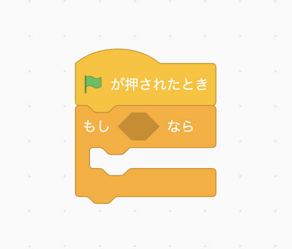
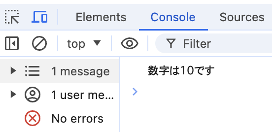
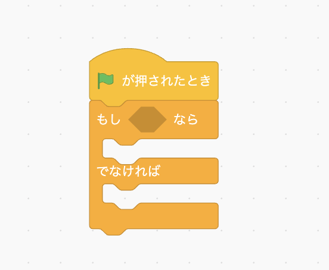
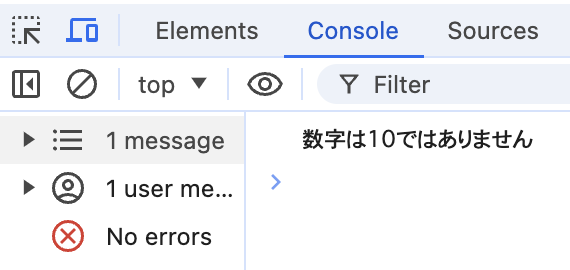
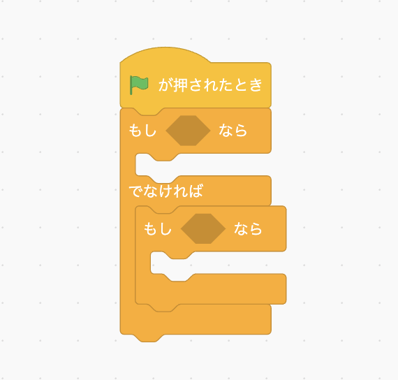
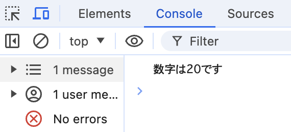
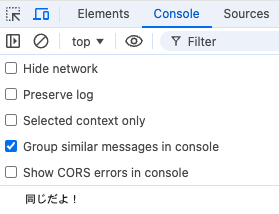
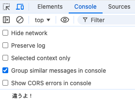
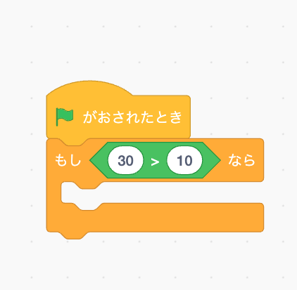
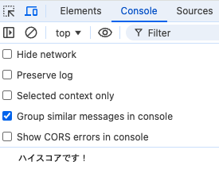

**```カリキュラム03```**

<!DOCTYPE html>
<html lang="ja">
<head>
    <meta charset="UTF-8">
    <meta http-equiv="X-UA-Compatible" content="IE=edge">
    <meta name="viewport" content="width=device-width, initial-scale=1.0">
    <link rel="stylesheet" href="../style.css">
    <title>03.カリキュラム</title>
</head>
<body>
    <h1>比較について学習をしましょう！</h1>
    <h2><b>比較について</b></h2>
    <p>比較とは、「もし〜なら」「〇〇と〇〇は同じか」など、条件を分岐するために使用されたり何かと何かを比べるときに使用されるものになります。</p>
     <p>具体的には、if文や比較演算子、三項演算子というものがあります。</p>
    <p>if文は「もし〜なら」という意味で、スクラッチやマインクラフトの学習でも出てきたかと思います。</p>
    
    <p>JavaScriptでもif文を使って条件を指定し、その条件に当てはめて何かを実行するということがよくあります。</p>
    <p>タイピングゲームでは、「もし入力された文字が合っていたら色を変える」「もしタイマーが0になったらゲームが終了する」<br>
    といった処理で使われており、たくさん使用されています。</p>
 <p>それでは、比較について実際の書き方や使い方を学習していきましょう！</p>
 <hr>

<h2><b>if文の書き方と使い方</b></h2>

``` js
// script.js
let number = 10;

if(number === 10){
    console.log('数字は10です');
}
```
 <p>if文は「もし〇〇だったら」という意味で、スクラッチやマインクラフトの学習でも出てきたかと思います。</p>

<p>このコードは、変数<code>number</code>に10を代入し、もし変数<code>number</code>が10だったら<code>console.log</code>で文字を表示する」というプログラムです。</p>

<p>if文は、先頭に<code>if</code>と記述し、()の中に条件を記述します。<br>
そして、その条件が合っていれば（trueなら）{}の中に書かれているコードを実行します。</p>

<p>今回は条件が合っているので、console欄に「'数字は10です'」と正しく表示されているはずです。<br>
index.htmlから検証ツールを開いて確認してみましょう。</p>


<hr>
<h2><b>else文について</b></h2>
 <p>else文は「〇〇でなければ」という意味で、スクラッチやマインクラフトの学習でも出てきたかと思います。</p>
    
    <p>JavaScriptでもelse文を使って条件を指定し、その条件に当てはめて何かを実行するということがよくあります。</p>
    <p>タイピングゲームでは、「もし入力された文字が合っていたら入力済みの文字を配列から削除するが、そうでなかったら消削除しない」<br>
    といった処理などで使用されています。</p>
 <p>それでは、実際の書き方や使い方を学習していきましょう！</p>
 <hr>

<h2><b>else文の書き方と使い方</b></h2>

``` js
// script.js
let number = '20';

if(number === 10){
    console.log('数字は10です');
}else{
    console.log('数字は10ではありません');
}
```
<p>変数<code>number</code>に20を代入し、変数<code>number</code>が10だったら「数字は10です」と表示し、そうでなければ「数字は10ではありません」と表示するプログラムです。</p>

<p>書き方として、if文の中に<code>else{}</code>と加えて、もう一つの条件を記述します。<br>
elseの中には、上に書いてあるif文の条件に当てはまらなかったとき（falseの時）に実行したいコードを記述します。</p>

<p>今回は変数の値が20のため条件が合っていないので、console欄に「'数字は10ではありません'」と表示されているはずです。<br>
index.htmlから検証ツールを開いて確認してみましょう。</p>


<hr>
<h2><b>else if文について</b></h2>
 <p>else if文は「もし〜ではなくて、もし〇〇だったら〜」という意味で、スクラッチやマインクラフトの学習ではあまり出てきませんでしたが、<br>
 今後学習していく中で使用していくことがあるので理解を深めていきましょう。</p>
 <p>スクラッチのブロックで示すと、このような形になります。</p>


<hr>
<h2><b>else if文の書き方と使い方</b></h2>
 
``` js
// script.js
let number = 20;

if(number === 10){
    console.log('数字は10です');
}else if(number === 20){
    console.log('数字は20です');
}else{
    console.log('数字はそれ以外です');
}
```
<p>変数numberに20を代入し、変数numberが10だったら「数字は10です」と表示、そうではなくてもし変数numberが20だったら「数字は20です」と表示、<br>
どちらにも当てはまらなければ「数字はそれ以外です」と表示するプログラムです。</p>

<p>条件を複数設定したい時などに使用します。</p>

<p>今回は変数の値が20のため、console欄に「'数字は20です'」と表示されているはずです。<br>
index.htmlから検証ツールを開いて確認してみましょう。</p>



<hr>
<h2><b>「==」と「===」の違いについて</b></h2>
「==」も「===」も、どちらも値を比較するための記号です。<br>
しかし、この2つの記号には大きな違いがあります。実際の例をもとに、その違いを見てみましょう。

``` js
// script.js
// == の場合
let number = 10;
let text = "10";

if (number == text) {
  console.log("同じだよ！");
} else {
  console.log("違うよ！");
}
```
<p>上記のプログラムは、変数numberの値「10」と変数textの値「"10"」が等しければ<br>
「"同じだよ！"」という文字が出力され、違っていれば「"違うよ！"」と出力されるプログラムになっています。</p>

<p>このプログラムを実行すると、「"同じだよ！"」と表示されます。</p>


<p>「==」のように = が2つの場合は、型を無視して比較がされるため、<br>
上記のように文字列と数値の比較の場合でも、値が同じであれば「等しい」という判断になります。</p>

<p>本来文字列と数値は別の型であり、「等しい」という判断になってしまうと<br>
予期せぬエラーの原因になってしまうため、「==」を使用することはほとんどありません。<p>


``` js
// script.js
// === の場合
let number = 10;
let text = "10";

if (number === text) {
  console.log("同じだよ！");
} else {
  console.log("違うよ！");
}
```

<p>上記のプログラムも、変数numberの値「10」と変数textの値「"10"」が等しければ<br>
「"同じだよ！"」という文字が出力され、違っていれば「"違うよ！"」と出力されるプログラムになっています。</p>


<p>このプログラムを実行すると、「"違うよ！"」と表示されます。</p>


<p>「===」のように = が3つの場合は、型も含めて厳密に比較するため、<br>
上記のように文字列と数値の比較の場合、型も含めて同じかどうかを比較しています。</p>

<p>今回は値は同じでも型が違ったため、「等しくない」という判断がされ<br>
elseの命令が実行され「"違うよ！"」という文字列が返ってきています。<p>

<p>予期しないエラーやバグを防ぐために、「===」を使うことが推奨されているので、こちらを使用していきましょう！<p>


<hr>
<h2><b>比較演算子について</b></h2>
<p>比較演算子は2つの値を比較して、特定の条件が成り立つかどうかを判断するために使用される演算子です。</p>
<p>スクラッチの学習では演算ブロックの中に出てきました。</p>

<p>比較演算子はプログラミングを行う上で本当によく使用するものになるので、使い方や書き方をしっかり覚えていきましょう！</p>

<hr>
<h2><b>比較演算子の書き方と使い方</b></h2>
<p>比較演算子はいくつか種類があります。一つずつ見ていきましょう。</p>

<p>①厳密等価演算子(===)</p>

``` js
// script.js
let number = 20;

if(number === 20){
    console.log('数字は20です');
}
```
<p>厳密等価演算子(===)は、2つの値が型も含めて等しいかどうかを比較します。<br>
今回の場合、変数<code>number</code>と20は等しいのでconsoleに文字が出力されます。</p>

<p>②厳密不等価演算子(!==)</p>

``` js
// script.js
let userInput = "20"; 

if (userInput !== 20) {
    console.log("入力された値は数値の20とは異なります");
}
```
<p>厳密不等価演算子(!==)は、2つの値が型も含めて等しくないかどうかを比較します。<br>
今回の場合、<code>userInput</code> は "20" という文字列であり、数値の20とは型が異なるため、consoleに文字が出力されます。</p>

<p>③大なり演算子(>)</p>

``` js
// script.js
let score = 100;

if (score > 70) {
    console.log("合格です");
}
```
<p>大なり演算子(>)は左側の値が右側の値よりも大きいかどうかを比較します。<br>
今回の場合、変数<code>score</code>には100が代入されており70よりも大きいため、consoleに文字が出力されます。</p>

<p>④小なり演算子 (<)</p>

``` js
// script.js
let age = 16;

if (age < 18) {
    console.log("年齢制限があります");
}
```
<p>小なり演算子 (<)は左側の値が右側の値より小さいかどうかを比較するために使用します。<br>
今回の場合、変数<code>age</code>には16が代入されており18よりも小さいため、consoleに文字が出力されます。</p>

<p>⑤大なりイコール演算子 (>=)</p>

``` js
// script.js
let age = 18;

if (age >= 18) {
    console.log("成人です");
}
```

<p>大なりイコール演算子（>=）は、左側の値が右側の値以上であるかどうかを比較するために使用します。<br>
今回のif文では、「18以上であるか」を確認しているため、18も含むことになります。</p>

<p>よって、consoleに文字が出力されます。</p>

<p>⑥小なりイコール演算子（<=）</p>

``` js
// script.js
let age = 12;

if (age <= 12) {
    console.log("このアトラクションに参加できます");
}

```
<p>小なりイコール演算子（<=）は、左側の値が右側の値以下であるかどうかを比較するために使用します。<br>
今回のif文では、「12以下であるか」を確認しているため、12も含むことになります。</p>

<p>よって、consoleに文字が出力されます。</p>

<p>⑦等しくない演算子（!=）</p>

``` js
// script.js
let color = "blue";

if (color != "red") {
    console.log("赤以外の色が選ばれました");
}
```
<p>!= は 「等しくない」 ことを判定する比較演算子です。<br>
<code>color != "red"</code> という条件は、「変数 <code>color</code> の値が "red" ではないか？」をチェックしています。</p>

<p>この場合、<code>color</code> の値は "blue" なので、"red" とは等しくありません。<br>
そのため、条件式は <code>true</code> となり、<code>console.log("赤以外の色が選ばれました");</code>が実行されます。</p>

<hr>

<h2><b>剰余演算子（%）について</b></h2>
<p>「%」は剰余演算子と呼ばれ、割り算の余りを求めるために使います。</p>

``` js
// script.js
console.log(10 % 3); // 実行結果は1
console.log(15 % 4); // 実行結果は3
console.log(20 % 5); // 実行結果は0
```
<style>
        table {
            width: 30%;
            border-collapse: collapse;
            margin: 20px 0;
            font-size: 18px;
            text-align: left;
        }
        th, td {
            border: 1px solid #ddd;
            padding: 10px;
        }
        th {
            background-color: #f4f4f4;
        }
</style>
<table>
        <tr>
            <th>式</th>
            <th>計算</th>
            <th>結果</th>
        </tr>
        <tr>
            <td>10 % 3</td>
            <td>10 ÷ 3 = 3あまり1</td>
            <td>1</td>
        </tr>
        <tr>
            <td>15 % 4</td>
            <td>15 ÷ 4 = 3あまり3</td>
            <td>3</td>
        </tr>
        <tr>
            <td>20 % 5</td>
            <td>20 ÷ 5 = 4あまり0</td>
            <td>0</td>
        </tr>
</table>

<h3><b>if文との組み合わせ</b></h3>

``` js
// script.js
let num = 7;

if (num % 2 === 0) {
    console.log(num + " は偶数です");
} else {
    console.log(num + " は奇数です");
}
```

<p>num % 2 は num を 2 で割った余り を求めています。<br>
今回は7 % 2　= 余りが1なので、以下のような実行結果になります。</p>

``` js
// script.js
7 は奇数です
```

<hr>
<h2><b>三項演算子について</b></h2>

<p>三項演算子（または条件演算子）は、JavaScriptをはじめとする多くのプログラミング言語で使用される<br>
簡潔な条件分岐を実現するための演算子です。</p>

<p>特にシンプルで短い条件分岐の時には役立つものになるので、使い方や書き方をしっかり覚えていきましょう！</p>

<hr>
<h2><b>三項演算子の書き方と使い方</b></h2>

<p>三項演算子は、「条件式 ? trueの場合の値 : falseの場合の値」 という形で書かれます。<br>
実際に例を見ていきましょう！</p>

``` js
// script.js
// == の場合
let score = 20;

let highScore = (score > 15) ? "ハイスコアです！" : "もっと頑張りましょう！";
console.log(highScore);  
```

<p>この場合、条件式は<code>score > 15</code> という部分に当たります。<br>
そして、この条件式が<code>true</code>の場合は、左側にある部分、つまり「"ハイスコアです！"」という文字列が代入されます。</p>

<p>この条件式に当てはまらないとき（falseの時）は、右側にある部分、つまり「"もっと頑張りましょう！"」という文字列が代入されます。</p>

<p>そして、変数<code>highScore</code>に代入された文字列を<code>console.log</code>で表示しています。<br>
今回変数<code>score</code>には20が代入されており、15より大きいため、この条件式は<code>true</code>となっています。</p>

<p>よって、変数<code>highScore</code>には「"ハイスコアです！"」という文字列が代入されているので、consoleにはこちらの文字が表示されます。</p>



<p>このように、三項演算子を使うことで、短くて読みやすいコードを書くことができます。</p>

<hr>
<h2><b>練習問題</b></h2>
<p>①num1とnum2の大小関係を比較して、以下の条件に従って結果を表示するプログラムを作成してください。</p>

``` js
// script.js
let num1 = 8;
let num2 = 5;

// ここにコードを書いてください

console.log();  
```
<p>・もしnum1がnum2より大きい場合、consoleに「'num1はnum2より大きい'」 と出力してください。</p>
<p>・もしnum2がnum1より小さい場合、consoleに「'num2はnum1より小さい'」 と出力してください。</p>
<hr>
<p>②指定された条件に従ってif文とelse文を使ってコードを完成させてください。</p>

``` js
// script.js
let age = 20;  

// ここにif-else文を書いてください

console.log(); 
```
<p>・ageが18歳以上である場合、consoleに「'あなたは成人です'」と出力してください。</p>
<p>・それ以外の場合は、consoleに「'あなたは未成年です'」と出力してください。</p>
<hr>

<p>③比較演算子と else if を使って、変数 temperature に応じたメッセージを表示するプログラムを作成してください。</p>


``` js
// script.js
let temperature = 28;

// ここに else ifを使ったコードを書いてください

console.log(); 
```
<p>temperature が 30 以上の場合は、"今日はとても暑いです" と出力してください。</p>
<p>temperature が 20 以上 30 未満の場合は、"今日は快適な天気です" と出力してください。</p>
<p>temperature が 20 未満の場合は、"今日は寒いです" と出力してください。</p>


<hr>
<p>④三項演算子を使って、変数 score の値によって異なるメッセージを出力するプログラムを作成してください。</p>

``` js
// script.js
let score = 75;

// ここに三項演算子を使ったコードを書いてください

console.log(); 
```
<p>score が 80 以上の場合は、"合格です！" と出力してください。</p>
<p>そうでない場合は、"不合格です" と出力してください。</p>


 <!-- 折り畳み展開ポインタ -->
 <div onclick="obj=document.getElementById('open').style; obj.display=(obj.display=='none')?'block':'none';">
    <a style="cursor:pointer;">▼ 解答はこちらをクリックすると見れます</a>
    </div>
    <!--// 折り畳み展開ポインタ -->  
    <!-- 折り畳まれ部分 -->
    <div id="open" style="display:none;clear:both;">  
    <!--ここの部分が折りたたまれる＆展開される部分になります。
    自由に記述してください。-->

 ``` js
// 練習問題① 
// script.js
let num1 = 8;
let num2 = 5;

if (num1 > num2) {
    console.log('num1はnum2より大きい');
} 
if (num2 < num1) {
    console.log('num2はnum1より小さい');
}
```

``` js
// 練習問題②
// script.js
let age = 20;

if (age >= 18) {
    console.log('あなたは成人です');
} else {
    console.log('あなたは未成年です');
}
```

``` js
// 練習問題③
// script.js
let temperature = 28;

if (temperature >= 30) {
    console.log("今日はとても暑いです");
} else if (temperature >= 20) {
    // temperatureが20以上の場合
    console.log("今日は快適な天気です");
} else {
    // それ以外の（20未満の）場合
    console.log("今日は寒いです");
}
```

 ``` js
// 練習問題④
// script.js
let score = 75;

let result = (score >= 80) ? "合格です！" : "不合格です";
console.log(result);
```
<!--// 折り畳まれ部分 -->
</div>

