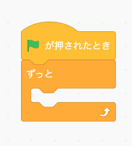
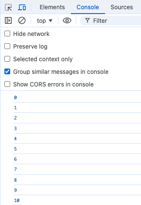
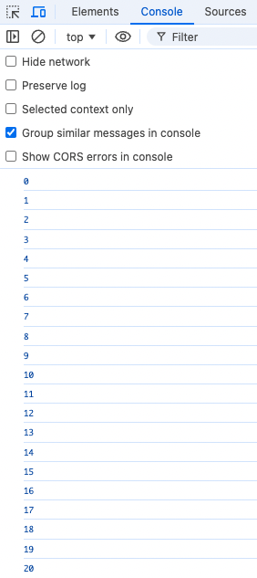
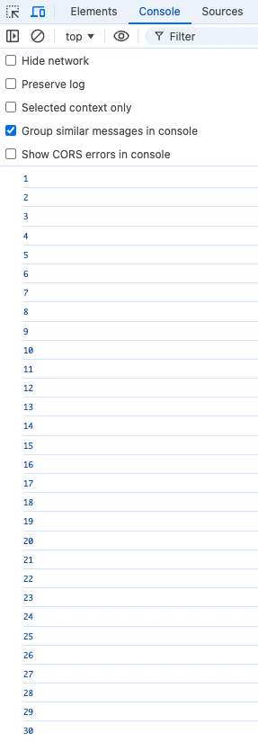

**```カリキュラム04```**

<!DOCTYPE html>
<html lang="ja">
<head>
    <meta charset="UTF-8">
    <meta http-equiv="X-UA-Compatible" content="IE=edge">
    <meta name="viewport" content="width=device-width, initial-scale=1.0">
    <link rel="stylesheet" href="../style.css">
    <title>04.カリキュラム</title>
</head>
<body>
    <h1>ループ文について学習をしましょう！</h1>
    <h2><b>ループ文</b></h2>
    <p>ループ文とは、同じコードを繰り返し実行する際に使われる文です。<br>
    ループを使用すると、プログラムが効率的に大量のデータを処理したり、特定の条件が満たされるまでコードを繰り返し実行したりすることができます。</p>
    <p>具体的には、while文やfor文などがあります。</p>
    <p>スクラッチでも出てきた「ずっと」や「〇〇まで繰り返す」がwhile文やfor文にあたります。</p>
    
 <p>それでは、ループ文について実際の書き方や使い方を学習していきましょう！</p>
 <hr>

 <h2><b>while文について</b></h2>
 <p>while文は、条件がtrueである間ずっとコードを実行し続けたい時に使用します。<br>
    スクラッチで出てきた「ずっと」ブロックがこのwhile文にあたります。</p>
    
 <p>それでは、実際の書き方や使い方を学習していきましょう！</p>

 <hr>
<h2><b>while文の書き方と使い方</b></h2>

``` js
// script.js
let number = 0;

while (number <= 10) {
    console.log(number);
    number++;
}
```
<p>このコードは、変数<code> number</code> が10以下である間繰り返し<code> number</code> を表示し、<code> number</code> をプラス1ずつしていくというプログラムになります。</p>

<p>while文を使用することで、設定した条件が満たされるまではプログラムが実行され続けます。<br>
今回は変数<code> number</code> が10以下である限り、つまり11になるまで繰り返し処理が実行されています。</p>

<p>処理の中身は、consoleに<code> number</code> を表示して、表示後<code> number</code> の値をプラスしています。<br>
<code> ++</code> は「インクリメント演算子」と呼ばれ、変数の値を1つ増やすために使われます。</p>




<hr>
<h2><b>for文について</b></h2>
 <p>for文は、特定の条件が満たされるまでコードを繰り返し実行したい時に使用します。</p>
    <p>スクラッチで出てきた「〇〇まで繰り返す」がこのfor文にあたります。</p>
    
 <p>それでは、実際の書き方や使い方を学習していきましょう！</p>
 <hr>

<h2><b>for文の書き方と使い方</b></h2>

``` js
// script.js
for (let i = 1; i <= 10; i++) {
    console.log(i); 
}
```
<p>これは変数<code> i </code>が10以下である間、繰り返し変数<code> i </code>が1ずつ増加し、consoleに<code> i </code>の値を表示するプログラムになります。<br>
1つずつ見ていきましょう。</p>

``` js
// script.js
for
```
<p>まず、for文を書く時には先頭に<code>for</code>と書きます。<br>
forの後ろのカッコ（）の中に、for文がどのように繰り返し処理を行うかを定義する3つの主要な要素を書きます。</p>


``` js
// script.js
let i = 1;
```
<p>まずは、先頭の部分の説明です。</p>

<p>letは、変数を宣言するためのキーワードです。<br>
<code> i </code>は、変数の名前です。任意の名前を付けられますが、一般的にi（イテレータの略）がよく使われます。<br>
= 1は、 変数<code> i </code> に値 1 を代入しています。この設定により、繰り返しは<code> i </code> が 1 から始まります。</p>

``` js
// script.js
i <= 10;
```
<p>次に、真ん中の部分の説明です。</p>

<p><code> i </code>は、現在の変数の値になります。<br>
<code><=</code>は、「以下」を表す比較演算子です。カリキュラム03で学習しました。<br>
10 は、ループの終了条件となる値になります。ここでは、<code>i</code>が10を超えたら繰り返しが止まります。</p>

``` js
// script.js
i++;
```

<p>最後の部分の説明です。</p>
<p><code>i++</code>は、<code> i </code>の値を1つ増やします。<code>++</code> は「インクリメント」と呼ばれ、変数の値を1つ増やす操作です。</p>

<p>上記コードの実行結果をconsoleに表示させるプログラムになっているので、<br>
index.htmlから検証ツールを開いて確認してみましょう。</p>


<hr>

<h2><b>for...of文について</b></h2> <p><code>for...of</code> は、配列の各要素を順番に取り出して処理を行いたいときに使用します。</p> <p>それでは、実際の書き方や使い方を学習していきましょう！</p> <hr>

<h2><b>for...of文の書き方と使い方</b></h2>

``` js
// script.js
// script.js
let animals = ["犬", "猫", "鳥", "魚", "ウサギ"];

for (const animal of animals) {
    console.log(animal);
}
``` 

<p>このコードでは、配列 `animals` に格納された動物の名前を1つずつ取り出して処理しています。</p>
<p><code>for...of</code> 文では、`animals` 配列の各要素が順番に変数 <code>animal</code> に格納され、その都度 <code>console.log(animal)</code> によって表示されます。</p>
<p>例えば、最初に配列から取り出されるのは <code>犬</code> で、次に <code>猫</code>、そして順番に <code>鳥</code>、<code>魚</code>、<code>ウサギ</code> が表示されます。</p>
<p>このように、<code>for...of</code> を使うと、インデックスを気にせずに配列の要素を1つずつ簡単に処理することができます。</p>
<hr>

<h2><b>for...inについて</b></h2>
<p>for...in は、オブジェクトや配列のインデックスを順番に取り出して処理を行いたいときに使用します。<br>
それでは、実際の書き方や使い方を学習していきましょう！</p>
<hr>

<h2><b>for...inの書き方と使い方</b></h2>

``` js
// script.js
let fitnessTest = {
    "50m走": 55,
    "握力": 40,
    "上体起こし": 35,
    "反復横跳び": 60,
    "長座体前屈": 70
};

for (let event in fitnessTest) {
    if (fitnessTest[event] >= 50) {
        console.log(event + " は合格です");
    } else {
        console.log(event + " は不合格です");
    }
}
```

<p>上記プログラムは生徒の運動テストの結果をオブジェクトで管理し、各種目のスコアをチェックして「合格」または「不合格」を判定するプログラムです。<br>
それでは、一つずつ解説していきます。</p>

``` js
// script.js
let fitnessTest = {
    "50m走": 55,
    "握力": 40,
    "上体起こし": 35,
    "反復横跳び": 60,
    "長座体前屈": 70
};
```
<p>ここでは、<code> fitnessTest</code> というオブジェクトを作成しています。<br>
各種目を キー（"50m走"、"握力" など）、スコアを 値（55, 40 など） として登録しています。</p>


<h2><b>オブジェクトとは？</b></h2>
<p>オブジェクトとは、データをまとめて管理するためのデータ構造の一つです。<br>
オブジェクトは、キーとバリューのペアから構成されており、関連するデータを一つのまとまりとして扱うことができます。</p>

<h2><b>今回の例では？</b></h2>
<p>このコードでは、運動テストの各種目とスコアを一つのオブジェクトとしてまとめています。</p>
<ul>
    <li><strong>キー</strong>: 各種目名（例："50m走", "握力"）</li>
    <li><strong>バリュー</strong>: その種目のスコア（例: 55, 40）</li>
</ul>

<h2><b>オブジェクトを使うメリット</b></h2>
<p>オブジェクトにまとめておくことで、<strong>コードが読みやすくなったり、メンテナンスが楽になる</strong> というメリットがあります！</p>


``` js
// script.js
for (let event in fitnessTest)
```
<p><code>for...in </code>を使うと、オブジェクトの キー（種目名）を順番に取得 できます。<br>
簡単にいうと、<code>fitnessTest</code> の中にある "50m走", "握力", "上体起こし", "反復横跳び", "長座体前屈" を1つずつ取り出すという意味になります。</p>

<p>例えば… 1回目のループでは event = "50m走"<br>
2回目のループでは event = "握力"<br>
というふうに、オブジェクトのキーが順番に<code> event</code> に入ります。</p>

``` js
// script.js
if (fitnessTest[event] >= 50)
```

<p>このコードでは、<code>fitnessTest[event] </code>を使って オブジェクトのキー（種目名）に対応するスコアを取得 しています。</p>

<p>例えば、<code>event </code>に "50m走" が入っている場合、<br>
<code>fitnessTest[event]</code> は<code> fitnessTest["50m走"] </code>となり、その値 55 を取得します。</p>

<p>55点は 50点以上なので「合格」と表示されます。</p>

<p>実行結果</p>

``` js
50m走 は合格です
握力 は不合格です
上体起こし は不合格です
反復横跳び は合格です
長座体前屈 は合格です
```

<hr>
<h2><b>forEach文について</b></h2>
<p>forEachは、配列の各要素に対して順番にコードを実行したい時に使用します。</p>
<p>それでは、実際の書き方や使い方を学習していきましょう！</p>
<hr>

<h2><b>forEach文の書き方と使い方</b></h2>

``` js
// script.js
[1, 2, 3, 4, 5].forEach(i => {
    console.log(i); 
});
```
<p>これは配列の各要素（1から5まで）が順番に変数<code> i </code>に渡され、<code> console.log(i) </code>でその値が表示されるプログラムです。<br>
1つずつ見ていきましょう。</p>

``` js
// script.js
[1, 2, 3, 4, 5]
```
<p>配列を作成しています。この配列には、1から5までの数が順番に格納されています。<br>
( JavaScriptの配列についてはカリキュラム05で学習します)</p>

``` js
// script.js
.forEach(i => {
    console.log(i); 
});
```

<p>forEach メソッドを使って、配列の各要素を順番に処理します。<br>
配列の各要素が変数<code> i </code>に順に渡され、<code>console.log(i)</code> でその値を表示します。</p>

<p><code>for</code> 文では、変数 <code> i </code> を使ってループの回数を指定し、<code> i </code> の値を自動的に増加させてループを回しますが、<br>
<code>forEach</code> では配列の各要素に対して自動的に処理が行われるため、インデックスを管理する必要がなく、コードが簡潔になります。</p>

<p>このように、<code>forEach</code> を使えば、特にインデックスやループの回数を気にせずに、配列の要素を順番に処理することができます。</p>

<hr>
<!-- 次はここから -->
<h2><b>continue文について</b></h2> 
<p><code>continue</code> は、ループの中で特定の条件に合った場合に、その回の処理をスキップし、次の繰り返しへ進むために使用します。</p> 
<p>それでは、実際の書き方や使い方を学習していきましょう！</p> 
<hr>


<h2><b>continue文の書き方と使い方</b></h2>
<h3> 例: 特定の値をスキップする</h3>
<p>以下のコードでは、1から5までの数値を順番に表示しますが、<code>3</code> のときだけスキップします。</p>

``` js
// script.js
for (let i = 1; i <= 5; i++) {
    if (i === 3) {
        continue; // 3 のときはスキップ
    }
    console.log(i);
}
``` 

<p>実行すると、<code>1, 2, 4, 5</code> が表示され、<code>3</code> はスキップされます。</p>

<h3>continue のポイント</h3>
<ul>
    <li>ループの処理を途中でスキップし、次の繰り返しへ進む</li>
    <li><code>if</code> 文と組み合わせて条件を指定する</li>
    <li><code>while</code> ループでも使用可能</li>
</ul>

<p>このように <code>continue</code> を活用すると、特定の条件に合った処理を簡単にスキップできます！</p>

<hr>
<h2><b>break文について</b></h2>
 <p>break文は、ループを途中で終了させるために使われる文です。<br>
 ループの中で特定の条件が満たされたときに、ループを強制的に抜けることができます。<br>
 <p>それでは、実際の書き方や使い方を学習していきましょう！</p>

<hr>
<h2><b>break文の書き方と使い方</b></h2>
 
``` js
// script.js
for (let i = 1; i <= 10; i++) {
    if (i === 5) {
        break;
    }
    console.log(i); 
}
```
<p>これは、1から10までの数値を繰り返して表示しますが、数値が5になったら繰り返しを終了するというプログラムになります。</p>

<p>プログラムの途中にあるbreak文があるので、説明をします。</p>

``` js
// script.js
if (i === 5) {
  break;
}
```
<p>ここでbreak文を使用しています。<br>
これは、もし変数<code> i </code>の値が5になったらbreak文を実行するという意味になります。</p>

<p>break文を実行することで、その時点で繰り返し処理が終了されるので、それ以降の繰り返し処理は行われません。</p>

<p>上記コードの実行結果をconsoleに表示させるプログラムになっているので、<br>
index.htmlから検証ツールを開いて確認してみましょう。</p>

<p>本来であれば、<code> i </code>が10以下の間は繰り返し処理が実行されるはずですが、<br>
break文によって繰り返し処理が終了されているので、以下のような処理になっています。</p>


<hr>

<h2><b>switch文について</b></h2>
 <p>switch文は、ある式の値に基づいて、複数の処理を分岐したい時に使用します。<br>
それでは、実際の書き方や使い方を学習していきましょう！</p>

<hr>
<h2><b>switch文の書き方と使い方</b></h2>

``` js
// script.js
[1, 2, 3, 4, 5].forEach(num => {
    switch (num) {
        case 1:
            console.log("これは1です");
            break;
        case 2:
            console.log("これは2です");
            break;
        case 3:
            console.log("これは3です");
            break;
        case 4:
            console.log("これは4です");
            break;
        case 5:
            console.log("これは5です");
            break;
        default:
            console.log("範囲外の数値です");
    }
});
``` 

<p>このプログラムでは、配列 [1, 2, 3, 4, 5] の各要素を<code>forEach</code>で順番に<code>switch</code>文に渡し<br>
それぞれの数値に応じたメッセージを <code>console.log</code>で表示します。</p>

<p><code>switch (num)</code> によって、num の値に応じた処理を実行します。</p>
<p><code>case 1: </code>のように、num が 1 の場合は "これは1です" と表示されます。</p>
<p><code>break;</code> を使って、それぞれの case の処理が終わったら switch 文を抜けます。</p>
<p><code>default: </code>では、num が 1 ～ 5 以外の場合に "範囲外の数値です" と表示します。</p>

<p>このように、switch 文を使うことで、複数の条件に応じた処理をシンプルに記述できます！</p>
<hr>

<h2><b>includes()について</b></h2>
 <p>includes() は、配列や文字列の中に特定の要素が含まれているかを調べるメソッドです。<br>
それでは、実際の書き方や使い方を学習していきましょう！</p>

<hr>
<h2><b>includes()の書き方と使い方</b></h2>

``` js
// script.js
let colors = ["赤", "青", "緑", "黄", "黒"];

if (colors.includes("青")) {
    console.log("青はリストに含まれています");
} else {
    console.log("青はリストに含まれていません");
}

if (colors.includes("白")) {
    console.log("白はリストに含まれています");
} else {
    console.log("白はリストに含まれていません");
}
```
<p>それでは、上記コードについて説明していきます。<p>

``` js
// script.js
let colors = ["赤", "青", "緑", "黄", "黒"];
```

<p>ここでは、5つの色 ("赤", "青", "緑", "黄", "黒") を格納した配列を作成しています。<p>


``` js
// script.js
if (colors.includes("青")) {
    console.log("青はリストに含まれています");
} else {
    console.log("青はリストに含まれていません");
}
```
<p><code>colors.includes("青") </code>を使うことで、配列<code> colors </code>の中に "青" という値が含まれているかどうかを調べることができます。</p>

<p>このメソッドは <code>true</code> か<code> false </code>を返すため、<code>if</code> 文を使って条件分岐を行います。<br>
もし "青" が <code>colors </code>に含まれていれば <code>true</code> となり、console.log("青はリストに含まれています") が実行されます。</p>

<p>一方、"青" がリストに含まれていない場合は false となり、console.log("青はリストに含まれていません") が実行される仕組みです。</p>

<hr>

<h2><b>indexOf()について</b></h2>
 <p><code> indexOf()</code>  は、配列の中で特定の要素が何番目にあるのかを調べることができます。<br>
それでは、実際の書き方や使い方を学習していきましょう！</p>

<hr>
<h2><b>indexOf()の書き方と使い方</b></h2>

``` js
// script.js
// script.js
let books = ["国語", "数学", "英語", "理科", "社会"];
let num = books.indexOf("英語");

console.log("英語は左から" + (num + 1) + "番目に置いてあります");
``` 

<p>それでは、上記コードについて説明していきます。<p>

``` js
// script.js
let books = ["国語", "数学", "英語", "理科", "社会"];
```

<p>ここでは、5つの本 ("国語", "数学", "英語", "理科", "社会" ) を格納した配列を作成しています。<p>

``` js
// script.js
let num = books.indexOf("英語");
```

<p><code> books.indexOf("英語")</code>  によって、配列の中で "英語" が 何番目にあるか を取得します。<br>
インデックスは 0 から始まるため、"英語" のインデックスは 2 になります。</p>

<hr>

<h2><b>練習問題</b></h2>
<p>①1から20までの数字をwhile文を使って繰り返して表示するプログラムを作成してください。</p>




<p>②for文を使って、1から50までの数字を順番に表示するプログラムを作成してください。<br>
ただし、数字が 30 になったら繰り返しを中止するプログラムにしてください。</p>




<p>③配列 ["日本", "アメリカ", "フランス", "ドイツ", "イタリア"] の各要素を for...of 文を使って表示するプログラムを作成してください。</p>

``` js
let countries = ["日本", "アメリカ", "フランス", "ドイツ", "イタリア"];

// ここに処理を記述
``` 
<p>実行結果</p>

``` js
日本
アメリカ
フランス
ドイツ
イタリア
``` 

<p>④配列 ["サッカー", "野球", "バスケットボール", "テニス", "バレーボール"] の中に <br>
"野球" が含まれているかどうかを includes() を使って判定し、<br>
<br>
含まれていれば "野球はリストに含まれています"<br>
含まれていなければ "野球はリストに含まれていません"<br>
と表示するプログラムを作成してください。</p>

``` js
let sports = ["サッカー", "野球", "バスケットボール", "テニス", "バレーボール"];
``` 


<!-- 折り畳み展開ポインタ -->
 <div onclick="obj=document.getElementById('open').style; obj.display=(obj.display=='none')?'block':'none';">
    <a style="cursor:pointer;">▼ 解答はこちらをクリックすると見れます</a>
    </div>
    <!--// 折り畳み展開ポインタ -->  
    <!-- 折り畳まれ部分 -->
    <div id="open" style="display:none;clear:both;">  
    <!--ここの部分が折りたたまれる＆展開される部分になります。
    自由に記述してください。-->

 ``` js
// 練習問題① 
// script.js
let number = 1;

while (number <= 20) {
    console.log(number);
    number++;
}
```

``` js
// 練習問題②
// script.js
for (let i = 1; i <= 50; i++) {
    if (i === 30) {
        break;
    }
    console.log(i);
}
```

``` js
// 練習問題③
// script.js
let countries = ["日本", "アメリカ", "フランス", "ドイツ", "イタリア"];

for (const country of countries) {
    console.log(country);
}
```

``` js
// 練習問題④
// script.js
let sports = ["サッカー", "野球", "バスケットボール", "テニス", "バレーボール"];

if (sports.includes("野球")) {
    console.log("野球はリストに含まれています");
} else {
    console.log("野球はリストに含まれていません");
}
```

<!--// 折り畳まれ部分 -->
</div>

