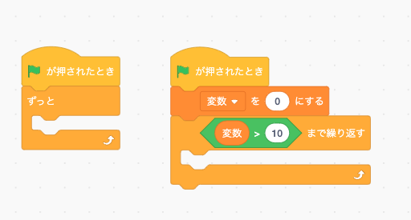
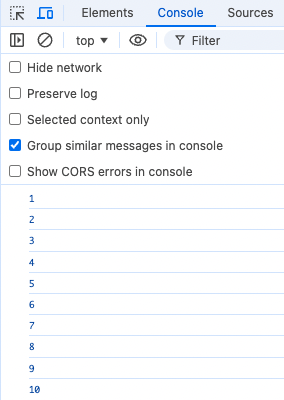

**```カリキュラム04```**

<!DOCTYPE html>
<html lang="ja">
<head>
    <meta charset="UTF-8">
    <meta http-equiv="X-UA-Compatible" content="IE=edge">
    <meta name="viewport" content="width=device-width, initial-scale=1.0">
    <link rel="stylesheet" href="../style.css">
    <title>04.カリキュラム</title>
</head>
<body>
    <h1>ループ文について学習をしましょう！</h1>
    <h2><b>ループ文</b></h2>
    <p>ループ文とは、同じコードを繰り返し実行する際に使われる文です。<br>
    ループを使用すると、プログラムが効率的に大量のデータを処理したり、特定の条件が満たされるまでコードを繰り返し実行したりすることができます。</p>
    <p>具体的には、while文やfor文などがあります。</p>
    <p>スクラッチでも出てきた「ずっと」や「〇〇まで繰り返す」がwhile文やfor文にあたります。</p>
    
 <p>それでは、ループ文について実際の書き方や使い方を学習していきましょう！</p>
 <hr>

 <h2><b>while文について</b></h2>
 <p>while文は、条件がtrueである間ずっとコードを実行し続けたい時に使用します。<br>
    スクラッチで出てきた「ずっと」ブロックがこのwhile文にあたります。</p>
    
 <p>それでは、実際の書き方や使い方を学習していきましょう！</p>

 <hr>
<h2><b>while文の書き方と使い方</b></h2>

``` js
// script.js
let number = 0;

while (number <= 10) {
    console.log(number);
    number++;
}
```
<p>このコードは、変数<code> number</code> が10以下である間繰り返し<code> number</code> を表示し、<code> number</code> をプラス1ずつしていくというプログラムになります。</p>

<p>while文を使用することで、設定した条件が満たされるまではプログラムが実行され続けます。<br>
今回は変数<code> number</code> が10以下である限り、つまり11になるまで繰り返し処理が実行されています。</p>

<p>処理の中身は、consoleに<code> number</code> を表示して、表示後<code> number</code> の値をプラスしています。<br>
<code> ++</code> は「インクリメント演算子」と呼ばれ、変数の値を1つ増やすために使われます。</p>


<hr>
<h2><b>for文について</b></h2>
 <p>for文は、特定の条件が満たされるまでコードを繰り返し実行したい時に使用します。</p>
    <p>スクラッチで出てきた「〇〇まで繰り返す」がこのfor文にあたります。</p>
    
 <p>それでは、実際の書き方や使い方を学習していきましょう！</p>
 <hr>

<h2><b>for文の書き方と使い方</b></h2>

``` js
// script.js
for (let i = 1; i <= 10; i++) {
    console.log(i); 
}
```
<p>これは変数<code> i </code>が10以下である間、繰り返し変数<code> i </code>が1ずつ増加し、consoleに<code> i </code>の値を表示するプログラムになります。<br>
1つずつ見ていきましょう。</p>

``` js
// script.js
for
```
<p>まず、for文を書く時には先頭に<code>for</code>と書きます。<br>
forの後ろのカッコ（）の中に、for文がどのように繰り返し処理を行うかを定義する3つの主要な要素を書きます。</p>


``` js
// script.js
let i = 1;
```
<p>まずは、先頭の部分の説明です。</p>

<p>letは、変数を宣言するためのキーワードです。<br>
<code> i </code>は、変数の名前です。任意の名前を付けられますが、一般的にi（イテレータの略）がよく使われます。<br>
= 1は、 変数<code> i </code> に値 1 を代入しています。この設定により、繰り返しは<code> i </code> が 1 から始まります。</p>

``` js
// script.js
i <= 10;
```
<p>次に、真ん中の部分の説明です。</p>

<p><code> i </code>は、現在の変数の値になります。<br>
<code><=</code>は、「以下」を表す比較演算子です。カリキュラム03で学習しました。<br>
10 は、ループの終了条件となる値になります。ここでは、<code>i</code>が10を超えたら繰り返しが止まります。</p>

``` js
// script.js
i++;
```

<p>最後の部分の説明です。</p>
<p><code>i++</code>は、<code> i </code>の値を1つ増やします。<code>++</code> は「インクリメント」と呼ばれ、変数の値を1つ増やす操作です。</p>

<p>上記コードの実行結果をconsoleに表示させるプログラムになっているので、<br>
index.htmlから検証ツールを開いて確認してみましょう。</p>


<hr>
<h2><b>forEach文について</b></h2>
<p>forEachは、配列の各要素に対して順番にコードを実行したい時に使用します。</p>
<p>それでは、実際の書き方や使い方を学習していきましょう！</p>
<hr>

<h2><b>forEach文の書き方と使い方</b></h2>

``` js
// script.js
[1, 2, 3, 4, 5].forEach(i => {
    console.log(i); 
});
```
<p>これは配列の各要素（1から5まで）が順番に変数<code> i </code>に渡され、<code> console.log(i) </code>でその値が表示されるプログラムです。<br>
1つずつ見ていきましょう。</p>

``` js
// script.js
[1, 2, 3, 4, 5]
```
<p>配列を作成しています。この配列には、1から5までの数が順番に格納されています。<br>
( JavaScriptの配列についてはカリキュラム05で学習します)</p>

``` js
// script.js
.forEach(i => {
    console.log(i); 
});
```

<p>forEach メソッドを使って、配列の各要素を順番に処理します。<br>
配列の各要素が変数<code> i </code>に順に渡され、<code>console.log(i)</code> でその値を表示します。</p>

<p><code>for</code> 文では、変数 <code> i </code> を使ってループの回数を指定し、<code> i </code> の値を自動的に増加させてループを回しますが、<br>
<code>forEach</code> では配列の各要素に対して自動的に処理が行われるため、インデックスを管理する必要がなく、コードが簡潔になります。</p>

<p>このように、<code>forEach</code> を使えば、特にインデックスやループの回数を気にせずに、配列の要素を順番に処理することができます。</p>

<hr>
<h2><b>break文について</b></h2>
 <p>break文は、ループを途中で終了させるために使われる文です。<br>
 ループの中で特定の条件が満たされたときに、ループを強制的に抜けることができます。<br>
 <p>それでは、実際の書き方や使い方を学習していきましょう！</p>

<hr>
<h2><b>break文の書き方と使い方</b></h2>
 
``` js
// script.js
for (let i = 1; i <= 10; i++) {
    if (i === 5) {
        break;
    }
    console.log(i); 
}
```
<p>これは、1から10までの数値を繰り返して表示しますが、数値が5になったら繰り返しを終了するというプログラムになります。</p>

<p>プログラムの途中にあるbreak文があるので、説明をします。</p>

``` js
// script.js
if (i === 5) {
  break;
}
```
<p>ここでbreak文を使用しています。<br>
これは、もし変数<code> i </code>の値が5になったらbreak文を実行するという意味になります。</p>

<p>break文を実行することで、その時点で繰り返し処理が終了されるので、それ以降の繰り返し処理は行われません。</p>

<p>上記コードの実行結果をconsoleに表示させるプログラムになっているので、<br>
index.htmlから検証ツールを開いて確認してみましょう。</p>

<p>本来であれば、<code> i </code>が10以下の間は繰り返し処理が実行されるはずですが、<br>
break文によって繰り返し処理が終了されているので、以下のような処理になっています。</p>


<hr>
<h2><b>練習問題</b></h2>
<p>①1から20までの数字をwhile文を使って繰り返して表示するプログラムを作成してください。</p>


<p>②for文を使って、1から50までの数字を順番に表示するプログラムを作成してください。<br>
ただし、数字が 30 になったら繰り返しを中止するプログラムにしてください。</p>


<!-- 折り畳み展開ポインタ -->
 <div onclick="obj=document.getElementById('open').style; obj.display=(obj.display=='none')?'block':'none';">
    <a style="cursor:pointer;">▼ 解答はこちらをクリックすると見れます</a>
    </div>
    <!--// 折り畳み展開ポインタ -->  
    <!-- 折り畳まれ部分 -->
    <div id="open" style="display:none;clear:both;">  
    <!--ここの部分が折りたたまれる＆展開される部分になります。
    自由に記述してください。-->

 ``` js
// 練習問題① 
// script.js
let number = 1;

while (number <= 20) {
    console.log(number);
    number++;
}
```

``` js
// 練習問題②
// script.js
for (let i = 1; i <= 50; i++) {
    if (i === 30) {
        break;
    }
    console.log(i);
}
```

<!--// 折り畳まれ部分 -->
</div>

