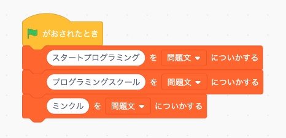
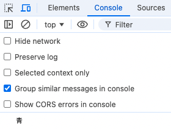
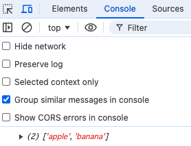
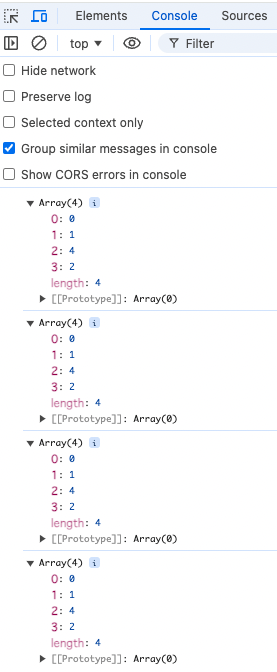

**```カリキュラム05```**

<!DOCTYPE html>
<html lang="ja">
<head>
    <meta charset="UTF-8">
    <meta http-equiv="X-UA-Compatible" content="IE=edge">
    <meta name="viewport" content="width=device-width, initial-scale=1.0">
    <link rel="stylesheet" href="../style.css">
    <title>05.カリキュラム</title>
</head>
<body>
    <h1>配列について学習をしましょう！</h1>
    <h2><b>配列</b></h2>
    <p>配列とは、複数のデータを一つにまとめて管理する箱のようなものです。<br>
    スクラッチでリストを作成したかと思いますが、そのリストが配列というものになります。</p>
    <p>このスクラッチの例でいくと、「問題文」という配列の中に文章が3つ格納されているという意味になります。</p>
    
    <p>JavaScriptでも配列を使って、その配列から文字やデータを取り出して何かを実行するということがよくあります。</p>
    <p>タイピングゲームでは、配列の中に問題文を格納しておき、そこから1問ずつ取り出して問題文を表示するという処理がされています。</p>
 <p>それでは、実際の書き方や使い方を学習していきましょう！</p>
 <hr>

<h2><b>配列の書き方と使い方</b></h2>

``` js
// script.js
const color = [
    '赤',
    '青',
    '緑'
];

console.log(color);
```
<p>配列の中身は何度も変わるものではないため、一般的には定数<code>const</code>に入れます。<br>
<code>color</code>は配列の名前になります。</p>

<p>配列を作るには、各カッコ[]を使用し、その中に情報を入れていきます。<br>
配列の中には文字や数字を入れることが出来ます。</p>

<p>今回は色に関する配列を作成するため、配列の中には赤・青・緑という文字を入れています。<br>
一つ一つの情報の後ろにコロン<code>（,）</code>を付けて情報を区切る必要があるので注意しましょう。</p>

<p><b>配列の最後の要素にはコロン（,）はあってもなくてもどちらでも大丈夫です。</b></p>

<p>これでcolorという配列の中に「赤・青・緑」という3つの情報を格納することが出来たので<br>
index.htmlを開いて検証ツールで確認してみましょう。</p>


<p>console欄で見てみると、配列の中に3つの情報が入っていることを確認することが出来ます。</p>

<p>よく見てみると、0:"赤" 1:"青" 2:"緑"と表示されています。<br>
これは、配列の中に入っている情報の順番を示しています。</p>

<p>プログラムは0から始まる仕組みになっているので、先頭にある赤は「0番目」の情報、次にある青は「1番目」の情報、<br>
最後にある緑は「2番目」の情報という考え方になります。</p>

<p>そのため、配列では「〇〇番目の情報を取得して表示する」ということも可能です。<br>
試しに、配列の1番目の情報（青）を取得してみましょう。</p>

``` js
// script.js
const color = [
    '赤',
    '青',
    '緑'
];

console.log(color[1]);
```
<p>「配列の〇〇番目」という指定をする時には、各カッコ[]の中に取得したい情報の位置を記述します。<br>
今回は青（配列の1番目の情報）を取得したいので、各カッコ[]の中には1という数字が入ります。</p>

<p>index.htmlを開いて検証ツールで確認し、青という情報が取得出来ていればOKです。<br>
このように、自分で指定して配列から情報を取得してくることが出来ます。</p>


<hr>
<h2><b>配列を変更するメソッド</b></h2>
<p>メソッドとは、配列や文字列に対して特定の処理を実行する関数のことです。<br>
メソッドを使えば、配列にデータを追加したり、データを削除したりと様々な操作を行うことが出来ます。</p>

<p>それでは、実際の書き方や使い方を学習していきましょう。</p>

<hr>
<h2><b>メソッド①push()</b></h2>

``` js
// script.js
let fruits = [
    'apple',
    'banana'
];
fruits.push('orange'); 

console.log(fruits);
```
<p><code>push()</code>というメソッドは、配列の末尾（最後）に要素を追加します。</p>
<p>今回の例では、<code>fruits</code>という配列に<code>「'apple'」</code>と<code>「'banana'」</code>の2つが入っていましたが</br>
配列の末尾に<code>「'orange'」</code>という文字列を追加しています。</p>

<p>上記コードの実行結果をconsoleに表示させるプログラムになっているので、
index.htmlから検証ツールを開いて確認してみましょう。</p>


<hr>
<h2><b>メソッド②pop()</b></h2>

``` js
// script.js
let fruits = [
    'apple',
    'banana',
    'orange'
];
fruits.pop(); 

console.log(fruits);
```
<p><code>pop()</code>というメソッドは、配列の末尾（最後）から要素を1つ削除します。</p>

<p>今回の例では、<code>fruits</code>という配列に<code>「'apple'」</code>と<code>「'banana'」</code>と<code>「'orange'」</code>の3つが入っており</br>
配列の末尾の要素<code>「'orange'」</code>を削除するプログラムになります。</p>

<p>上記コードの実行結果をconsoleに表示させるプログラムになっているので、
index.htmlから検証ツールを開いて確認してみましょう。</p>



<hr>
<h2><b>メソッド③shift()</b></h2>

``` js
// script.js
let fruits = [
    'apple',
    'banana',
    'orange'
];
fruits.shift(); 

console.log(fruits);
```

<p><code>shift()</code>というメソッドは、配列の先頭から要素を1つ削除します。</p>

<p>今回の例では、<code>「'apple'」</code>と<code>「'banana'」</code>と<code>「'orange'」</code>の3つが入っており</br>
配列の先頭の要素<code>「'apple'」</code>を削除するプログラムになります。</p>

<p>上記コードの実行結果をconsoleに表示させるプログラムになっているので、
index.htmlから検証ツールを開いて確認してみましょう。</p>


<hr>
<h2><b>メソッド④unshift()</b></h2>

``` js
// script.js
let fruits = [
    'apple',
    'banana',
    'orange'
];
fruits.unshift('peach'); 

console.log(fruits);
```

<p><code>unshift()</code>というメソッドは、配列の先頭に要素を追加します。</p>

<p>今回の例では、<code>fruits</code>という配列に<code>「'apple'」</code>と<code>「'banana'」</code>と<code>「'orange'」</code>の3つが入っており</br>
配列の先頭に<code>「'peach'」</code>を追加するプログラムになります。</p>

<p>上記コードの実行結果をconsoleに表示させるプログラムになっているので、
index.htmlから検証ツールを開いて確認してみましょう。</p>


<hr>
<h2><b>メソッド⑤splice()</b></h2>

``` js
// script.js
let fruits = [
    'apple',
    'banana',
    'orange'
];

fruits.splice(1, 1, 'kiwi', 'grape');

console.log(fruits); 
```

<p><code>splice()</code>というメソッドは、配列に対して要素を追加、削除、または置き換えることが出来ます。</p>

<p>このコードでは、<code>splice()</code>で<code>'banana'</code>を削除して<code>'kiwi'</code>と<code>'grape'</code>を追加します。<br>
結果として、配列は<code>['apple', 'kiwi', 'grape', 'orange']</code>となります。</p>

<p>それでは、<code>fruits.splice(1, 1, 'kiwi', 'grape');</code>の部分について、詳しく説明します。</p>

<p>1: は、配列のインデックス1から操作を始めるという意味です。（'banana'が対象）。<br>
1:は、 1つの要素を削除するという意味です。（'banana'を削除）。<br>
<code>'kiwi', 'grape':</code>は、削除した位置に新しく<code>'kiwi'</code>と<code>'grape'</code>を追加するための要素です。</p>

<p>上記コードの実行結果をconsoleに表示させるプログラムになっているので、
index.htmlから検証ツールを開いて確認してみましょう。</p>


<hr>
<h2><b>練習問題</b></h2>
<p>①1から5までの数字を格納した配列を作成してください。</br>
その後、「3」という数字を取得して、console欄に表示させてみましょう。</p>

<br>
<br>
<p>②空の配列numbersを作成し、以下の操作を行ってください。</p>

<p>1.push()メソッドを使って配列に1から3までの数字を追加し、console.log()で表示してください。</p>
<p>2.unshift()メソッドを使って0を配列の先頭に追加し、console.log()で表示してください。</p>
<p>3.pop()メソッドを使って配列の末尾の要素を削除し、console.log()で表示してください。</p>
<p>4.splice()メソッドを使って、配列の2番目にある要素の前に、数字「4」を挿入してください。。</p>



<!-- 折り畳み展開ポインタ -->
 <div onclick="obj=document.getElementById('open').style; obj.display=(obj.display=='none')?'block':'none';">
    <a style="cursor:pointer;">▼ 解答はこちらをクリックすると見れます</a>
    </div>
    <!--// 折り畳み展開ポインタ -->  
    <!-- 折り畳まれ部分 -->
    <div id="open" style="display:none;clear:both;">  
    <!--ここの部分が折りたたまれる＆展開される部分になります。
    自由に記述してください。-->

 ``` js
// 練習問題① 
// script.js
let numbers = [
    1,
    2,
    3,
    4,
    5
];  
console.log(numbers[2]); 
```

``` js
// 練習問題②
// script.js
let numbers = [];  

// 1. push()メソッドを使って1から3までの数字を追加
numbers.push(1);
numbers.push(2);
numbers.push(3);
console.log(numbers); 

// 2. unshift()メソッドを使って0を配列の先頭に追加
numbers.unshift(0);
console.log(numbers); 

// 3. pop()メソッドを使って配列の末尾の要素を削除
numbers.pop();
console.log(numbers);  

// 4. splice()メソッドを使って、配列の2番目の前に新しい数字4を挿入
numbers.splice(2, 0, 4);  
console.log(numbers);  
```

<!--// 折り畳まれ部分 -->
</div>

