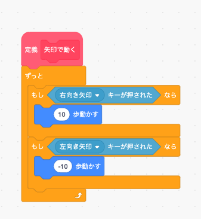
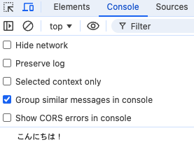
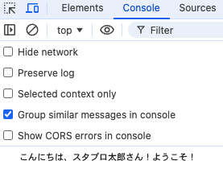
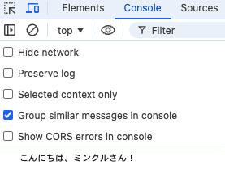
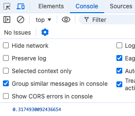
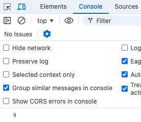
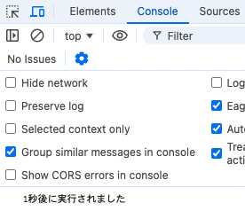
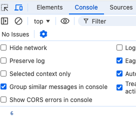
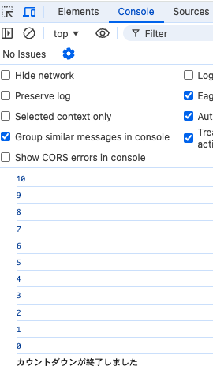

**```カリキュラム06```**

<!DOCTYPE html>
<html lang="ja">
<head>
    <meta charset="UTF-8">
    <meta http-equiv="X-UA-Compatible" content="IE=edge">
    <meta name="viewport" content="width=device-width, initial-scale=1.0">
    <link rel="stylesheet" href="../style.css">
    <title>06.カリキュラム</title>
</head>
<body>
<h1>関数について学習をしましょう！</h1>
<h2><b>関数について</b></h2>
<p>関数とは、プログラムの中で特定の処理をまとめたものです。<br>
関数を使うことで、繰り返し行う処理を一箇所にまとめて管理でき、同じ処理を何度も書かずに再利用することができます。</p>
<p>スクラッチでブロック定義が出てきたと思いますが、それが関数にあたります。</p>

<p>それでは、実際の書き方や使い方を学習していきましょう！</p>
<hr>

<h2><b>関数の書き方と使い方</b></h2>
<p>JavaScriptで関数を作るには、<code>function</code>というキーワードを使います。<br>
関数には「名前」「引数」「処理内容」「戻り値」があります。</p>

<p>まずは、簡単な関数の作り方を見ていきます。</p>

``` js
// script.js
function greet() {
    console.log('こんにちは！');
  }
  
// 関数を呼び出す
greet(); 
```
<p>このコードは、<code>greet</code>という関数を作り、その関数を呼び出すとconsole欄に「'こんにちは！'」と<br>
表示されるプログラムになっています。</p>

<p>実際にconsole欄で実行結果を確認してみましょう。</p>


<p>それでは、この関数の意味を説明していきます。</p>


``` js
// script.js
function greet() 
```
<p>関数を作る際には、<code>function</code>と記述します。<br>
<code>greet</code>というのは関数の名前になっており、任意の関数名を付けることが出来ます。</p>

<p>今回は挨拶に関するプログラムだったので、挨拶を意味する「greet」という関数名にしました。<br>
関数名を付けるときには、そのコードに関連する、意味のある名前にしましょう。</p>

``` js
// script.js
greet(); 
```
<p>これは、作成した関数<code>greet</code>を呼び出しています。<br>
関数を呼び出す時には、関数名+()で呼び出すことが出来ます。</p>

<p>これが関数の作り方と呼び出し方になります。</p>
<hr>

<h2><b>引数を使った関数</b></h2>
<p>次に、引数を使った関数について説明します。</p>

``` js
function user(name) {
  console.log('こんにちは、' + name + 'さん！ようこそ。');
}

// 関数を呼び出して使う
user('スタプロ太郎');   
``` 
<p>このコードは、<code>user</code>という関数を作り、その関数を呼び出すとconsole欄に「こんにちは、スタプロ太郎さん！ようこそ！」と<br>
表示されるプログラムになっています。</p>

<p>実際にconsole欄で実行結果を確認してみましょう。</p>


<p>それでは、この関数の意味を説明していきます。</p>

<p><code>function user(name) </code>の部分で、user という関数を定義しています。<br>
<code>name</code>は引数で、この関数に渡されるデータです。この例では名前を受け取る役割をしています。</p>

<p>関数の中の<code>console.log('こんにちは、' + name + 'さん！ようこそ！'); </code>で、<code>name</code> の値を使って挨拶のメッセージを作り、それを画面に表示します。</p>

<p>たとえば、<code>name </code>が 'スタプロ太郎' であれば、「こんにちは、スタプロ太郎さん！ようこそ！」と表示されます。</p>

<p>また、<code>「+」</code>を使うことで、複数の文字列をつなげることが出来ます。<br>
文字列同士をつなげるときに使う場合、<code> 「+」</code> は「結合演算子」と呼ばれます。</p>

<p>最後に、<code>user('スタプロ太郎'); </code>で関数を呼び出し、'スタプロ太郎' という文字列を引数として渡しています。<br>
この呼び出しにより、<code>name</code> に 'スタプロ太郎' が代入され、関数の中でメッセージが表示されます。</p>

<p>これが引数を使った関数になります。</p>
<hr>

<h2><b>無名関数</b></h2>
<p>無名関数とは、名前のない関数でその場で使う一時的な処理に適しています。<br>
変数に代入して使うことが多いです。</p>

``` js
const greet = function(name) {
  console.log('こんにちは、' + name + 'さん！');
};

greet('ミンクル'); 
``` 

<p>今回の例では、<code>function(name)</code> の部分で無名関数を定義し、その関数を<br>
<code>greet</code>という変数に代入しています。</p>

<p>ここで<code>greet</code>は関数を代入した変数となり、関数名のように扱うことができます。</p>

<p><code>greet('ミンクル');</code>とすることで、<code>greet</code> に代入された関数を呼び出し、<br>
'ミンクル' という文字列を <code>name</code> の引数として渡します。</p>

<p>この結果、<code>console.log</code> が実行され、画面に「こんにちは、ミンクルさん！」と表示されます。</p>

<hr>

<h2><b>アロー関数</b></h2>
<p>アロー関数とは、<code>function</code>と記述しなくても短い構文で関数を作れる書き方です。<br>
無名関数のシンプルな形で、特に簡単な処理に使いやすいです。</p>

``` js
const greet = (name) => {
    console.log('こんにちは、' + name + 'さん！');
  };
  
  greet('ミンクル'); 
``` 
<p><code>(name) => </code>の部分がアロー関数になります。<code>function</code>を使わずに、代わりに<code>「=>」</code>を使って<br>
関数を定義することが出来ます。</p>

<p>関数の書き方が無名関数と少し違うだけで、関数の呼び出し方などは一緒です。<br>
コードを短く簡潔に書けるので、無名関数ではなくアロー関数で記述をしていきましょう。</p>

<p>実行結果は、上で行った無名関数の処理と全く同じです。</p>


<hr>

<h2><b>コールバック関数</b></h2>
<p>コールバック関数とは、関数の引数として別の関数を渡し、後にその関数が実行されるようにする仕組みです。<br>
処理の順番を決めたり、特定のタイミングで何かを実行したいときに使います。</p>

``` js
function greet(name) {
  console.log('こんにちは、' + name + 'さん！');
}

function getName(callback) {
  const userName = 'ミンクル'; 
  callback(userName); 
}

getName(greet); 
``` 
<p>少し難しいですが、一つずつ順番に解説をしていきます。</p>

<h3><b>実行される順番</b></h3>
<p>①<code>getName(greet);</code> の呼び出し<br>
<code>getName</code> 関数が <code>greet</code> 関数をコールバック関数として受け取りながら呼び出されます。</p>

<p>②<code>getName</code> 関数内の実行<br>
<code>getName</code> 関数が実行され、まず <code>const userName = 'ミンクル';</code> で <code>userName</code> に 'ミンクル' という値が代入されます。</p>

<p>③<code>callback(userName);</code>の実行<br>
<code>callback(userName); </code>が実行されます。<code>callback</code> は <code>greet</code> 関数のことです。
つまり、実際には <code>greet('ミンクル'); </code>と同じことが起こります。</p>

<p>④<code>greet(name) </code>関数内の実行<br>
<code>greet</code> 関数が実行され、<code>console.log('こんにちは、' + name + 'さん！');</code> という処理が行われ、画面に「こんにちは、ミンクルさん！」と表示されます。</p>


<hr>

<h2><b>オブジェクト指向</b></h2>
<p>オブジェクト指向とは、データ（値）と処理（関数）をひとつのまとまり（オブジェクト）として扱う考え方 です。<br>
オブジェクト指向を活用することで、コードの再利用や管理のしやすさが向上します。</p>

<h2><b>クラスとインスタンス（レシピと料理の関係）</b></h2>
<p>オブジェクト指向では、クラス を使って オブジェクトの設計図 を作成します。<br>
このクラスをもとに実際のデータを持つオブジェクトを作ることをインスタンス化と呼びます。</p>

<p>これを料理に例えてみると分かりやすいので、料理に例えてみます。</p>

<p><b>クラス（レシピ）</b></p>
<p>→ 料理を作るための手順や材料の指示が書かれたもの。<br>
→ たとえば「オムライスのレシピ」があれば、それを見てオムライスを作ることができます。</p>

<p><b>インスタンス（実際の料理）</b></p>
<p>→ レシピに従って作られた料理。<br>
→ 実際に作った「オムライス」は、レシピを元にした具体的な 1つのインスタンス です。</p>

<p><b>クラスの特徴（レシピの良さ）</b></p>
<p>→ レシピがあれば、同じ方法で何度でもオムライスを作ることができ、さらにレシピを改良すれば新しいアレンジ料理も簡単に作ることが出来ます。</p>

<p>オブジェクト指向も同じで、クラス（レシピ） を作っておけば、何度でも同じ構造のオブジェクト（料理）を作ることができる という仕組みになっています。</p>

<p>このように オブジェクト指向は、プログラムの設計を分かりやすくし、繰り返し使える仕組み を提供してくれます！</p>

<hr>
<h2><b>オブジェクトの実装例</b></h2>

<p>下記コードは、料理のメニューと値段を一覧で表示するというプログラムになっています。</p>

``` js
// script.js
class Menu {
    constructor(menuList) {
        this.menuList = menuList;
    }

    announce() {
        for (let dish in this.menuList) {
            console.log(dish + " を " + this.menuList[dish] + " 円で販売します");
        }
    }
}

let foodPriceList = {
    "カレー": 500,
    "オムライス": 700
};

let lunchMenu = new Menu(foodPriceList);
lunchMenu.announce();
```

<p><b>実行結果</b></p>

``` js
// script.js
カレーを500 円で販売します
オムライスを700 円で販売します
``` 
<p>それでは、上記コードについて解説をしていきます。</p>

<p><b>クラスの定義</b></p>

``` js
// script.js
class Menu {
``` 

<p>Menu クラスを定義しています。クラスは「メニューの情報を管理しやすくするための設計図」のようなものです。<br>
これを作ることで、あとから簡単にメニューを追加・変更できるようになります。</p>

<p><b>コンストラクター関数</b></p>

``` js
// script.js
constructor(menuList) {
    this.menuList = menuList;
}
``` 

<p> <code>constructor(menuList)</code> は、 クラスのインスタンスを作るときに自動的に実行される特別な関数で、これを「コンストラクタ関数」と呼びます。
<br> クラスとは「設計図」のようなもので、そこから「実際に使うオブジェクト（インスタンス）」を作ります。
</p> 

<p> そのとき、最初に必要な準備をするのがコンストラクター関数の役割です。 </p> 

<p> <code>menuList</code> には、料理の名前と値段のリスト（オブジェクト）が渡されます。<br> 
今回のコードでは、 <code>{ "カレー": 500, "オムライス": 700 }</code> というデータが渡されています。 </p> 

<p> そして、<code>this.menuList = menuList;</code> というコードでこのデータをクラスの中に保存します。<br>
 <code>this</code> とは、「このクラスのインスタンス自身」を指す特別なキーワードです。<br> 
 つまり、<code>this.menuList</code> は、この <code>Menu</code> クラスの中でメニュー表の情報をずっと使えるようにするための変数です。 </p> 
 
 <p> こうすることで、<code>announce()</code> のような特別のメソッドの中でも <code>menuList</code> のデータを自由に使うことができるようになります。<br> 
 もし <code>this.menuList = menuList;</code> がなかった場合、クラスの他の部分ではこのメニューの情報を参照できなくなってしまいます。 </p>

<p><b>メニューを発表する関数を作る</b></p>

``` js
// script.js
announce() {
``` 
<p><code>announce（アナウンス）</code>という名前の関数を定義しています。<br>
関数の名前は何でもOKですが、今回はメニューを発表するための関数なので<code>announce</code>という名前にしています。</p> 

<p><b>メニューの料理を1つずつ取り出す</b></p>

``` js
// script.js
for (let dish in this.menuList) {
``` 
<p>for...inループを使って、メニューの料理を1つずつ取り出しています。
変数dishには、1回目のループでは "カレー", 2回目では "オムライス" が入ります。</p>

<p><b>取り出した料理を表示</b></p>

``` js
// script.js
console.log(dish + " を " + this.menuList[dish] + " 円で販売します");
``` 
<p><code>console.log(...) </code>でメッセージを表示しています。</p>

<p><code>this.menuList</code> は、{ "カレー": 500, "オムライス": 700 } のデータを持っており、
<code>this.menuList[dish] </code>は、<code>dish </code>に入っている 料理名をキーとして値を取り出す という意味になります。</p>

<p>つまり、<code>this.menuList["カレー"]</code> は 500、<code>this.menuList["オムライス"] </code>は 700 を取得するという意味になります。</p>

<p><b>メニューのリストを作る</b></p>

``` js
// script.js
let foodPriceList = {
    "カレー": 500,
    "オムライス": 700
};
``` 

<p>このコードでは、<code>foodPriceList</code> という変数の中に、料理の名前と値段のリストを保存しています。<br>
料理の名前がキー（"カレー"、"オムライス"）、値段が値（500、700）となる「オブジェクト」 を作っています。</p>

<p><b>Menuクラスを使ってメニューを作る</b></p>

``` js
// script.js
let lunchMenu = new Menu(foodPriceList);
``` 
<p>この1行のコードで、Menu クラスのインスタンスを作成 しています。<br>
<code>new</code> を使うことで、Menu クラスの設計に基づいたオブジェクト（インスタンス）を作成することが出来ます。</p>

<p>そして、<code>new Menu(foodPriceList); </code>によって作られた メニュー表（インスタンス）を<code>lunchMenu</code>に代入しています。</p>

<p><b>メニューを表示する関数の呼び出し</b></p>

``` js
// script.js
lunchMenu.announce();
``` 
<p><code>announce() </code>は Menu クラスの中にある関数です。<br>
この関数は「console.logにメニューと値段を表示させる」という関数なので、関数を呼び出すと結果が表示されるようになります。</p>

<hr>
<h2><b>クラスの継承</b></h2>
<p>クラスの継承<code>extends</code>は、あるクラス（親クラス）の機能をそのまま引き継ぎながら、新しい機能を追加する仕組み です。</p>

<p>たとえば、ゲームを作るときに「すべてのキャラクターが持っている基本的な機能」を Character クラスにまとめておき、それを Hero や Monster クラスが引き継ぐことで、共通する機能を無駄なく使えるようになります。</p>

<p>extends を使うことで、子クラスは親クラスのすべての機能を引き継ぎます。<br>
また、super を使えば 「親クラスの処理を実行した後に、新しい処理を追加」 できます。</p>

<h2><b>クラスの継承の例</b></h2>

``` js
// script.js
class FactoryTour {
    constructor(product) {
        this.product = product;
    }

    intro() {
        console.log("ここでは" + this.product + "を製造しています");
    }
}

class FoodFactoryTour extends FactoryTour {
    intro() {
        super.intro();
        console.log("工場に入る前に髪にネットを着用してください");
    }
}

let iceCreamFactoryTour = new FoodFactoryTour("アイスクリーム");
iceCreamFactoryTour.intro();
```

<p><b>実行結果</b></p>

``` js
// script.js
ここではアイスクリームを製造しています  
工場に入る前に髪にネットを着用してください  
``` 
<p>それでは、上記コードについて解説をしていきます。</p>


<p><b>クラスの定義</b></p>

``` js
// script.js
class FactoryTour {
``` 

<p><code>FactoryTour</code>というクラスを作成しています。</p>


<p><b>クラスのコンストラクタ（クラスの初期設定）定義</b></p>

``` js
// script.js
constructor(product) {
    this.product = product;
}
``` 

<p>onstructor(product) は、インスタンスが作られたときに自動で実行される関数 です。</p>
<p>product という 引数（外から渡される値） を受け取ります。</p>

<p>this.product = product; によって、受け取った値をクラス内部に保存します。<br>
例えば、今回のコードのように<code>new FactoryTour("アイスクリーム")</code> を作った場合、</p>

``` js
// script.js
this.product = "アイスクリーム";
``` 
<p>となり、<code>this.product</code>にはアイスクリームが入ります。</p>


<p><b>intro() メソッドを定義</b></p>

``` js
// script.js
intro() {
    console.log("ここでは" + this.product + "を製造しています");
}
``` 

<p><code>intro()</code> という メソッド（クラスの中の関数） を作成しています。<br>
関数の中身として、<code>console.log(...)</code> を使って、保存された product を含んだメッセージを表示 します。</p>

<p>今回は、this.product = "アイスクリーム" なので、</p>

``` js
// script.js
ここではアイスクリームを製造しています
``` 
<p>と表示されます。</p>

<p><b>クラスの拡張（継承）</b></p>

``` js
// script.js
class FoodFactoryTour extends FactoryTour {
``` 

<p><code>FoodFactoryTour</code> という 新しいクラスを作成 しています。<br>
<code>extends FactoryTour</code> を使うことで、<code>FactoryTour</code> のすべての機能を引き継いでいます（継承）</p>

これにより、<code>FoodFactoryTour</code> でも <code>FactoryTour</code>の<code> constructor() </code>や <code>intro() </code>が使えるようになります。</p>

<p><b>intro() メソッドの上書き（オーバーライド）</b></p>

``` js
// script.js
intro() {
``` 
<p>intro() を もう一度定義し直しています<b>（オーバーライドと言います）</b><br>
こうすることで、親クラスの<code>intro()</code>の処理を変更・拡張できます。</p>

<p><b>super.intro(); を実行</b></p>

``` js
// script.js
super.intro();
``` 

<p><code>super</code> は、親クラス（FactoryTour）のメソッドを呼び出す特別なキーワード です。<br>
ここで <code>super.intro(); </code>を実行すると、親クラスの<code> intro()</code> の処理がそのまま実行 されます。</p>

<p>今回のように、<code>new FoodFactoryTour("アイスクリーム") </code>の場合、親クラスの <code>intro()</code> が呼ばれて、次のメッセージが表示されます：</p>

``` js
// script.js
ここではアイスクリームを製造しています
``` 

<p><b>console.log(...) で追加のメッセージを表示</b></p>

``` js
// script.js
console.log("工場に入る前に髪にネットを着用してください");
``` 
<p>新しく追加したい処理 をここに書いています。<br>
親クラスの<code> intro() </code>を実行した後に、このメッセージが追加で表示されます。<p>

``` js
// script.js
工場に入る前に髪にネットを着用してください
``` 

<p><b>インスタンスを作成</b></p>

``` js
// script.js
let iceCreamFactoryTour = new FoodFactoryTour("アイスクリーム");
``` 

<p><code>new FoodFactoryTour("アイスクリーム")</code> で 新しいインスタンスを作成 しています。<br>
<code>constructor(product) </code>が呼ばれ、<code>this.product = "アイスクリーム"; </code>となります。</p>

<p><b>intro() メソッドを実行</b></p>

``` js
// script.js
iceCreamFactoryTour.intro();
``` 
<p>次の処理が順番に行われます。</p>

<p>1.super.intro(); を実行 → 親クラスの intro() が実行されるので以下の内容が表示される</p>

``` js
// script.js
ここではアイスクリームを製造しています
``` 
<p>2.追加のメッセージを表示が表示される</p>

``` js
// script.js
工場に入る前に髪にネットを着用してください
``` 
<p><b>まとめ</b></p>
<style>
    table {
        width: 50%;
        margin: 20px auto;
        border-collapse: collapse;
        background: white;
        box-shadow: 0px 4px 8px rgba(0, 0, 0, 0.1);
    }
    th, td {
        padding: 6px;
        border: 1px solid #ddd;
        text-align: left;
    }
    tr:nth-child(even) {
        background-color: #f2f2f2;
    }
</style>

<table>
    <tr>
        <th>行数</th>
        <th>コード</th>
        <th>説明</th>
    </tr>
    <tr>
        <td>1</td>
        <td><code>class FactoryTour</code></td>
        <td>基本となる <code>FactoryTour</code> クラスを作成</td>
    </tr>
    <tr>
        <td>2</td>
        <td><code>constructor(product)</code></td>
        <td><code>product</code> を受け取って保存</td>
    </tr>
    <tr>
        <td>3</td>
        <td><code>intro()</code></td>
        <td>「ここでは〇〇を製造しています」を表示</td>
    </tr>
    <tr>
        <td>4</td>
        <td><code>class FoodFactoryTour extends FactoryTour</code></td>
        <td><code>FactoryTour</code> を拡張</td>
    </tr>
    <tr>
        <td>5</td>
        <td><code>intro()</code></td>
        <td><code>intro()</code> を上書き（親クラスを拡張）</td>
    </tr>
    <tr>
        <td>6</td>
        <td><code>super.intro();</code></td>
        <td><code>FactoryTour</code> の <code>intro()</code> を実行</td>
    </tr>
    <tr>
        <td>7</td>
        <td><code>console.log(...)</code></td>
        <td>新しいメッセージを追加</td>
    </tr>
    <tr>
        <td>8</td>
        <td><code>new FoodFactoryTour("アイスクリーム")</code></td>
        <td><code>this.product = "アイスクリーム"</code></td>
    </tr>
    <tr>
        <td>9</td>
        <td><code>iceCreamFactoryTour.intro();</code></td>
        <td>2つのメッセージが表示</td>
    </tr>
</table>


<hr>
<h2><b>エラーハンドリング（例外処理）</b></h2>
<p>JavaScriptでは、プログラムの実行中にエラーが発生すると、それ以降の処理が止まってしまいます。<br>
しかし、<code>try...catch（トライキャッチ）</code> を使うことで、エラーが発生してもプログラムを適切に処理することができます。</p>
<p>また、<code>throw（スロー）</code> を使えば 自分でエラーを発生させることも可能です。</p>
<p>それでは、<code>try...catch</code>、<code>throw</code>、<code>Error</code> について詳しく見ていきましょう！<br>
まずは以下のコードを書いてください。</p>

``` js
// script.js
function checkAge(age) {
    try {
        if (age < 0) {
            throw new Error("年齢は0以上を入力してください");
        }
        console.log("入力された年齢:", age);
    } catch (error) {
        console.log("エラーが発生しました:", error.message);
    }
}

checkAge(25);  // 正常な入力
checkAge(-5);  // エラーになる
```

<p>上記コードでは、checkAge という関数を作成し、年齢が負の数だった場合にエラーを発生させる仕組みを実装しています。</p>

<hr>

<h2><b>try...catch の役割</b></h2>
<p><code>try...catch</code> は、エラーが発生してもプログラムが止まらないようにするための仕組みです。</p>
<p>tryブロックの中には エラーが発生する可能性があるコード を記述し、catch ブロックでは エラーが発生したときの処理 を記述します。<br>
この仕組みによって、プログラム全体が強制終了するのを防ぎ、適切にエラーメッセージを表示することができます。</p>

<p>この例では、<code>try</code> の中で年齢が負の数かどうかをチェックし、エラーが発生した場合には <code>catch</code> に処理が移り、エラーメッセージを表示するようになっています。</p>

<hr>

<h2><b>throw の役割</b></h2>
<p><code>throw</code> は、意図的にエラーを発生させるための機能です。</p>
<p>通常、プログラムの実行中にエラーが発生すると、JavaScriptが自動的にエラーをスローしますが、<code>throw </code>を使うと 開発者が自分でエラーを発生させることができます。<p>

<p>プログラムの実行中に <code>throw </code>を実行すると、それ以降の try ブロックの処理はすべて中断され、catch ブロックに移動します。<br>
この流れを、次の<code>checkAge</code>関数の例を使って詳しく解説します。</p>

<h3><b>checkAge(-5); の場合（エラーが発生する入力）</b></h3>
<p>実行の流れ</p>

<p>1.<code>checkAge(-5)</code> が呼び出され、<code>age </code>の値は -5 になる。</p>
<p>2.try ブロックに入る。</p>
<p>3.<code>if (age < 0)</code> の条件をチェックする。</p>
<p>4.<code>age</code> は -5 なので true になり、<code>throw new Error("年齢は0以上を入力してください"); </code>が実行される。</p>
<p>5.<code>throw</code> が実行された瞬間、try ブロックの残りのコード（console.log("入力された年齢:", age);）は すべてスキップ される。</p>
<p>6.<code>catch (error)</code> ブロックに移動する。</p>
<p>7.<code>console.log("エラーが発生しました:", error.message);</code> が実行される。</p>
<p>8.<code>error.message</code> には、<code>new Error("年齢は0以上を入力してください")</code> で指定した "年齢は0以上を入力してください" が入っているため、"エラーが発生しました: 年齢は0以上を入力してください" が表示される。</p>

<hr>
<h3><b>throw new Error("年齢は0以上を入力してください"); の処理の詳細</b></h3>
<p>この throw の処理の流れを細かく分解すると、以下のようになります。</p>

<p>1.throw が実行されると新しい Error オブジェクトが作成され、Errorオブジェクトには以下の情報が含まれます。</p>
<style>
        table {
            width: 35%;
            border-collapse: collapse;
            margin: 20px 0;
            font-size: 18px;
            text-align: left;
        }
        th, td {
            padding: 10px;
            border: 1px solid #ddd;
        }
        th {
            background-color: #f4f4f4;
        }
    </style>
 <table>
        <tr>
            <th>プロパティ</th>
            <th>値</th>
        </tr>
        <tr>
            <td><code>name</code></td>
            <td><code>"Error"</code>（エラーの種類）</td>
        </tr>
        <tr>
            <td><code>message</code></td>
            <td><code>"年齢は0以上を入力してください"</code>（エラーメッセージ）</td>
        </tr>
    </table>

<p>2.throw によって、プログラムの実行が 強制的に中断されます。</p>
<p>3.<code>catch (error)</code> に Error オブジェクトが渡される。</p>

``` js
// script.js
catch (error) {
    console.log("エラーが発生しました:", error.message);
}
```
<p><code>catch (error)</code> で、<code>throw </code>によって発生した Error オブジェクトを受け取る。</p>
<p><code>error.message</code> を<code> console.log</code> すると、"年齢は0以上を入力してください" が表示される。</p>


<h2><b>Errorオブジェクトとは？</b></h2>
<p>Error オブジェクトは、エラーの情報を含む特別なオブジェクトです。<br>
<code>new Error("エラーメッセージ") </code>の形式で使用し、エラーメッセージを指定することができます。</p>

<p>この例では、<code>new Error("年齢は0以上を入力してください") </code>を作成し、エラー情報を catch に渡しています。</p>


<hr>
<h2><b>組み込み関数について</b></h2>
<p>組み込み関数とは、JavaScriptなどのプログラミング言語であらかじめ用意されている関数のことです。<br>
これらの関数は特定の動作を簡単に実行できるように設計されており、開発者が一から作らなくても便利に使える機能がたくさんあります。</p>
<p>これまで何度も出てきた<code>console.log()</code>なども組み込み関数になります。</p>
<p>たくさん種類がありますが、ここではよく使うものを紹介します。</p>


<hr>
<h2><b>組み込み関数①ランダム関数</b></h2>
<p>ランダム関数は、指定された範囲内でランダムな値を作り出す関数です。<br>
JavaScriptには、ランダムな数を作るための <code>Math.random()</code> という関数があります。この関数は、0以上1未満の間でランダムな数（小数）を返します。</p>

<p>タイピングゲームでは、配列の中に入っている問題文の中からランダムに一つを選び、そこから問題文を表示するという処理で使用されています。</p>

``` js
// script.js
let number = Math.random();
console.log(number); 
```

<p>実行結果を見てみると、0以上1未満のランダムな小数が生成されています。</p>


<p>ただし、小数点のままだと使いにくいので、小数点以下を切り捨てるという関数もあります。<br>
それが、<code>Math.floor()</code>という関数になります。</p>

<p><code>Math.floor() </code>は小数点以下を切り捨てる関数なので、<code>Math.random()</code> の結果に適用すると常に0になってしまいます。<br>そのため、0 から 9 までの整数を得たい場合は、生成された小数に10倍することで0以上10未満のランダムな数を取得することが出来ます。
</p>

``` js
// script.js
let number = Math.floor(Math.random() * 10); 
console.log(number);
```
<p>実行結果を見てみると、0 から 9 までのランダムな値が生成されています。</p>


<p>これらを応用して、次は配列からランダムに言葉を取得するプログラムを作ってみましょう！</p>

<hr>    

<h2><b>ランダム関数の書き方と使い方</b></h2>
<h3>①1から10までのランダムな値を生成する</h3>

``` js
// script.js
let randomNum = Math.floor(Math.random() * 10) + 1;

console.log(randomNum);
```
<p>まず、<code>Math.random()</code> という部分は、0以上1未満のランダムな小数を作ります。例えば、0.3や0.7のような数です。</p>

<p>次に、そのランダムな小数に10をかけます。すると、0から10未満のランダムな小数ができます。<br>
例えば、0.3を10倍すると3、0.7を10倍すると7のような感じです。</p>

<p>その次に、<code>Math.floor()</code> という部分で、小数点以下を切り捨てて整数にします。例えば、3.6なら3に、7.9なら7になります。<br>
これで、0から9までのランダムな整数ができます。</p>

<p>その後に、そのランダムな整数に1を足します。これで、上の計算で0という結果になっても、1が足されるので<br>
1から10までのランダムな整数ができます。出来た整数は変数<code>randomNum</code>に代入されます。</p>

<p>最後に、<code>console.log(randomNum) </code>で、作られたランダムな数を画面に表示します。<br>
このコードを実行すると、1から10までのどれかの数がランダムに選ばれて表示されます。</p>

<p>index.htmlを開き、検証ツールで確認してみましょう。</p>
<hr>

<h3>②配列の中にある言葉をランダムに取得</h3>

``` js
// script.js
let words = ["りんご",
             "ばなな", 
             "ぶどう",
             "いちご", 
             "みかん"
];

let currentKey = Math.floor(Math.random() * words.length);
let currentWord = words[currentKey];

console.log(currentWord);
```
<p>ここでは、5つの言葉（「りんご」、「ばなな」、「ぶどう」、「いちご」、「みかん」）をリスト（配列）に入れています。<br>
このリストの名前は <code>words</code> です。</p>

<p><code>Math.random()</code> は、0から1までのランダムな小数（例えば、0.5や0.9）を作ります。</p>

<p><code>words.length</code> は、リストの長さ（つまり、リストに入っている言葉の数）を返します。
今回はリストに5つ情報が入っているので、5になります。</p>

<p><code>Math.random() * words.length</code>は、先程決められたランダムな少数と5という数字を掛け算しています。<br>
これにより、0から5未満のランダムな小数を作ります。</p>

<p><code>Math.floor() </code>は、小数点以下を切り捨てて、整数にします。これで、0から4までのランダムな整数（インデックス）が作られます。</p>

<p>次に、<code>currentKey</code>を使ってランダムに選ばれた言葉を取り出します。
例えば、<code>currentKey</code>の中身が2なら、<code>words[2]</code> は「ぶどう」です。</p>


<p>最後に、<code>console.log(currentWord)</code> で、ランダムに選ばれた言葉を画面に表示します。<br>
例えば、選ばれた言葉が「ばなな」なら、画面に「ばなな」と表示されます。</p>

<p>index.htmlを開き、検証ツールで確認してみましょう。<br>
リロードするたびにランダムで言葉が選ばれて表示されるはずです。</p>

<p>実際のタイピングゲームでも、このように配列の中にある問題をランダムで取得して表示をしています！</p>

<hr>
<h2><b>組み込み関数②タイマー関数</b></h2>
<p>タイマー関数とは、一定時間後に何かの処理を行いたいときや、少しの遅延を加えたい場合に使います。<br>
タイピングゲームでも利用されている、タイマーなどを作ることも出来ます。</p>

<h2><b>setTimeout()</b></h2>
<p>まず、<code>setTimeout()</code>という関数を説明します。<br>
この関数は、指定した時間が経過した後に一度だけ関数を実行します。</p>

<p>一定時間後に何かの処理を行いたいときや、少しの遅延を加えたい場合に使います。</p>

``` js
setTimeout(() => {
  console.log('1秒後に実行されました');
}, 1000);
``` 
<p>今回の例では、1秒後にconsole欄に文字が出力されるというプログラムになっています。</p>
<p>1000というのは1000ミリ秒を意味しており、1000ミリ秒は1秒になります。</p>
<p>実行結果を見てみると、1秒後にconsole欄に文字が出力されています。</p>


<h2><b>setInterval()</b></h2>
<p>次に、<code>setInterval()</code>という関数を説明します。<br>
この関数は、指定した間隔で繰り返し関数を実行します。指定の時間ごとに同じ処理を繰り返すときに使います。</p>

``` js
setInterval(() => {
  console.log('1秒ごとに繰り返し実行されます');
}, 1000); 
``` 

<p>今回の例では、1秒ごとにconsole欄に文字が出力されるというプログラムになっています。</p>

<h2><b>clearInterval()</b></h2>
<p><code>setInterval()</code> は指定した時間ごとに処理を繰り返し実行しますが、一度開始すると自動では止まりません。<br>
その繰り返し処理を停止させるには、<code>clearInterval() </code>という関数を使用する必要があります。</p>

``` js
let count = 0; 

const intervalId = setInterval(() => {
  count++;
  console.log(count);

  if (count >= 5) {
    clearInterval(intervalId); 
    console.log('繰り返し処理が停止しました');
  }
}, 1000); 
``` 
<p>上記コードは、<code>setInterval() </code>を使って1秒ごとにカウントを増やし、5以上になったら
<code>clearInterval()</code> で繰り返し処理を停止するプログラムです。<br>
1行ずつ詳しく説明します。</p>

``` js
let count = 0; 
``` 

<p>変数 <code>count </code>を初期化しています。初期値は 0 で、カウント用の変数として使われます。<br>
この変数は、<code>setInterval()</code> の中で1秒ごとに増加していきます。</p>

``` js
const intervalId = setInterval(() => 
``` 
<p><code>setInterval()</code>という関数の実行時に<b>「タイマーID」</b>というものが返されるのですが、
このタイマーIDを<code>clearInterval()</code>に渡すことで、繰り返し処理を停止することが出来ます。</p>

<p>そのため、そのIDを<code>intervalId</code>という変数に保存しておく必要があるので、上記のように<br>
<code>setInterval()</code>が返す値を<code>intervalId</code>という変数に保存しています。</p>

``` js
count++;
``` 
<p>変数 <code>count</code> の値を1つずつ増やします。</p>

``` js
console.log(count);
``` 
<p>現在の <code>count</code> の値をコンソールに表示します。</p>

``` js
if (count >= 5) 
``` 
<p>if文を使って、<code>count</code> が5以上になったかどうかをチェックしています。</p>

``` js
clearInterval(intervalId);
``` 
<p><code>clearInterval()</code> を使って、<code>setInterval() </code>で設定した繰り返し処理を停止します。<br>
引数には、先ほど取得した<code>intervalId</code>を渡し、特定の繰り返し処理を終了させます。</p>

``` js
console.log('繰り返し処理が停止しました');
``` 
<p>繰り返しが停止されたことを示すメッセージをコンソールに表示します。<br>
このメッセージが表示されるのは、<code>count</code> が5以上になり、繰り返しが停止されたときです。</p>

``` js
}, 1000); // 1秒ごとに実行
``` 
<p>1秒（1000ミリ秒）ごとに関数を実行するように設定しています。</p>

<hr>
<h2><b>練習問題</b></h2>
<p>①ランダム関数を使い、サイコロアプリを作ってみましょう。<br>
ページをリロードするたびに、1から6までのランダムな数字がconsole欄に表示されるようなプログラムを作成してみましょう！</p>



<br>

<p>②タイマー関数を使い、変数の値を1秒ごとに1ずつ減らし、0以下になったら停止するプログラムを作成してみましょう！</p>
<p><b>仕様</b></p>

<p>・変数 count を初期値 10 で定義してください。</p>
<p>・setInterval() を使用して、1秒ごとに count の値を1減らしてください。</p>
<p>・count の値が 0 以下になったら、clearInterval() を使って繰り返し処理を停止し、「カウントダウンが終了しました」というメッセージを表示してください。</p>




<!-- 折り畳み展開ポインタ -->
 <div onclick="obj=document.getElementById('open').style; obj.display=(obj.display=='none')?'block':'none';">
    <a style="cursor:pointer;">▼ 解答はこちらをクリックすると見れます</a>
    </div>
    <!--// 折り畳み展開ポインタ -->  
    <!-- 折り畳まれ部分 -->
    <div id="open" style="display:none;clear:both;">  
    <!--ここの部分が折りたたまれる＆展開される部分になります。
    自由に記述してください。-->

 ``` js
// 練習問題① 
// script.js
let diceRoll = Math.floor(Math.random() * 6) + 1;
console.log(diceRoll);
```

``` js
// 練習問題②
// script.js
let count = 10;

const intervalId = setInterval(() => {
  console.log(count);
  count--;

if (count < 0) {
    clearInterval(intervalId);
    console.log("カウントダウンが終了しました");
  }
}, 1000);
```
