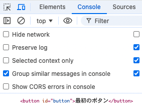
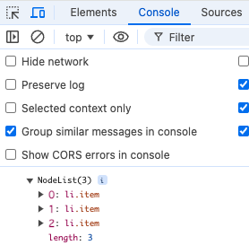
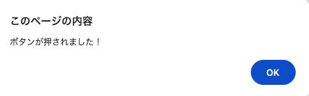
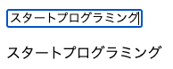
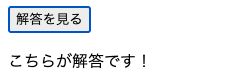
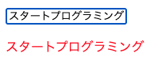

**```カリキュラム07```**

<!DOCTYPE html>
<html lang="ja">
<head>
    <meta charset="UTF-8">
    <meta http-equiv="X-UA-Compatible" content="IE=edge">
    <meta name="viewport" content="width=device-width, initial-scale=1.0">
    <link rel="stylesheet" href="../style.css">
    <title>07.カリキュラム</title>
</head>
<body>
    <h1>DOM操作とイベントの使用について学習をしましょう！</h1>
    <h2><b>DOM操作</b></h2>
    <p>DOM（ドム）は、ウェブページを構成する要素をプログラムで扱いやすくするための仕組みです。
    </p>
    <p>これを使うと、JavaScriptを使ってウェブページの内容を自由に変えたり、見た目を変えたり、ユーザーの操作に反応するように設定したりできます。</p>

 <p>それでは、実際の書き方や使い方を学習していきましょう！</p>
 <hr>

<h2><b>要素の取得</b></h2>
<p>DOM操作を行うためには、JavaScriptから特定の要素を取得し、その要素に対して操作を加えます。<br>
まずは、要素の取得方法から学習しましょう！</p>

<p>以下のHTMLの要素を操作するので、まずはindex.htmlにコードを記述しましょう！</p>

``` html
<!-- html -->
<h1>DOM操作の練習</h1>
<button id="button">最初のボタン</button>
<button class="next_button">2番目のボタン</button>

<ul>
    <li class="item">メニュー1</li>
    <li class="item">メニュー2</li>
    <li class="item">メニュー3</li>
</ul>
```

 <hr>
<h2><b>getElementById()</b></h2>
<p><code>getElementById()</code>はID属性を持つ要素を取得します。<br>
一番シンプルでよく使われる方法です。</p>

<p>ゲットエレメントバイアイディーと読みます。</p>

``` js
// script.js
const button = document.getElementById('button')
console.log(button);
```

<p><code>document.getElementById('button')</code>という箇所で、<code>button</code>というIDを持つ要素を探して取得しています。</p>

<p>そして、取得した要素を<code>button</code>という変数に代入しています。<br>
その結果をconsole欄で表示してみると、上手くhtmlのボタンの情報が取得出来ていることが分かります。</p>



<hr>
<h2><b>querySelector()</b></h2>
<p><code>querySelector()</code>はCSSセレクタを使って、最初に一致する要素を取得します。<br>
ID、クラス名、タグ名など、CSSで指定するのと同じ方法で選べます。</p>

<p>クエリーセレクターと読みます。</p>


``` js
// script.js
const text =document.querySelector('h1')
console.log(text);

const button =document.querySelector('#button')
console.log(button);

const next_button =document.querySelector('.next_button')
console.log(next_button);
```

<p>タグ名で取得する場合はそのままタグ名を記述し、IDで取得する場合は先頭にシャープ<code>（#）</code>を付けます。<br>
クラス名で取得する場合は先頭にドット<code>(.)</code>を付けるので、cssで記述する時と同じ書き方になります。</p>

<p>そして、取得した要素をそれぞれの変数に代入しています。<br>
その結果をconsole欄で表示してみると、上手くhtml側の情報が取得出来ていることが分かります。</p>


<hr>
<h2><b>querySelectorAll()</b></h2>
<p><code>querySelectorAll()</code>は、CSSセレクタに一致するすべての要素を取得します。<br>
複数の要素をまとめて扱いたい場合に便利です。</p>

<p>クエリーセレクターオールと読みます。</p>


``` js
// script.js
const item =document.querySelectorAll('.item')
console.log(item);
``` 
<p>今回は<code>item</code>というクラス名が付いた要素全てを取得し、取得した要素を変数に代入しています。<br>
その結果をconsole欄で表示してみると、<code>item</code>というクラス名が付いた要素、<code>li</code>タグの情報が取得出来ていることが分かります。</p>


<p>この他にも要素を取得する方法はありますが、特にこの3つを使用することが多いです。<br>
そのため、この3つを覚えて使いこなせるようにしていきましょう！</p>

<hr>
<h2><b>イベントについて</b></h2>
<p>JavaScriptのイベントは、ウェブページで何かが「起こった」ときに実行される動作や反応を定義するための仕組みです。<br>
具体的には、クリックされた時、キーボード入力がされた時、マウスが載った時など様々なイベントがあります。</p>

<p>イベントを使うことで、ユーザの操作に合わせた動的なアプリやサイトを作ることが出来ます。<br>
まずは、クリックイベントから学習をしていきましょう！</p>
<hr>
<h2><b>クリックイベント</b></h2>
<p>クリックイベントは、ユーザーが要素をクリックしたときに発生するイベントです。<br>
このイベントを使うことで、ボタンやリンク、画像などをクリックした際に特定の処理を実行することが出来ます。</p>

<p>まずは、「ボタンがクリックされたらアラートが表示される」というプログラムを作成していきます。</p>

``` html
<!-- html -->
<button id="start_button">ゲームスタート</button>
``` 

``` js
// script.js
const startButton = document.getElementById('start_button');

startButton.addEventListener('click', () =>{
    alert('ボタンが押されました！')
});
``` 

<p>実行結果をブラウザで確かめてみると、このようにアラートが出てきます！</p>


<p>それでは、上記コードの意味を解説していきます。</p>

``` js
const startButton = document.getElementById('start_button');
``` 
<p>まず、<code>getElementById</code>を使ってID<code>start_button</code>の情報を取得しています。<br>
そして、取得した情報を<code>startButton</code>という変数に代入しています。</p>

``` js
startButton.addEventListener('click', () =>{

});
``` 
<p>クリックイベントを使うには、どの要素に対してイベントを設定するかを指定します。
そして、実行したいイベントを追加します。</p>

<p><code>addEventListener('click', () =>{})</code>とすることで、クリックイベントを追加することが出来ます。<br>
アッドイベントリスナーと読みます。</p>

<p>今回は<code>startButton</code>に対してイベントを追加したいので、<code>startButton.addEventListener</code>という書き方になります。</p>

``` js
alert('ボタンが押されました！')
``` 
<p><code>alert() </code>は、ブラウザにポップアップメッセージを表示するメソッドです。<br>
今回の例では、ボタンがクリックされると「ボタンが押されました！」というメッセージが表示されます。</p>


<p>これで上手くクリックイベントを設定することが出来ました！</p>

<hr>
<h2><b>inputイベント</b></h2>
<p>inputイベントは、ユーザーがフォームの入力要素<code>（inputやtextarea）</code>に対して値を入力した時に発生するイベントです。<br>
ユーザーの入力内容に合わせてテキストの色を変えたり、入力の正誤判定などが出来ます。</p>

<p>今回は、「inputタグに入力した文字がリアルタイムで別の場所に表示される」というプログラムを作ってみましょう！</p>

``` html
<!-- html -->
<input type="text" id="textInput">
<p id="displayText">ここに入力内容が表示されます</p>
``` 

``` js
// script.js
const textInput = document.getElementById('textInput');
const displayText = document.getElementById('displayText');

textInput.addEventListener('input', () => {
    displayText.textContent = textInput.value; 
});
```

<p>コードの記述が出来たら、一度実行して動きを確認してみましょう！<br>
入力した文字がリアルタイムで表示されていれば成功です！<p>


<p>それでは、上記コードの意味を解説していきます。</p>

``` js
// script.js
const textInput = document.getElementById('textInput');
const displayText = document.getElementById('displayText');
``` 

<p>まず、<code>getElementById</code>を使ってID<code>textInput</code>と<code>displayText</code>の情報を取得しています。<br>
ここでいう<code>textInput</code>と<code>displayText</code>はinputタグとpタグの情報になります。</p>

<p>そして、取得した情報を変数に代入しています。</p>

``` js
textInput.addEventListener('input', ()=> {

});
``` 
<p>inputイベントを使うには、どの要素に対してイベントを設定するかを指定します。<br>
 そして、実行したいイベントを追加します。</p>

<p><code>addEventListener('input', () =>{})</code>とすることで、inputイベントを追加することが出来ます。
クリックイベントと書き方は同じになります。</p>

<p>今回はinputタグの中（つまりtextInput）に文字が入力されたらイベントを実行したいので、<br>
<code>textInput.addEventListener</code>という書き方になります。</p>

``` js
// script.js
displayText.textContent = textInput.value; 
```
<p><code>textInput.value</code>は、テキストボックスに入力されている内容を取得する命令になります。</p>

<p>つまり、この一文で「テキストボックスに入力された内容を、<code>displayText</code>（つまりpタグ）のテキストに<br>
置き換えて表示する」という命令になります。</p>

<p>これで、inputタグに入力した文字がリアルタイムで別の場所に表示されるプログラムが出来ました！</p>

<hr>
<h2><b>要素の変更や追加</b></h2>
<p>次は、取得した要素の変更や追加をしていきます。</p>
<p>これを上手く使えるようになると、「文字が入力されたら色を変える」「スクロールされたら写真が表示される」などの
動きのあるアプリやサイトが作れるようになります。</p>

<p>それでは、実際にコードを書いていきましょう！</p>
<hr>

<h2><b>textContent</b></h2>
<p>まずは、取得してきた要素のテキスト変更する方法です。<br>
<code>textContent</code>という命令を使用します。</p>

<p>テキストコンテントと読みます。</p>


``` html
<!-- html -->
<h1>DOM操作の練習</h1>
```

``` js
// script.js
const item =document.querySelector('h1')
item.textContent = 'DOM操作の実践';
``` 
<p>コードの記述が出来たら、一度実行して動きを確認してみましょう！<br>
テキストが変更されていれば成功です！</p>


<p>上記コードで、h1タグの情報を取得し、そのh1タグのテキストを「DOM操作の実践」という<br>
テキストに変更することが出来ます。これについて説明をします。</p>

``` js
// script.js
const item =document.querySelector('h1')
``` 
<p><code>document.querySelector('h1')</code>という箇所で、h1を探して情報を取得しています。<br>
そして、取得した要素を<code>item</code>という変数に代入しています。</p>

``` js
// script.js
item.textContent = 'DOM操作の実践';
```
<p>取得してきた情報が<code>item</code>という変数に入っているので、<code>item</code>に対して<code>textContent</code>を適用させています。<br>
イコール<code>「=」</code>の右側には、変更して表示させたいテキストを入力します。</p>

<p>今回は「DOM操作の実践」というテキストに変更させたいので、それを入力しています。<br>
上記コードを実行すると、h1のテキストが変更されて表示されるようになります。</p>

<p>これで上手くテキストの変更が出来ました！</p>

<hr>
<h2><b>classList.add()</b></h2>
<p>次は、指定した要素にクラスを追加したり、クラスを取り外す方法を学習します。</p>

<p><code>classList.add()</code>は、指定したクラスを要素に追加します。<br>
ゲーム画面の切り替えや文字の色の変更など、様々な場面で使用されます。</p>

<p>クラスリストアドと読みます。</p>

<p>今回はスタートボタンを作成し、スタートボタンを押すとボタンが消えるプログラムを作成してみましょう。</p>

``` html
<!-- index.html -->
<button id="start_button">ゲームスタート</button>
```

``` css
/* style.css */
.hidden {
    display: none;
}
```
``` js
// script.js
    const startButton = document.getElementById('start_button');

    startButton.addEventListener("click", () =>{
    startButton.classList.add("hidden");
    });
``` 
<p>コードの記述が出来たら、一度実行して動きを確認してみましょう！<br>
ボタンをクリックするとボタンが消えるようになっています！</p>


<p>それでは、上記コードの意味を解説していきます。</p>

``` js
// script.js
const startButton = document.getElementById('start_button');
``` 
<p>まず、<code>getElementById</code>を使ってID<code>start_button</code>の情報を取得しています。<br>
そして、取得した情報を<code>startButton</code>という変数に代入しています。</p>

``` js
// script.js
startButton.addEventListener('click', () =>{
   
});
``` 
<p>今回は、「ボタンをクリックするとクラスを追加する」という命令にしたいので<code>startButton</code>に対してクリックイベントを設定しています。</p>

``` js
// script.js
startButton.classList.add("hidden");
``` 
<p><code>classList.add()</code>で、指定した要素にクラスを追加することが出来ます。<br>
今回は取得してきた<code>startButton</code>に対してクラスを追加したいので、<code>startButton.classList.add（）</code>という書き方になります。</p>

<p>()の中には追加したいクラス名を記述します。<br>
今回は<code>hidden</code>という名前のクラスを追加したいので、()の中には<code>hidden</code>と記述します。</p>

<p>この命令で「ボタンがクリックされたら新しく<code>hidden</code>という名前のクラスが付く」という意味になります。</p>

``` css
/* style.css */
.hidden {
    display: none;
}
```
<p><code>hidden</code>というクラスが付いたらボタンを隠したいので、cssで<code>display:none;</code>という命令を入れています。<br>
<code>display:none;</code>という命令で要素を隠すことが出来ます。</p>

<p>これでclassを追加し、スタートボタンを押すとボタンが消えるプログラムが出来ました！</p>

<hr>
<h2><b>classList.remove()</b></h2>
<p>次は、指定したクラスを取り外す方法を学習します。</p>
<p><code>classList.remove()</code>は、指定したクラスを削除するメソッドです。</p>

<p>クラスリストリムーブと読みます。</p>

<p>今回は「解答を見る」というボタンを押すとテキストが表示されるプログラムを作成してみましょう。</p>

``` html
<!-- index.html -->
<button id="start_button">解答を見る</button>
<p id="message" class="hidden">こちらが解答です！</p>
```

``` css
/* style.css */
.hidden {
    display: none;
}
```

``` js
// script.js
const startButton = document.getElementById('start_button');
const message = document.getElementById('message');

startButton.addEventListener("click", () =>{
message.classList.remove("hidden");
});
```

<p>コードの記述が出来たら、一度実行して動きを確認してみましょう！<br>
「解答を見る」というボタンを押すとテキストが表示されるようになっています！</p>



<p>それでは、上記コードの意味を解説していきます。</p>

``` js
// script.js
const startButton = document.getElementById('start_button');
const message = document.getElementById('message');
```

<p>まず、<code>getElementById</code>を使ってID<code>start_button</code>と<code>message</code>の情報を取得しています。</br>
ここでいう<code>start_button</code>と<code>message</code>はボタンとpタグの情報になります。</p>

<p>そして、取得した情報を変数に代入しています。</p>

``` js
// script.js
startButton.addEventListener('click', () =>{
   
});
``` 
<p>今回は、「ボタンがクリックされたらクラスを取り外す」という命令にしたいので<code>startButton</code>に対してクリックイベントを設定しています。</p>

``` js
// script.js
message.classList.remove("hidden");
``` 

<p><code>classList.remove()</code>で指定した要素のクラスを取り外すことが出来ます。</br>
今回はpタグ、つまり<code>message</code>についているクラスを取り外したいので<code>message.classList.remove();</code>という書き方になります。</p>

<p>現在は<code>hidden</code>というクラスがついていることでpタグが隠れているので、<code>hidden</code>というクラスを取り除くことにより、pタグが表示されるようになります。</p>

<p>そのため、()の中には<code>hidden</code>と記述します。
これで、<code>hidden</code>というクラスを取り外すことが出来ます。</p>

``` css
/* style.css */
.hidden {
    display: none;
}
```
<p><code>hidden</code>というクラスが取れたことにより、上記cssが適用されなくなります。</br>
つまり、<code>display: none;</code>で要素を隠していた命令が適用されなくなるので、通常通りに要素が表示されるようになります。</p>

<p>これで、ボタンをクリックすると隠れていたテキストが表示させるようになりました！<p>

<hr>
<h2><b>classList.toggle()</b></h2>
<p>最後に、クリックをするたびにクラスを付けたり外したりする方法を学習します。</p>
<p><code>classList.toggle()</code>は、指定したクラスがあれば取り外し、なければ付けるというメソッドになります。</p>

<p>クラスリストトグルと読みます。</p>

<p>今回は、画像をクリックするごとに画像の大きさが変わるプログラムを作成してみましょう。</p>


``` html
<!-- index.html -->
<div class="box">
    
</div>
```

``` css
/* style.css */
.box img{
    width: 300px;
    height: 300px;
}

.large img{
    width: 500px;
    height: 500px;
}
```

``` js
// script.js
const boxImg = document.querySelector('.box img');

boxImg.addEventListener("click", () => {
boxImg.parentNode.classList.toggle("large");
});
```

<p>コードの記述が出来たら、一度実行して動きを確認してみましょう！<br>
画像をクリックするごとに画像の大きさが変わるようになっています！</p>


<p>それでは、上記コードの意味を解説していきます。</p>


``` js
const boxImg = document.querySelector('.box img');
```
<p><code>document.querySelector()</code>を使って、<code>box</code>というclassの中にあるimg要素を取得しています。<br>
そして、取得した情報を<code>boxImg</code>という変数に代入しています。</p>

``` js
// script.js
boxImg.addEventListener('click', () =>{
   
});
``` 
<p>今回は、「画像がクリックされたらクラスの付け外しをする」という命令にしたいので<br>
先程取得したimg要素の情報が入っている<code>boxImg</code>に対してクリックイベントを設定しています。</p>

``` js
boxImg.parentNode.classList.toggle("large");
``` 
<p><code>parentNode</code>とは、指定された要素の親要素を取得するという命令になります。<br>
今回は<code>boxImg</code>が指定されており、現在<code>boxImg</code>には「img要素」の情報が入っています。</p>

<p>そのため、<code>boxImg</code>から見た親要素は<code>div class="box"</code>になるので、そこに対してクラスの付け外しをするという命令になります。</p>

<p><code>toggle（）</code>という命令は、指定したクラスがあれば取り外し、なければ付けるというメソッドになります。</p>

<p>今回は<code>large</code>というclassを付け外ししたいので、クリックして<code>large</code>というクラスがなければ付ける。<br>
もう一度クリックして<code>large</code>というクラスがあれば取り外すという命令になります。</p>

``` css
/* style.css */
.box img{
    width: 300px;
    height: 300px;
}

.large img{
    width: 500px;
    height: 500px;
}
```
<p>最初は画像の大きさは横幅300px、縦幅300pxに設定しています。</br>
largeクラスが付いた時に画像を大きくしたいので、その場合は横幅500px、縦幅500pxになるようにcssで設定しています。</p>

<p>これで画像をクリックするたびにクラスの付け外しを行い、画像の大きさが変わるプログラムが出来ました！</p>

<hr>
<h2><b>練習問題</b></h2>
<p>①ボタンがクリックされたらテキストが変わるプログラムを作成してみましょう！</br>
HTMLは以下のコードを使用してください。</p>


``` html
<!-- index.html -->
<button id="button">クリック前</button>
```

<p><b>仕様</b></p>
<p>・getElementById()を使って要素を取得する</p>
<p>・ボタンがクリックされたら「クリックされたよ！」というテキストに変更する</p>


<br><hr>
<p>②文字が入力されたらリアルタイムで文字を表示させて、文字の色が変わるプログラムを作成してみましょう！</br>
HTMLは以下のコードを使用してください。</p>


``` html
<!-- index.html -->
<input type="text" id="textInput">
<p id="displayText">ここに入力内容が表示されます</p>
```
<p><b>仕様</b></p>
<p>・getElementById()を使って要素を取得する</p>
<p>・inputタグに文字が入力されたらpタグに文字を表示させる</p>
<p>・inputタグに文字が入力されたら「displayText」にcolorというclassを付ける</p>
<p>・colorというclassが付いたら文字を赤色にする</p>



<br><hr>
<p>③ボタンをクリックするたびに、カウンターが1ずつ増えて表示されるプログラムを作成してみましょう。<br>
HTMLは以下のコードを使用してください。</p>

``` html
<!-- index.html -->
<button id="countButton">クリックしてカウントアップ</button>
<p id="countDisplay">0</p>
```

<br><hr>
<p>④ボタンをクリックすると、特定の要素が表示/非表示を切り替えるプログラムを作成してみましょう。<br>
HTMLは以下のコードを使用してください。</p>

``` html
<!-- index.html -->
<button id="toggleButton">表示/非表示を切り替える</button>
<p id="toggleText">このテキストが表示されたり非表示になったりします</p>
```

<!-- 折り畳み展開ポインタ -->
 <div onclick="obj=document.getElementById('open').style; obj.display=(obj.display=='none')?'block':'none';">
    <a style="cursor:pointer;">▼ 解答はこちらをクリックすると見れます</a>
    </div>
    <!--// 折り畳み展開ポインタ -->  
    <!-- 折り畳まれ部分 -->
    <div id="open" style="display:none;clear:both;">  
    <!--ここの部分が折りたたまれる＆展開される部分になります。
    自由に記述してください。-->

 ``` js
// 練習問題① 
// script.js
const button = document.getElementById("button");

button.addEventListener("click", () => {
    button.textContent = "クリックされたよ！";
});
```

``` css
 /* 練習問題②
 style.css */
.color{
    color: red; 
}
```
``` js
// 練習問題②
// script.js
const textInput = document.getElementById('textInput');
const displayText = document.getElementById('displayText');

textInput.addEventListener('input', () => {
  displayText.textContent = textInput.value; 
  displayText.classList.add('color'); 
});
```

``` js
// 練習問題③
// script.js
const countButton = document.getElementById('countButton');
const countDisplay = document.getElementById('countDisplay');

let count = 0;

countButton.addEventListener('click', () => {
  count++; 
  countDisplay.textContent = count; 
});
```

``` css
/* 練習問題④
style.css */
 .hidden {
    display: none; 
}
```

``` js
// 練習問題④
// script.js
const toggleButton = document.getElementById('toggleButton');
const toggleText = document.getElementById('toggleText');

toggleButton.addEventListener('click', () => {
  toggleText.classList.toggle('hidden'); 
});
```

<!--// 折り畳まれ部分 -->
</div>

