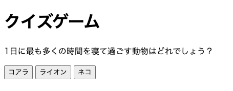
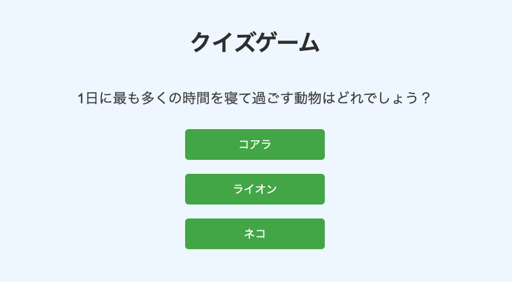
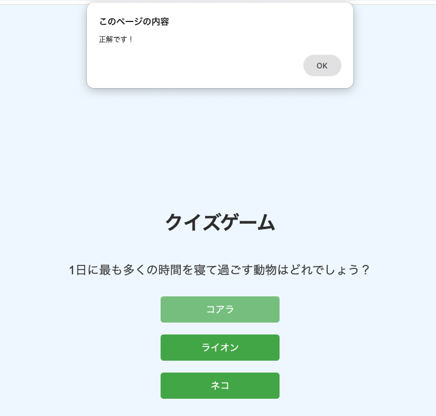
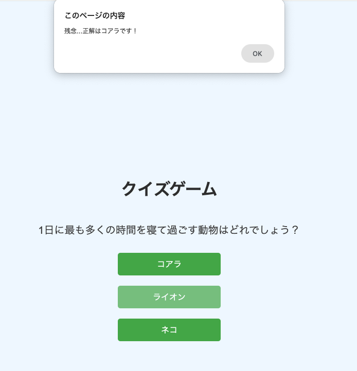
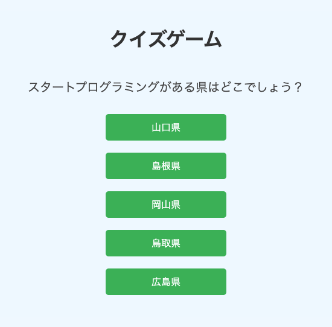

**```カリキュラム08```**

<!DOCTYPE html>
<html lang="ja">
<head>
    <meta charset="UTF-8">
    <meta http-equiv="X-UA-Compatible" content="IE=edge">
    <meta name="viewport" content="width=device-width, initial-scale=1.0">
    <link rel="stylesheet" href="../style.css">
    <title>08.カリキュラム</title>
</head>
<body>
<h1>クイズゲームを作ろう！</h1>
<p>これまで学習した内容を活かし、クイズゲームを作成してみましょう！<br>
まずは、1問だけのクイズゲームを作成していきます！</p>

<h3><b>クイズゲームの仕様</b></h3>
<p>・問題文の下に回答ボタンがある</p>
<p>・回答が正解だと「正解です！」というアラートが表示される</p>
<p>・間違えてしまうと「残念...正解は〇〇です！」というアラートが表示される</p>

<h2><a href="../クイズゲーム見本(1問)/index.html" target="_blank" rel="noopener noreferrer">見本はこちら</a></h2>

<p>それでは、早速作っていきましょう！</p>

<hr>
<h2><b>ボタン編</b></h2>
<h2><b>HTML</b></h2>
<p>①まずは、htmlのコードを準備します。<br>
h1タグとpタグでタイトルと問題を表示し、回答用のボタンを準備します。</p>

<p>一つ一つのボタンの情報をJavaScriptで取得するため、それぞれにIDを振っておきましょう！<br>
今回は上から順番に<code>「button1」「button2」「button3」</code>というIDを振ります。</p>

``` html
<!-- index.html -->
<h1>クイズゲーム</h1>
<p>1日に最も多くの時間を寝て過ごす動物はどれでしょう？</p>
<button id="button1">コアラ</button>    
<button id="button2">ライオン</button>    
<button id="button3">ネコ</button>    
```
<p>コードを記述後、リロードして確認してみましょう！<br>
画像のようになっていれば上手くコードが記述出来ています。</p>

<hr>

<h2><b>CSS</b></h2>
<p>②次に、cssで見た目を整えていきます。<br>
今回はcssの学習ではないため、コードの中身を覚えたりチェックする必要はありません。</p>

<p>コードはそのままコピーして貼り付けてください。</p>

``` css
/* style.css */
body {
    display: flex;
    flex-direction: column;
    align-items: center;
    justify-content: center;
    height: 100vh;
    margin: 0;
    font-family: Arial, sans-serif;
    background-color: #f0f8ff;
}

h1 {
    margin-bottom: 20px;
    color: #333;
    text-align: center;
}

p{
    font-size: 20px;
    margin-bottom: 20px;
    text-align: center;
    color: #444;
}

button {
    display: block;
    width: 200px;
    padding: 10px;
    margin: 10px;
    font-size: 16px;
    cursor: pointer;
    border: none;
    border-radius: 5px;
    background-color: #4caf50;
    color: white;
    transition: background-color 0.3s;
}

button:hover{
    opacity: 0.7;
}
``` 

<p>コードを記述後、リロードして確認してみましょう！<br>
画像のようになっていれば上手くコードが記述出来ています。</p>


<hr>

<h2><b> JavaScript</b></h2>
<p>③次は、JavaScriptで正誤判定を作っていきます。<br>
この問題の正解は「コアラ」なので、ボタン1が正解ということになります。</p>

<p>そのため、「ボタン1がクリックされたら正解のアラートを表示」、<br>
「ボタン2かボタン3がクリックされたら不正解のアラートを表示」という考え方になります。</p>

<p>まずは、ボタン1がクリックされたら正解のアラートを表示するプログラムを作りましょう！</p>

``` js
// script.js
document.getElementById('button1').addEventListener('click', () =>{
    alert('正解です！')
});
``` 
<p>コードが記述出来たら、一度動きを確認してみましょう！<br>
ボタン1を押して、正解のアラートが出てきたら成功です！</p>



<p>それでは、上記コードの意味を解説していきます。</p>

``` js
// script.js
document.getElementById('button1').addEventListener('click', () =>{

});
``` 

<p>まず、<code>getElementById</code>を使ってID<code>「button1」</code>の情報を取得しています。<p>

<p>そして、その取得した情報（つまりボタン1）がクリックされたら〜という意味で<br>
<code>.addEventListener('click', () =>　</code>というクリックイベントが設定されています。<p>

``` js
// script.js
alert('正解です！')
``` 
<p>ボタン1がクリックされるとアラートを表示させたいので、「正解です！」というアラートを表示させています。</p>

<h2><b>これでボタン1がクリックされると正解のアラートが表示されるプログラムが出来ました！</b></h2>

<hr>
<p>④次は、不正解の判定を作っていきます。<br>
「ボタン2かボタン3がクリックされたら不正解のアラートを表示」というプログラムを作っていきましょう！</p>

<p>先程のコードの続きに記述していきましょう！</p>


``` js
// script.js
document.getElementById('button2').addEventListener('click', () =>{
    alert('残念...正解はコアラです！')
});

document.getElementById('button3').addEventListener('click', () =>{
    alert('残念...正解はコアラです！')
});
```

<p>コードが記述出来たら、一度動きを確認してみましょう！<br>
ボタン2と3を押して、不正解のアラートが出てきたら成功です！</p>



<p>それでは、上記コードの意味を解説していきます。</p>

``` js
// script.js
document.getElementById('button2').addEventListener('click', () =>{

});

document.getElementById('button3').addEventListener('click', () =>{
});
``` 

<p>まず、<code>getElementById</code>を使ってID<code>「button2」</code>の情報を取得しています。<br>
<code>「button3」</code>も同じ処理になっています。<p>

<p>そして、その取得した情報（ボタン2もしくはボタン3）がクリックされたら〜という意味で<br>
<code>.addEventListener('click', () =>　</code>というクリックイベントが設定されています。<p>

``` js
// script.js
    alert('残念...正解はコアラです！')
```

<p>ボタン2もしくはボタン3がクリックされると不正解のアラートを表示させたいので、<br>
「残念...正解はコアラです！」というアラートを表示させています。<p>

<h2><b>これでボタン2もしくはボタン3がクリックされると不正解のアラートが表示されるプログラムが出来ました！</b></h2>

<hr>
<p>次は、先程のコードをリファクタリング（コードを短くしたり綺麗にしたり、分かりやすく修正すること）をしていきたいと思います！</p>


<p>これまで学習したif文や関数などを使用し、より使いやすく分かりやすいコードにしていきましょう！</p>

<p><b>※HTMLは新たにクラスを付ける必要があるので以下のclassを追加で記述しましょう！<br>
CSSは以前のコードのままで大丈夫です。</b></p>

``` html
<!-- index.html -->
<h1>クイズゲーム</h1>
<p>1日に最も多くの時間を寝て過ごす動物はどれでしょう？</p>
<button id="button1" class="answerButton">コアラ</button>    
<button id="button2" class="answerButton">ライオン</button>    
<button id="button3" class="answerButton">ネコ</button>    
```

<hr>
<h2><b>リファクタリング編</b></h2>

<p>まずは、今回作成するコードを全て記述しておきます。<br>
ただし、みんなはこの段階でコードを写すのではなく、最初に書いたコードとどこが変わっているかをチェックしてみてください。</p>

``` js
// script.js
// 最初に書いたコード
document.getElementById('button1').addEventListener('click', () =>{
    alert('正解です！')
});

document.getElementById('button2').addEventListener('click', () =>{
    alert('残念...正解はコアラです！')
});

document.getElementById('button3').addEventListener('click', () =>{
    alert('残念...正解はコアラです！')
});
``` 

``` js
// script.js
// リファクタリングしたコード
const correctAnswer = document.getElementById('button1');

const checkAnswer = (selectedButton) =>{
    if (selectedButton === correctAnswer) {
        alert('正解です！')
    } else {
        alert('残念...正解はコアラです！')
    }
}

const buttons = document.querySelectorAll('.answerButton');

for (let i = 0; i < buttons.length; i++) {
    buttons[i].addEventListener('click', function() {
        checkAnswer(this);
    });
}
``` 
<p>コードが長くなっているように見えますが、リファクタリングをすることで今後新しい問題を追加しても応用が効くようになりとても便利になります。</p>

<p>それでは、このコードの意味を一つずつ解説していくのでここからコードを書いていきましょう！</p>
<hr>


<p>①まずは、正解であるボタン1の要素を取得し変数に入れていきます。<br>
この変数は、後ほど正誤判定で使用します。

``` js
// script.js
const correctAnswer = document.getElementById('button1');
``` 

<p><code>getElementById</code>を使ってID<code>「button1」</code>の情報を取得し、その情報を<code>「correctAnswer」</code>という変数に代入しています。</p>
<hr>

<p>②次に、「それぞれのボタンにクリックイベントを追加して、クリックされたボタンに対して関数を実行する」
というプログラムを作成していきます。</p>

``` js
// script.js
const buttons = document.querySelectorAll('.answerButton');
``` 

<p><code>querySelectorAll</code>を使ってclass名が<code>「answerButton」</code>の情報を取得し、その情報を<code>「buttons」</code>という変数に代入しています。</p>

<p>これにより、複数のボタンをまとめて処理できるようになります。</p>

<hr>
<p>③次に、<code>「buttons」</code>に格納されたすべてのボタンに対して順番に処理を追加したいため、for文で処理を回していきます。</p>

``` js
// script.js
for (let i = 0; i < buttons.length; i++) {
  
}
``` 
<p><code>let i = 0;</code>は、ループのカウンターとなる変数<code>「i」</code>を0に初期化しています。<br>
<code>「i」</code> は、処理を何回繰り返したかを数える役割を果たします。</p>

<p><code>i < buttons.length;</code>は、ループを続ける条件を指定しています。<br>
<code>buttons.length</code> は、ボタンの数（buttonsの長さ）を表しているので、今回の場合は3回ということになります。</p>

<p><code>i++</code>は、ループが1回終了するごとに<code> i </code>の値を1つ増やすことを意味します。<br>
たとえば、最初は<code> i = 0</code> ですが、ループが1回実行されると<code> i </code>が 1 になります。</p>

<p>そのため、上記コードを簡単に説明すると「i がbuttons.length未満（今回は3未満）のときに繰り返し処理を行う」という意味になります。<br>行う処理の内容は次に説明する④の処理になります。</p>

<hr>
<p>④次に、各ボタンが押されたら正誤判定の関数を呼び出すというプログラムを作成していきます。</p>

``` js
// script.js
 buttons[i].addEventListener('click', function() {
        checkAnswer(this);
    });
``` 

<p><code>buttons[i]</code> は<code> i </code>番目のボタンを指しています。最初は<code> i </code>が 0 から始まるので、<br>
繰り返し処理の1回目は最初のボタン<code>（buttons[0]）</code>にクリックイベントを設定します。</p>

<p>繰り返し処理の2回目は2つ目のボタン<code>（buttons[1]）</code>、3回目は3つ目のボタン<code>（buttons[2]）</code>に対して同様にクリックイベントを設定します。</p>

<p>このクリックイベントは、<code>.addEventListener('click', function() </code>で追加されています。</p> 

<p>イベントリスナー内では<code> checkAnswer(this); </code>というコードで、<code>checkAnswer </code>という関数を実行しています。<br>
（この関数については後ほど説明します）</p>

<p>関数の引数に<code>this</code>が入っていますが、これはクリックされたボタン自身を指します。</p>

<p>つまり、1つ目のボタンがクリックされれば、<code>this </code>は1つ目のボタンを指します。<br>
同様に、2つ目や3つ目のボタンがクリックされた場合も、そのボタン自身が<code> this </code>となります。</p>

<p>これで「各ボタンが押されたら正誤判定の関数を呼び出す」というプログラムが出来ました！</p>

<p><b>今回アロー関数ではなく無名関数を使用していますが、イベントリスナーで<code> this</code>が<br>クリックされた要素を正しく指すようにするためには、無名関数を使用するのがベストなので覚えておきましょう！</b></p>

<hr>

<p>⑤先程<code>checkAnswer</code>という関数を実行しましたが、この関数内で正誤判定を実装したいので作成していきます。</p>

``` js
// script.js
const checkAnswer = (selectedButton) =>{
    if (selectedButton === correctAnswer) {
        alert('正解です！')
    } else {
        alert('残念...正解はコアラです！')
    }
}
``` 
<p>少し分かりにくいので、1つずつコードを区切って解説をしていきます。</p>

``` js
// script.js
const checkAnswer = (selectedButton) =>{
  
}
``` 

<p>これは<code>checkAnswer</code>という名前の関数を定義している部分です。</p>

<p>この関数は、ボタンがクリックされたときに呼び出され、引数としてクリックされたボタンの情報<code>selectedButton</code>を受け取ります。</p>

<p><code>selectedButton</code>という引数名は自由に決めることが出来るので、プログラムに関連のある分かりやすい名前にしましょう。</p>

<p>具体的には、イベントリスナーの無名関数内で <code>this</code> はクリックされたボタンを指します。<br>
この <code>this</code> を <code>checkAnswer</code> 関数の引数として渡し、<code>checkAnswer</code> 関数内で <code>selectedButton</code> という名前で受け取って処理を行います。</p>

<p>もっと簡単にいうと、押されたボタンの情報が<code>selectedButton</code>の中に入っているということです。</p>

``` js
// script.js
if (selectedButton === correctAnswer) {
        alert('正解です！')
    } else {
        alert('残念...正解はコアラです！')
    }
``` 
<p>このコードは、選択されたボタンが正解かどうかを判定し、それに応じて異なるメッセージを表示する処理です。</p>

<p><code>if (selectedButton === correctAnswer)</code>は、「クリックされたボタン（<code>selectedButton</code>）が正解のボタン（<code>correctAnswer</code>）と等しい場合」に<br>その後の処理を実行するという意味になります。</p>

<p>今回は、ボタン1を正解としているので、ボタン1がクリックされた場合にアラートで「正解です！」というメッセージが表示されます。</p>

<p>そうでなければ（つまりボタン1以外がクリックされたら）不正解なので<br>
else文が実行されアラートで「残念...正解はコアラです！」というメッセージが表示されます。</p>

<h2><b>これでリファクタリングが出来ました！<br>
リファクタリングをしたことで応用が効くようになったので、次の練習問題で実践してみましょう！</b></h2>

<hr>
<h2><b>練習問題</b></h2>
<p>①次のクイズゲームを作成してみましょう！<br>
（先程まで書いていたコードに追加で記述していきましょう）</p>

<h3><b>仕様</b></h3>
<ul>
    <li>クイズの内容を「スタートプログラミングがある県はどこでしょう？」に変更する</li>
    <li>回答選択肢は「山口県・島根県・岡山県・鳥取県・広島県」の5つのボタンを用意する</li>
    <li>正解は「ボタン5（広島県）」</li>
</ul>



<!-- 折り畳み展開ポインタ -->
 <div onclick="obj=document.getElementById('open').style; obj.display=(obj.display=='none')?'block':'none';">
    <a style="cursor:pointer;">▼ 解答はこちらをクリックすると見れます</a>
    </div>
    <!--// 折り畳み展開ポインタ -->  
    <!-- 折り畳まれ部分 -->
    <div id="open" style="display:none;clear:both;">  
    <!--ここの部分が折りたたまれる＆展開される部分になります。
    自由に記述してください。-->

``` html
<!-- 練習問題 -->
<!-- html -->
<h1>クイズゲーム</h1>
    <p>スタートプログラミングがある県はどこでしょう？</p>
    <button id="button1" class="answerButton">山口県</button>    
    <button id="button2" class="answerButton">島根県</button>    
    <button id="button3" class="answerButton">岡山県</button>    
    <button id="button4" class="answerButton">鳥取県</button>    
    <button id="button5" class="answerButton">広島県</button>  
```

``` js
// 練習問題
// script.js
const correctAnswer = document.getElementById('button5');

const checkAnswer = (selectedButton) => {
    if (selectedButton === correctAnswer) {
        alert('正解です！');
    } else {
        alert('残念...正解は広島県です！');
    }
}

const buttons = document.querySelectorAll('.answerButton');

for (let i = 0; i < buttons.length; i++) {
    buttons[i].addEventListener('click', function() {
        checkAnswer(this);
    });
}
```
<!--// 折り畳まれ部分 -->
</div>

<p>②次のコードの意味を言語化してみましょう！<br>
下のコードをコピーしてVScodeに貼り付けて、「ここにコードの意味を記述」と書いてあるところにコードの意味を書いていきましょう！</p>

``` js
// script.js
const correctAnswer = document.getElementById('button5'); /*ここにコードの意味を記述*/

const checkAnswer = (selectedButton) => { /*ここにコードの意味を記述*/
    if (selectedButton === correctAnswer) { /*ここにコードの意味を記述*/
        alert('正解です！'); /*ここにコードの意味を記述*/
    } else { /*ここにコードの意味を記述*/
        alert('残念...正解は広島県です！'); /*ここにコードの意味を記述*/
    }
}

const buttons = document.querySelectorAll('.answerButton'); /*ここにコードの意味を記述*/

for (let i = 0; i < buttons.length; i++) { /*ここにコードの意味を記述*/
    buttons[i].addEventListener('click', function() { /*ここにコードの意味を記述*/
        checkAnswer(this); /*ここにコードの意味を記述*/
    });
}
```


<!-- 折り畳み展開ポインタ -->
 <div onclick="obj=document.getElementById('opens').style; obj.display=(obj.display=='none')?'block':'none';">
    <a style="cursor:pointer;">▼ 解答はこちらをクリックすると見れます</a>
    </div>
    <!--// 折り畳み展開ポインタ -->  
    <!-- 折り畳まれ部分 -->
    <div id="opens" style="display:none;clear:both;">  
    <!--ここの部分が折りたたまれる＆展開される部分になります。
    自由に記述してください。-->

``` js
// script.js
const correctAnswer = document.getElementById('button5'); 
// id属性が 'button5' であるHTML要素（5番目のボタン）を取得し、変数 correctAnswer に格納

const checkAnswer = (selectedButton) => { 
// 選択されたボタン（selectedButton）を引数として受け取るcheckAnswer関数

    if (selectedButton === correctAnswer) { 
    // もし、選択されたボタンが正解のボタン（correctAnswer）と一致するなら

        alert('正解です！'); 
        // アラートで「正解です！」と表示

    } else { 
    // でなければ（選択されたボタンが正解ではなかったら）

        alert('残念...正解は広島県です！'); 
        // アラートで「残念...正解は広島県です！」と表示
    }
}

const buttons = document.querySelectorAll('.answerButton'); 
// クラス 'answerButton' を持つ全てのボタン要素を取得し、buttons という変数に格納

for (let i = 0; i < buttons.length; i++) { 
// iがbuttons.length未満のときに繰り返し処理を行う（ループが1回終了するごとに i の値を1つ増やす）

    buttons[i].addEventListener('click', function() { 
    // 現在のボタン（i番目）にクリックイベントを追加

        checkAnswer(this); 
        // クリックされたボタン（this）を引数として、先ほどの checkAnswer 関数を実行。this はクリックされたボタン自身を指している
    });
}

```
<!--// 折り畳まれ部分 -->
</div>
