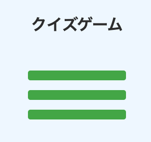
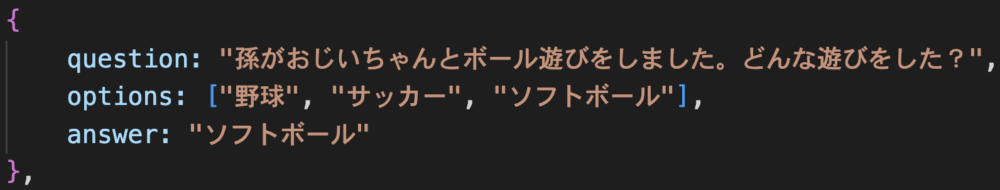
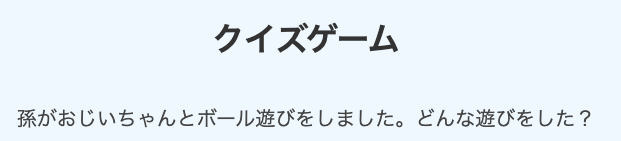
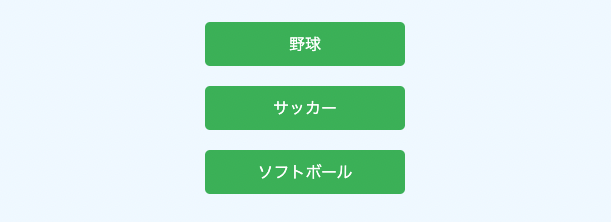
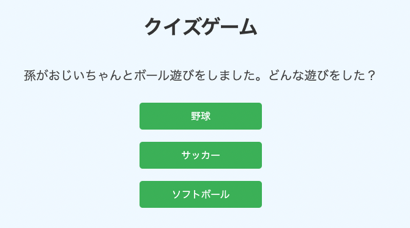
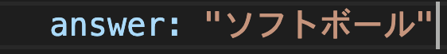
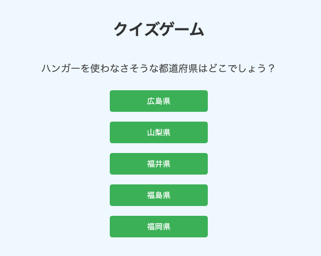
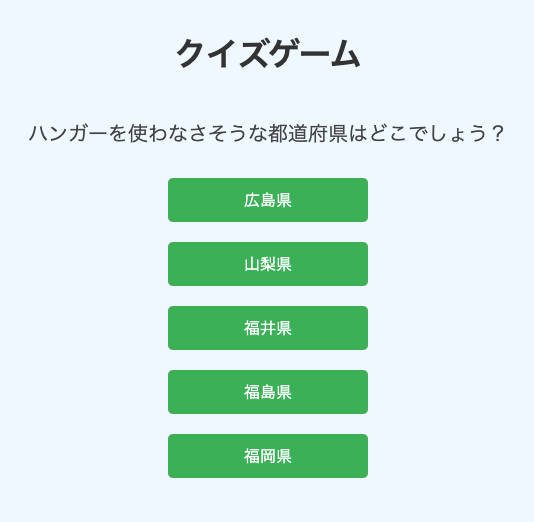

**```カリキュラム09```**

<!DOCTYPE html>
<html lang="ja">
<head>
    <meta charset="UTF-8">
    <meta http-equiv="X-UA-Compatible" content="IE=edge">
    <meta name="viewport" content="width=device-width, initial-scale=1.0">
    <link rel="stylesheet" href="../style.css">
    <title>09.カリキュラム(3問)</title>
</head>
<body>
<h1>クイズゲームを作ろう！(3問)</h1>
<p>前のカリキュラムでは、1問だけのクイズゲームを作成しました。<br>
今回は問題数を増やし、3問のクイズゲームを作成してみましょう！</p>

<h2><a href="./クイズゲーム見本(3問)/index.html" target="_blank" rel="noopener noreferrer">見本はこちら</a></h2>

<h2><b>JavaScriptのコードの完成形を載せておくので、書く順番が分からなくなったら参考にしてください。</b></h2>

``` js
// script.js
const quizzes = [
    {
        question: "孫がおじいちゃんとボール遊びをしました。どんな遊びをした？",
        options: ["野球", "サッカー", "ソフトボール"],
        answer: "ソフトボール"
    },
    {
        question: "1トンの鉄と1トンの紙はどちらが重い？",
        options: ["1トンの鉄", "1トンの紙", "どちらも同じ"],
        answer: "どちらも同じ"
    },
    {
        question: "花束が2束と3束あります。合わせると何束になる？",
        options: ["0束", "1束", "5束"],
        answer: "1束"
    }
];

let currentQuizIndex = 0;
let score = 0;

function showQuiz() {
    const quiz = quizzes[currentQuizIndex];
    document.getElementById('question').textContent = quiz.question;
    document.getElementById('option1').textContent = quiz.options[0];
    document.getElementById('option2').textContent = quiz.options[1];
    document.getElementById('option3').textContent = quiz.options[2];
}

function checkAnswer(selectedAnswer) {
    const correctAnswer = quizzes[currentQuizIndex].answer;
    if (selectedAnswer === correctAnswer) {
        score++;
        alert("正解！");
    } else {
        alert("不正解…");
    }

    currentQuizIndex++;
    if (currentQuizIndex < quizzes.length) {
        showQuiz();
    } else {
        document.getElementById('result').textContent = `終了！あなたのスコアは ${score} 点です。`;
    }
}

const buttons = document.querySelectorAll('.answerButton');
for (let i = 0; i < buttons.length; i++) {
    buttons[i].addEventListener('click', function () {
        checkAnswer(this.textContent); 
    });
}

showQuiz();
``` 

<h3><b>クイズゲームの仕様</b></h3>
<p>・問題文の下に回答ボタンがある</p>
<p>・回答が正解だと「正解です！」というアラートが表示される</p>
<p>・回答が不正解だと「不正解...」というアラートが表示される</p>
<p>・回答を終えると次の問題に移る</p>
<p>・3問全て終了した時点で、正解数に応じたスコアが表示される</p>

<p><b>それでは、早速作っていきましょう！</b></p>

<hr>
<h2><b>HTML</b></h2>
<p>①まずは、HTMLのコードを準備します。<br>
以前はクイズの問題をHTMLにベタ書きしていましたが、今回は問題をJavaScriptから動的に表示する形に変更します。</p>

<p>これにより、クイズの内容を簡単に更新したり拡張したりできるというメリットがあります。</p>

<p>全体を囲っているdivタグには、レイアウトを調整するために<code>quizContainer</code>というclassを付けています。</p>

<p>pタグに<code>question</code>というIDを付けていますが、これは後ほどJavaScriptからpタグの
情報を取得し、そのpタグに問題文を表示させるために必要なので付けています。</p>

<p>また、一つ一つのボタンの情報をJavaScriptで取得するため、それぞれにIDを振っていきます。<br>
今回は上から順番に<code>「option1」</code><code>「option2」</code><code>「option3</code>」というIDを振ります。</p>

<p>最後のpタグに<code>result</code>というIDを付けていますが、クイズが終了した際にスコアを表示させるために必要なので付けています。</p>

``` html
<!-- index.html -->
<h1>クイズゲーム</h1>
    <div class="quizContainer">
        <p id="question"></p>
        <button id="option1" class="answerButton"></button>
        <button id="option2" class="answerButton"></button>
        <button id="option3" class="answerButton"></button>
        <p id="result"></p>
    </div>
```

<h2><b>IDがたくさん振ってありややこしく見えるかもしれませんが、「後ほどJavaScriptから
情報を取得するために付けている」という感覚で大丈夫です！</b></h2>

<hr>
<h2><b>CSS</b></h2>
<p>②次に、cssで見た目を整えていきます。<br>
今回はcssの学習ではないため、コードの中身を覚えたりチェックする必要はありません。</p>

<p>コードはそのままコピーして貼り付けてください。</p>

``` css
/* style.css */
body {
    display: flex;
    flex-direction: column;
    align-items: center;
    justify-content: center;
    height: 100vh;
    margin: 0;
    font-family: Arial, sans-serif;
    background-color: #f0f8ff;
}

h1 {
    margin-bottom: 20px;
    color: #333;
    text-align: center;
}

.quizContainer{
    display: flex;
    flex-direction: column;
    align-items: center;
}

p {
    font-size: 20px;
    margin-bottom: 20px;
    text-align: center;
    color: #444;
}

button {
    display: block;
    width: 200px;
    padding: 10px;
    margin: 10px;
    font-size: 16px;
    cursor: pointer;
    border: none;
    border-radius: 5px;
    background-color: #4caf50;
    color: white;
    transition: background-color 0.3s;
}

button:hover {
    opacity: 0.7;
}

#result {
    font-size: 24px;
    margin-top: 20px;
    color: #333;
    text-align: center;
}
``` 

<p>コードを記述後、リロードして確認してみましょう！<br>
画像のようになっていれば上手くコードが記述出来ています。</p>

<hr>

<h2><b>JavaScript</b></h2>
<p>③次は、JavaScriptで問題の作成や正誤判定の作成を行います。<br>
まずは、問題を3問作成していきましょう！</p>

``` js
// script.js
const quizzes = [
    {
        question: "孫がおじいちゃんとボール遊びをしました。どんな遊びをした？",
        options: ["野球", "サッカー", "ソフトボール"],
        answer: "ソフトボール"
    },
    {
        question: "1トンの鉄と1トンの紙はどちらが重い？",
        options: ["1トンの鉄", "1トンの紙", "どちらも同じ"],
        answer: "どちらも同じ"
    },
    {
        question: "花束が2束と3束あります。合わせると何束になる？",
        options: ["0束", "1束", "5束"],
        answer: "1束"
    }
];
``` 
<p>それでは、上記コードの意味を解説していきます。</p>

``` js
// script.js
const quizzes = [
   
];
``` 
<p>この部分は、クイズのデータを格納するための配列を定義しています。<br>
分かりやすく説明すると<code>quizzes</code>という名前の配列を作成しているということになります。<p>

<p>クイズを配列で作ることで、複数の問題を効率よく管理し、操作を簡単にすることが出来ます。<p>

``` js
// script.js
  {
        question: "孫がおじいちゃんとボール遊びをしました。どんな遊びをした？",
        options: ["野球", "サッカー", "ソフトボール"],
        answer: "ソフトボール"
    },
    {
        question: "1トンの鉄と1トンの紙はどちらが重い？",
        options: ["1トンの鉄", "1トンの紙", "どちらも同じ"],
        answer: "どちらも同じ"
    },
    {
        question: "花束が2束と3束あります。合わせると何束になる？",
        options: ["0束", "1束", "5束"],
        answer: "1束"
    }
``` 
<p>このコードで問題と回答を定義しています。</p>

<p>詳しく説明すると、この部分のコードでは、quizzesという配列の中に3つのオブジェクトが入っています。<br>
（<b>{}で囲ってある部分が1つのオブジェクトです）</b></p>

<h2><b>オブジェクトとは？</b></h2>
<p>オブジェクトとは、データをまとめて管理するためのデータ構造の一つです。<br>
オブジェクトは、キーとバリューのペアから構成されており、関連するデータを一つのまとまりとして扱うことができます。</p>

<h2><b>今回のクイズの例</b></h2>
<p>このコードの場合、クイズの質問や選択肢、正解を一つのオブジェクトにまとめており、各オブジェクトは次のような構成になっています。</p>

question（キー）: クイズの質問(バリュー)<br>
options（キー） : クイズの選択肢(バリュー)<br>
answer（キー）  : クイズの正解(バリュー)</p>

<p>色々難しいことが書いてありますが、<b>「オブジェクトにまとめておくことでコードが読みやすくなったりメンテナスが楽になる！」</b>ということが理解できれば大丈夫です！</p>

<hr>
<p>④次は、作成した問題を表示させるための関数を作成してきましょう！<br>
先程のコードの続きに記述してください。</p>

``` js
// script.js
let currentQuizIndex = 0;
let score = 0;

function showQuiz() {
    const quiz = quizzes[currentQuizIndex];
    document.getElementById('question').textContent = quiz.question;
    document.getElementById('option1').textContent = quiz.options[0];
    document.getElementById('option2').textContent = quiz.options[1];
    document.getElementById('option3').textContent = quiz.options[2];
}

showQuiz();
```
<p>それでは、上記コードの意味を解説していきます。</p>

``` js
// script.js
let currentQuizIndex = 0;
let score = 0;
``` 
<p>上の行では、<code>currentQuizIndex</code>という変数を定義し、初期値として0を設定しています。</p>
<p>下の行では、<code>score</code>という変数を定義し、初期値として0を設定しています。</p>


``` js
// script.js
function showQuiz() {
  
}
``` 
<p>ここで、<code>showQuiz</code>という名前の関数を定義しています。<br>
クイズを表示させるという意味で、showQuizという関数名にしています。</p>

``` js
// script.js
const quiz = quizzes[currentQuizIndex];
``` 
<p>ここでは、<code>quizzes</code> という配列の中から<code>currentQuizIndex</code>番目のクイズを取得し、<code>quiz</code>という定数に代入をしています。</p>

<p><code>currentQuizIndex</code>には先程0を代入しているので、<code>quizzes</code>配列の0番目の問題、<br>
つまり最初の問題を取得しているという意味になります。</p>




``` js
// script.js
document.getElementById('question').textContent = quiz.question;
``` 
<p>このコードは、クイズの質問を表示するためのものです。<br>
分かりやすいように、まずイコール「=」の右側の部分を説明します。</p>

<p><code>quiz</code>の中には最初の問題が入っています。<br>
そのクイズの中にある<code>question</code>、つまり「孫がおじいちゃんとボール遊びをしました〜」の部分を<br>
取得するというのがイコール「=」の右側の部分になります。</p>

<p><code>document.getElementById('question').textContent</code>では、<code>question</code>というIDが付いた要素を取得し、<code>textContent</code>でテキストを変えるという意味になります。</p>

<p>つまり、<code>question</code>というIDが付いているpタグの部分に、<br>
「"孫がおじいちゃんとボール遊びをしました。どんな遊びをした？"」という問題を表示させるという意味になります。</p>


<p><b>画像は該当の箇所をイメージしてもらうために貼ってありますが、まだ関数を呼び出していないので、画像のように文字は表示されません。</b></p>

``` js
// script.js
    document.getElementById('option1').textContent = quiz.options[0];
    document.getElementById('option2').textContent = quiz.options[1];
    document.getElementById('option3').textContent = quiz.options[2];
``` 
<p>この3行も先程解説したコードと同じことをしています。</p>

<p>まずイコール「=」の右側の部分では、<code>quiz</code>の中にある<code>options</code>の<br>
0番目・1番目・2番目の部分を取得してきています。</p>

<p>つまり、optionsのバリューである「"野球", "サッカー", "ソフトボール"」の部分を取得してきているという意味になります。</p>


<p>そして、取得してきたものをそれぞれのIDが付いたボタン要素に表示させています。</p>


<p>画像は該当の箇所をイメージしてもらうために貼ってありますが、まだ関数を呼び出していないので、画像のように文字は表示されません。</p>

<p>そのため、関数を呼び出して問題を表示させていきます。</p>

``` js
// script.js
showQuiz();
``` 
<p>ここで<code>showQuiz</code>という関数を呼び出しています。<br>
関数を呼び出すことで、先程設定した<code>showQuiz</code>の関数が実行され、問題が表示されるようになります。</p>




<h2><b>これで作成した問題を表示させるための関数が出来ました！</b></h2>

<hr>
<p>⑤次に、各ボタン（クイズの選択肢）に対してクリックイベントを設定していきましょう！<br>
showQuiz()の上に記述してください。</p>

``` js
// script.js
const buttons = document.querySelectorAll('.answerButton');
for (let i = 0; i < buttons.length; i++) {
    buttons[i].addEventListener('click', function () {
        checkAnswer(this.textContent); 
    });
}
``` 
<p>それでは、上記コードの意味を解説していきます。</p>

``` js
// script.js
const buttons = document.querySelectorAll('.answerButton');
``` 
<p><code>document.querySelectorAll</code>は、指定した CSS セレクタに一致するすべての要素を取得するメソッドです。<br>
この場合、クラス名が <code>answerButton</code> のすべてのボタン要素を取得しています。</p>

<p>そして、取得してきた情報を<code>buttons</code>という変数に格納しています。</p>

``` js
// script.js
for (let i = 0; i < buttons.length; i++) {

}
``` 
<p><code>let i = 0;</code>は、ループのカウンターとなる変数<code>「i」</code>を0に初期化しています。<br>
<code>「i」</code> は、処理を何回繰り返したかを数える役割を果たします。</p>

<p><code>i < buttons.length;</code>は、ループを続ける条件を指定しています。<br>
<code>buttons.length</code> は、ボタンの数（buttonsの長さ）を表しているので、今回の場合は3回ということになります。</p>

<p><code>i++</code>は、ループが1回終了するごとに<code> i </code>の値を1つ増やすことを意味します。<br>
たとえば、最初は<code> i = 0</code> ですが、ループが1回実行されると<code> i </code>が 1 になります。</p>

<p>そのため、上記コードを簡単に説明すると「i がbuttons.length未満（今回は3未満）のときに繰り返し処理を行う」という意味になります。<br>行う処理の内容は次に説明する処理になります。</p>

``` js
// script.js
buttons[i].addEventListener('click', function () {
    checkAnswer(this.textContent); 
});
``` 
<p><code>buttons[i]</code> は<code> i </code>番目のボタンを指しています。最初は<code> i </code>が 0 から始まるので、<br>
繰り返し処理の1回目は最初のボタン<code>（buttons[0]）</code>にクリックイベントを設定します。</p>

<p>繰り返し処理の2回目は2つ目のボタン<code>（buttons[1]）</code>、3回目は3つ目のボタン<code>（buttons[2]）</code>に対して同様にクリックイベントを設定します。</p>

<p>この繰り返しによって、「すべてのボタンに1つずつクリックイベントを設定している」ということになります。</p>

<p>このクリックイベントは、<code>.addEventListener('click', function() </code>で追加されています。</p> 

<p>イベントリスナー内では<code> checkAnswer(this.textContent); </code>というコードで、<code>checkAnswer </code>という関数を実行しています。<br>
（この関数については後ほど説明します）</p>

<p>関数の引数に<code>this.textContent</code>と入っていますが、<code>this</code>はクリックされたボタン自身を指します。</p>

<p><code>this.textContent</code>の部分ですが、<code>this</code> はクリックされたボタン自体を指しています。<br>
つまり、1つ目のボタンがクリックされれば、<code>this</code> は1つ目のボタンを指し、同様に、2つ目や3つ目のボタンがクリックされた場合も、そのボタン自体が <code>this</code> となります。</p>

<p>さらに、<code>textContent</code> プロパティを使うことで、その要素（ボタン）に含まれているテキストを取得できます。</p>

<p>したがって、<code>this.textContent</code> という命令で「クリックされたボタンのテキストを取得する」という意味になります。</p>

この取得したテキストがクイズの回答として <code>checkAnswer</code> 関数に渡され、正解か不正解かを判定するために使われます。
</p>

<hr>
<p>⑥最後に、回答をチェックする関数を作成してきましょう！<br>
⑤で作成したコードの上に記述してください。</p>

``` js
// script.js
function checkAnswer(selectedAnswer) {
    const correctAnswer = quizzes[currentQuizIndex].answer;
    if (selectedAnswer === correctAnswer) {
        score++;
        alert("正解！");
    } else {
        alert("不正解…");
    }

    currentQuizIndex++;
    if (currentQuizIndex < quizzes.length) {
        showQuiz();
    } else {
        document.getElementById('result').textContent = `終了！あなたのスコアは ${score} 点です。`;
    }
}
``` 
<p>それでは、上記コードの意味を解説していきます。</p>

``` js
// script.js
function checkAnswer(selectedAnswer) {
   
}
``` 
<p>ここで、<code>checkAnswer</code>という名前の関数を定義しています。<br>
回答をチェックするという意味で、<code>checkAnswer</code>という関数名にしています。</p>

<p><code>checkAnswer</code>関数の引数<code>selectedAnswer</code>には、<br>
ユーザーがクリックしたボタンのテキスト（つまり、ユーザーが選んだ答え）が入ります。</p>

``` js
// script.js
const correctAnswer = quizzes[currentQuizIndex].answer;
``` 
<p>このコードでは、現在のクイズの答えを<code>correctAnswer</code>という変数に代入しています。</p>

<p><code>quizzes[currentQuizIndex]</code>では、quizzes配列のcurrentQuizIndex番目を参照しています。</p>
<p><code>currentQuizIndex</code>には初期値として0が入っているので、配列の0番目（つまり最初の問題）
の<code>answer</code>の情報を取得しています。</p>

<p>最初の問題の<code>answer</code>とは、「"ソフトボール"」の箇所になります。</p>



<p>そして取得してきた情報（今回だとソフトボール）を<code>correctAnswer</code>に代入しています。</p>

<p>これらを分かりやすくまとめると「クイズのデータが入った配列の中から、今解いているクイズの正解を取得し、それを <code>correctAnswer</code>という変数に格納している」ということになります。</p>

``` js
// script.js
if (selectedAnswer === correctAnswer) {
        score++;
        alert("正解！");
    } else {
        alert("不正解…");
}
``` 

<p>この部分のコードは、ユーザーが選んだ答え（selectedAnswer）が正解かどうかをチェックし、<br>
正解・不正解に応じてメッセージを表示する部分です。</p>


<p><code>if(selectedAnswer === correctAnswer)</code>は、「選択された答え（selectedAnswer）が<br>
正解（correctAnswer）と一致する場合に、その後の処理を実行する」という意味になります。</p>

<p>正解の場合、<code>score</code>（スコア）が1つ増えます。++ は「インクリメント演算子」と呼ばれ、変数の値を1増やします。<br>
したがって、<code>score++;</code>は「正解したらスコアを1つ増やす」という意味です。</p>

<p>また、正解の場合はアラートで「正解です！」というメッセージが表示されます。<p>

<p><code>else { alert("不正解…"); }</code>は正解ではなかった時（つまり不正解の時）に実行されます。<br>
不正解の場合はアラートで「不正解…」」というメッセージが表示されます。<p>

``` js
// script.js
currentQuizIndex++;
    if (currentQuizIndex < quizzes.length) {
        showQuiz();
    } else {
        document.getElementById('result').textContent = `終了！あなたのスコアは ${score} 点です。`;
    }
``` 
<p>この部分のコードは、現在のクイズを進めるための処理を行い、クイズがすべて終了したかどうかを確認して結果を表示する部分です。</p>


``` js
// script.js
currentQuizIndex++;
``` 

<p><code>currentQuizIndex</code>は現在表示されているクイズの番号を保持する変数です。
++ はインクリメント演算子で、この行は <code>currentQuizIndex</code>の値を1つ増やします。</p>

<p>つまり、次のクイズに進むために、現在のクイズの番号を更新しているということです。</p>

``` js
// script.js
if (currentQuizIndex < quizzes.length)
``` 
<p>この部分では、現在のクイズの番号<code>currentQuizIndex</code>が
クイズ全体の数<code>quizzes.length</code>よりも小さいかどうかを確認しています。</p>

<p><code>quizzes.length</code> は、クイズの配列内に含まれるクイズの総数を表します。<br>
（今回はクイズが3問あるので、<code>quizzes.length</code> は3になります。</p>

``` js
// script.js
showQuiz();
``` 
<p>クイズがまだ残っている場合、クイズを表示するための<code>showQuiz()</code>関数が呼ばれます。</p>

``` js
// script.js
else{
        document.getElementById('result').textContent = `終了！あなたのスコアは ${score} 点です。`;
    }
 ``` 
<p>このコードは<code>if</code>この条件が満たされなかった場合、つまり<code>currentQuizIndex</code>が<br>
クイズの総数以上になった場合（クイズがすべて終わった場合）に実行される部分です。</p>

<p><code>document.getElementById('result')<code>でHTML内の</code> id="result"</code>を持つ要素を取得しています。<p>

<p><code>${score} </code>は、テンプレートリテラルと呼ばれる機能を使って、変数 score の値を文字列の中に埋め込んで表示するための記法です。<p>

<p>例えば、クイズ終了時点で全問正解だった場合、変数<code>score</code>の値は3になっています。<br>
その変数<code>score</code>の値をそのまま文字列に埋め込むことが出来るのが、テンプレートリテラルになります。</p>

<p>上記コードをまとめると、id="result" を持つ要素（今回だとpタグ）に<br>
「終了！あなたのスコアは〇点です。」というメッセージを表示するという意味になります。</p>


<h2><b>これで3問のクイズゲームが完成しました！</b></h2>


<hr>
<h2><b>練習問題</b></h2>
<p>次のクイズゲームを作成してみましょう！<br>
（先程まで書いていたコードは消して、一から作成してみましょう！）</p>

<h3><b>仕様</b></h3>
<ul>
    <li>クイズの問題数を全部で5問にする</li>
    <li>回答選択肢は5つのボタンを用意する</li>
    <li>問題内容と解答は自分で考えて作成する</li>
    <li>cssはこれまで使用したものをそのままコピーして使ってください</li>
</ul>




<html lang="ja">
<head>
    <meta charset="UTF-8">
    <meta http-equiv="X-UA-Compatible" content="IE=edge">
    <meta name="viewport" content="width=device-width, initial-scale=1.0">
    <link rel="stylesheet" href="../style.css">
    <title>08.カリキュラム</title>
</head>
<body>
<h1>クイズゲームを作ろう！</h1>
<p>これまで学習した内容を活かし、クイズゲームを作成してみましょう！<br>
まずは、1問だけのクイズゲームを作成していきます！</p>

<h3><b>クイズゲームの仕様</b></h3>
<p>・問題文の下に回答ボタンがある</p>
<p>・回答が正解だと「正解です！」というアラートが表示される</p>
<p>・間違えてしまうと「残念...正解は〇〇です！」というアラートが表示される</p>

<h2><a href="./クイズゲーム見本(1問)/index.html" target="_blank" rel="noopener noreferrer">見本はこちら</a></h2>

<p>それでは、早速作っていきましょう！</p>

<hr>
<h2><b>ボタン編</b></h2>
<h2><b>HTML</b></h2>
<p>①まずは、htmlのコードを準備します。<br>
h1タグとpタグでタイトルと問題を表示し、回答用のボタンを準備します。</p>

<p>一つ一つのボタンの情報をJavaScriptで取得するため、それぞれにIDを振っておきましょう！<br>
今回は上から順番に<code>「button1」「button2」「button3」</code>というIDを振ります。</p>

``` html
<!-- index.html -->
<h1>クイズゲーム</h1>
<p>1日に最も多くの時間を寝て過ごす動物はどれでしょう？</p>
<button id="button1">コアラ</button>    
<button id="button2">ライオン</button>    
<button id="button3">ネコ</button>    
```
<p>コードを記述後、リロードして確認してみましょう！<br>
画像のようになっていれば上手くコードが記述出来ています。</p>

<hr>

<h2><b>CSS</b></h2>
<p>②次に、cssで見た目を整えていきます。<br>
今回はcssの学習ではないため、コードの中身を覚えたりチェックする必要はありません。</p>

<p>コードはそのままコピーして貼り付けてください。</p>

``` css
/* style.css */
body {
    display: flex;
    flex-direction: column;
    align-items: center;
    justify-content: center;
    height: 100vh;
    margin: 0;
    font-family: Arial, sans-serif;
    background-color: #f0f8ff;
}

h1 {
    margin-bottom: 20px;
    color: #333;
    text-align: center;
}

p{
    font-size: 20px;
    margin-bottom: 20px;
    text-align: center;
    color: #444;
}

button {
    display: block;
    width: 200px;
    padding: 10px;
    margin: 10px;
    font-size: 16px;
    cursor: pointer;
    border: none;
    border-radius: 5px;
    background-color: #4caf50;
    color: white;
    transition: background-color 0.3s;
}

button:hover{
    opacity: 0.7;
}
``` 

<p>コードを記述後、リロードして確認してみましょう！<br>
画像のようになっていれば上手くコードが記述出来ています。</p>


<hr>

<h2><b> JavaScript</b></h2>
<p>③次は、JavaScriptで正誤判定を作っていきます。<br>
この問題の正解は「コアラ」なので、ボタン1が正解ということになります。</p>

<p>そのため、「ボタン1がクリックされたら正解のアラートを表示」、<br>
「ボタン2かボタン3がクリックされたら不正解のアラートを表示」という考え方になります。</p>

<p>まずは、ボタン1がクリックされたら正解のアラートを表示するプログラムを作りましょう！</p>

``` js
// script.js
document.getElementById('button1').addEventListener('click', () =>{
    alert('正解です！')
});
``` 
<p>コードが記述出来たら、一度動きを確認してみましょう！<br>
ボタン1を押して、正解のアラートが出てきたら成功です！</p>


<p>それでは、上記コードの意味を解説していきます。</p>

``` js
// script.js
document.getElementById('button1').addEventListener('click', () =>{

});
``` 

<p>まず、<code>getElementById</code>を使ってID<code>「button1」</code>の情報を取得しています。<p>

<p>そして、その取得した情報（つまりボタン1）がクリックされたら〜という意味で<br>
<code>.addEventListener('click', () =>　</code>というクリックイベントが設定されています。<p>

``` js
// script.js
alert('正解です！')
``` 
<p>ボタン1がクリックされるとアラートを表示させたいので、「正解です！」というアラートを表示させています。</p>

<h2><b>これでボタン1がクリックされると正解のアラートが表示されるプログラムが出来ました！</b></h2>

<hr>
<p>④次は、不正解の判定を作っていきます。<br>
「ボタン2かボタン3がクリックされたら不正解のアラートを表示」というプログラムを作っていきましょう！</p>

<p>先程のコードの続きに記述していきましょう！</p>


``` js
// script.js
document.getElementById('button2').addEventListener('click', () =>{
    alert('残念...正解はコアラです！')
});

document.getElementById('button3').addEventListener('click', () =>{
    alert('残念...正解はコアラです！')
});
```

<p>コードが記述出来たら、一度動きを確認してみましょう！<br>
ボタン2と3を押して、不正解のアラートが出てきたら成功です！</p>


<p>それでは、上記コードの意味を解説していきます。</p>

``` js
// script.js
document.getElementById('button2').addEventListener('click', () =>{

});

document.getElementById('button3').addEventListener('click', () =>{
});
``` 

<p>まず、<code>getElementById</code>を使ってID<code>「button2」</code>の情報を取得しています。<br>
<code>「button3」</code>も同じ処理になっています。<p>

<p>そして、その取得した情報（ボタン2もしくはボタン3）がクリックされたら〜という意味で<br>
<code>.addEventListener('click', () =>　</code>というクリックイベントが設定されています。<p>

``` js
// script.js
    alert('残念...正解はコアラです！')
```

<p>ボタン2もしくはボタン3がクリックされると不正解のアラートを表示させたいので、<br>
「残念...正解はコアラです！」というアラートを表示させています。<p>

<h2><b>これでボタン2もしくはボタン3がクリックされると不正解のアラートが表示されるプログラムが出来ました！</b></h2>

<hr>
<p>次は、先程のコードをリファクタリング（コードを短くしたり綺麗にしたり、分かりやすく修正すること）をしていきたいと思います！</p>


<p>これまで学習したif文や関数などを使用し、より使いやすく分かりやすいコードにしていきましょう！</p>

<p><b>※HTMLは新たにクラスを付ける必要があるので以下のclassを追加で記述しましょう！<br>
CSSは以前のコードのままで大丈夫です。</b></p>

``` html
<!-- index.html -->
<h1>クイズゲーム</h1>
<p>1日に最も多くの時間を寝て過ごす動物はどれでしょう？</p>
<button id="button1" class="answerButton">コアラ</button>    
<button id="button2" class="answerButton">ライオン</button>    
<button id="button3" class="answerButton">ネコ</button>    
```

<hr>
<h2><b>リファクタリング編</b></h2>

<p>まずは、今回作成するコードを全て記述しておきます。<br>
ただし、みんなはこの段階でコードを写すのではなく、最初に書いたコードとどこが変わっているかをチェックしてみてください。</p>

``` js
// script.js
// 最初に書いたコード
document.getElementById('button1').addEventListener('click', () =>{
    alert('正解です！')
});

document.getElementById('button2').addEventListener('click', () =>{
    alert('残念...正解はコアラです！')
});

document.getElementById('button3').addEventListener('click', () =>{
    alert('残念...正解はコアラです！')
});
``` 

``` js
// script.js
// リファクタリングしたコード
const correctAnswer = document.getElementById('button1');

const checkAnswer = (selectedButton) =>{
    if (selectedButton === correctAnswer) {
        alert('正解です！')
    } else {
        alert('残念...正解はコアラです！')
    }
}

const buttons = document.querySelectorAll('.answerButton');

for (let i = 0; i < buttons.length; i++) {
    buttons[i].addEventListener('click', function() {
        checkAnswer(this);
    });
}
``` 
<p>コードが長くなっているように見えますが、リファクタリングをすることで今後新しい問題を追加しても応用が効くようになりとても便利になります。</p>

<p>それでは、このコードの意味を一つずつ解説していくのでここからコードを書いていきましょう！</p>
<hr>


<p>①まずは、正解であるボタン1の要素を取得し変数に入れていきます。<br>
この変数は、後ほど正誤判定で使用します。

``` js
// script.js
const correctAnswer = document.getElementById('button1');
``` 

<p><code>getElementById</code>を使ってID<code>「button1」</code>の情報を取得し、その情報を<code>「correctAnswer」</code>という変数に代入しています。</p>
<hr>

<p>②次に、「それぞれのボタンにクリックイベントを追加して、クリックされたボタンに対して関数を実行する」
というプログラムを作成していきます。</p>

``` js
// script.js
const buttons = document.querySelectorAll('.answerButton');
``` 

<p><code>querySelectorAll</code>を使ってclass名が<code>「answerButton」</code>の情報を取得し、その情報を<code>「buttons」</code>という変数に代入しています。</p>

<p>これにより、複数のボタンをまとめて処理できるようになります。</p>

<hr>
<p>③次に、<code>「buttons」</code>に格納されたすべてのボタンに対して順番に処理を追加したいため、for文で処理を回していきます。</p>

``` js
// script.js
for (let i = 0; i < buttons.length; i++) {
  
}
``` 
<p><code>let i = 0;</code>は、ループのカウンターとなる変数<code>「i」</code>を0に初期化しています。<br>
<code>「i」</code> は、処理を何回繰り返したかを数える役割を果たします。</p>

<p><code>i < buttons.length;</code>は、ループを続ける条件を指定しています。<br>
<code>buttons.length</code> は、ボタンの数（buttonsの長さ）を表しているので、今回の場合は3回ということになります。</p>

<p><code>i++</code>は、ループが1回終了するごとに<code> i </code>の値を1つ増やすことを意味します。<br>
たとえば、最初は<code> i = 0</code> ですが、ループが1回実行されると<code> i </code>が 1 になります。</p>

<p>そのため、上記コードを簡単に説明すると「i がbuttons.length未満（今回は3未満）のときに繰り返し処理を行う」という意味になります。<br>行う処理の内容は次に説明する④の処理になります。</p>

<hr>
<p>④次に、各ボタンが押されたら正誤判定の関数を呼び出すというプログラムを作成していきます。</p>

``` js
// script.js
 buttons[i].addEventListener('click', function() {
        checkAnswer(this);
    });
``` 

<p><code>buttons[i]</code> は<code> i </code>番目のボタンを指しています。最初は<code> i </code>が 0 から始まるので、<br>
繰り返し処理の1回目は最初のボタン<code>（buttons[0]）</code>にクリックイベントを設定します。</p>

<p>繰り返し処理の2回目は2つ目のボタン<code>（buttons[1]）</code>、3回目は3つ目のボタン<code>（buttons[2]）</code>に対して同様にクリックイベントを設定します。</p>

<p>このクリックイベントは、<code>.addEventListener('click', function() </code>で追加されています。</p> 

<p>イベントリスナー内では<code> checkAnswer(this); </code>というコードで、<code>checkAnswer </code>という関数を実行しています。<br>
（この関数については後ほど説明します）</p>

<p>関数の引数に<code>this</code>が入っていますが、これはクリックされたボタン自身を指します。</p>

<p>つまり、1つ目のボタンがクリックされれば、<code>this </code>は1つ目のボタンを指します。<br>
同様に、2つ目や3つ目のボタンがクリックされた場合も、そのボタン自身が<code> this </code>となります。</p>

<p>これで「各ボタンが押されたら正誤判定の関数を呼び出す」というプログラムが出来ました！</p>

<p><b>今回アロー関数ではなく無名関数を使用していますが、イベントリスナーで<code> this</code>が<br>クリックされた要素を正しく指すようにするためには、無名関数を使用するのがベストなので覚えておきましょう！</b></p>

<hr>

<p>⑤先程<code>checkAnswer</code>という関数を実行しましたが、この関数内で正誤判定を実装したいので作成していきます。</p>

``` js
// script.js
const checkAnswer = (selectedButton) =>{
    if (selectedButton === correctAnswer) {
        alert('正解です！')
    } else {
        alert('残念...正解はコアラです！')
    }
}
``` 
<p>少し分かりにくいので、1つずつコードを区切って解説をしていきます。</p>

``` js
// script.js
const checkAnswer = (selectedButton) =>{
  
}
``` 

<p>これは<code>checkAnswer</code>という名前の関数を定義している部分です。</p>

<p>この関数は、ボタンがクリックされたときに呼び出され、引数としてクリックされたボタンの情報<code>selectedButton</code>を受け取ります。</p>

<p><code>selectedButton</code>という引数名は自由に決めることが出来るので、プログラムに関連のある分かりやすい名前にしましょう。</p>

<p>具体的には、イベントリスナーの無名関数内で <code>this</code> はクリックされたボタンを指します。<br>
この <code>this</code> を <code>checkAnswer</code> 関数の引数として渡し、<code>checkAnswer</code> 関数内で <code>selectedButton</code> という名前で受け取って処理を行います。</p>

<p>もっと簡単にいうと、押されたボタンの情報が<code>selectedButton</code>の中に入っているということです。</p>

``` js
// script.js
if (selectedButton === correctAnswer) {
        alert('正解です！')
    } else {
        alert('残念...正解はコアラです！')
    }
``` 
<p>このコードは、選択されたボタンが正解かどうかを判定し、それに応じて異なるメッセージを表示する処理です。</p>

<p><code>if (selectedButton === correctAnswer)</code>は、「クリックされたボタン（<code>selectedButton</code>）が正解のボタン（<code>correctAnswer</code>）と等しい場合」に<br>その後の処理を実行するという意味になります。</p>

<p>今回は、ボタン1を正解としているので、ボタン1がクリックされた場合にアラートで「正解です！」というメッセージが表示されます。</p>

<p>そうでなければ（つまりボタン1以外がクリックされたら）不正解なので<br>
else文が実行されアラートで「残念...正解はコアラです！」というメッセージが表示されます。</p>

<h2><b>これでリファクタリングが出来ました！<br>
リファクタリングをしたことで応用が効くようになったので、次の練習問題で実践してみましょう！</b></h2>

<hr>
<h2><b>練習問題</b></h2>
<p>①次のクイズゲームを作成してみましょう！<br>
（先程まで書いていたコードに追加で記述していきましょう）</p>

<h3><b>仕様</b></h3>
<ul>
    <li>クイズの問題数は5問にする</li>
    <li>回答選択肢はの5つのボタンを用意する</li>
    <li>問題は自分で考える（どんな問題でも大丈夫です）</li>
</ul>



<!-- 折り畳み展開ポインタ -->
 <div onclick="obj=document.getElementById('open').style; obj.display=(obj.display=='none')?'block':'none';">
    <a style="cursor:pointer;">▼ 解答はこちらをクリックすると見れます</a>
    </div>
    <!--// 折り畳み展開ポインタ -->  
    <!-- 折り畳まれ部分 -->
    <div id="open" style="display:none;clear:both;">  
    <!--ここの部分が折りたたまれる＆展開される部分になります。
    自由に記述してください。-->

``` html
<!-- 練習問題 -->
<!-- html -->
<h1>クイズゲーム</h1>
<div class="quizContainer">
    <p id="question"></p>
    <button id="option1" class="answerButton"></button>
    <button id="option2" class="answerButton"></button>
    <button id="option3" class="answerButton"></button>
    <button id="option4" class="answerButton"></button>
    <button id="option5" class="answerButton"></button>
    <p id="result"></p>
</div>
```

``` js
// 練習問題
// script.js
// script.js
const quizzes = [
  {
    question: "ハンガーを使わなさそうな都道府県はどこでしょう？",
    options: ["広島県", "山梨県", "福井県", "福島県", "福岡県"],
    answer: "福岡県"
},
  {
    question: "読書中にサイコロを振ると何の目が出るでしょう？",
    options: ["1", "2", "3", "4", "5"],
    answer: "4"
},
{
  question: "曲がった弓の矢が多い都道府県はどこでしょう？",
  options: ["山梨県", "広島県", "山形県", "北海道", "群馬県"],
  answer: "山形県"
},
{
  question: "礼儀正しく座って空の方を見ている人は何を見ているでしょう？",
  options: ["星座", "夜空", "太陽", "流れ星", "流星群"],
  answer: "星座"
},
{
  question: "火事から全員の命を助けることが出来た。何人助けたでしょう？",
  options: ["1名", "5名", "9名", "18名", "100名"],
  answer: "9名"
}
];

let currentQuizIndex = 0;
let score = 0;

function showQuiz() {
  const quiz = quizzes[currentQuizIndex];
  document.getElementById('question').textContent = quiz.question;
  document.getElementById('option1').textContent = quiz.options[0];
  document.getElementById('option2').textContent = quiz.options[1];
  document.getElementById('option3').textContent = quiz.options[2];
  document.getElementById('option4').textContent = quiz.options[3];
  document.getElementById('option5').textContent = quiz.options[4];
}

function checkAnswer(selectedAnswer) {
  const correctAnswer = quizzes[currentQuizIndex].answer;
  if (selectedAnswer === correctAnswer) {
      score++;
      alert("正解！");
  } else {
      alert("不正解…");
  }

  currentQuizIndex++;
  if (currentQuizIndex < quizzes.length) {
      showQuiz();
  } else {
      document.getElementById('result').textContent = `終了！あなたのスコアは ${score} 点です。`;
  }
}

const buttons = document.querySelectorAll('.answerButton');
for (let i = 0; i < buttons.length; i++) {
  buttons[i].addEventListener('click', function () {
      checkAnswer(this.textContent); 
  });
}

showQuiz();
```
<!--// 折り畳まれ部分 -->
</div>


<p>②次のコードの意味を言語化してみましょう！<br>
下のコードをコピーしてVScodeに貼り付けて、「ここにコードの意味を記述」と書いてあるところにコードの意味を書いていきましょう！</p>

``` js
// script.js
const quizzes = [ /*ここにコードの意味を記述*/
    {
        question: "孫がおじいちゃんとボール遊びをしました。どんな遊びをした？", /*ここにコードの意味を記述*/
        options: ["野球", "サッカー", "ソフトボール"], /*ここにコードの意味を記述*/
        answer: "ソフトボール" /*ここにコードの意味を記述*/
    },
    {
        question: "1トンの鉄と1トンの紙はどちらが重い？", /*ここにコードの意味を記述*/
        options: ["1トンの鉄", "1トンの紙", "どちらも同じ"], /*ここにコードの意味を記述*/
        answer: "どちらも同じ" /*ここにコードの意味を記述*/
    },
    {
        question: "花束が2束と3束あります。合わせると何束になる？", /*ここにコードの意味を記述*/
        options: ["0束", "1束", "5束"], /*ここにコードの意味を記述*/
        answer: "1束" /*ここにコードの意味を記述*/
    }
];

let currentQuizIndex = 0; /*ここにコードの意味を記述*/
let score = 0; /*ここにコードの意味を記述*/

function showQuiz() { /*ここにコードの意味を記述*/
    const quiz = quizzes[currentQuizIndex]; /*ここにコードの意味を記述*/
    document.getElementById('question').textContent = quiz.question; /*ここにコードの意味を記述*/
    document.getElementById('option1').textContent = quiz.options[0]; /*ここにコードの意味を記述*/
    document.getElementById('option2').textContent = quiz.options[1]; /*ここにコードの意味を記述*/
    document.getElementById('option3').textContent = quiz.options[2]; /*ここにコードの意味を記述*/
}

function checkAnswer(selectedAnswer) { /*ここにコードの意味を記述*/
    const correctAnswer = quizzes[currentQuizIndex].answer; /*ここにコードの意味を記述*/
    if (selectedAnswer === correctAnswer) { /*ここにコードの意味を記述*/
        score++; /*ここにコードの意味を記述*/
        alert("正解！"); /*ここにコードの意味を記述*/
    } else { /*ここにコードの意味を記述*/
        alert("不正解…"); /*ここにコードの意味を記述*/
    }

    currentQuizIndex++; /*ここにコードの意味を記述*/
    if (currentQuizIndex < quizzes.length) { /*ここにコードの意味を記述*/
        showQuiz(); /*ここにコードの意味を記述*/
    } else { /*ここにコードの意味を記述*/
        document.getElementById('result').textContent = `終了！あなたのスコアは ${score} 点です。`; /*ここにコードの意味を記述*/
    }
}

const buttons = document.querySelectorAll('.answerButton'); /*ここにコードの意味を記述*/
for (let i = 0; i < buttons.length; i++) { /*ここにコードの意味を記述*/
    buttons[i].addEventListener('click', function () { /*ここにコードの意味を記述*/
        checkAnswer(this.textContent);  /*ここにコードの意味を記述*/
    });
}

showQuiz(); /*ここにコードの意味を記述*/
```

<!-- 折り畳み展開ポインタ -->
 <div onclick="obj=document.getElementById('opens').style; obj.display=(obj.display=='none')?'block':'none';">
    <a style="cursor:pointer;">▼ 解答はこちらをクリックすると見れます</a>
    </div>
    <!--// 折り畳み展開ポインタ -->  
    <!-- 折り畳まれ部分 -->
    <div id="opens" style="display:none;clear:both;">  
    <!--ここの部分が折りたたまれる＆展開される部分になります。
    自由に記述してください。-->

``` js
// script.js
const quizzes = [
// 'quizzes' という配列を定義
    {
        question: "孫がおじいちゃんとボール遊びをしました。どんな遊びをした？", 
        // 「question」というキーと、それに対応するバリュー（クイズの問題部分）。ここでクイズの質問文を定義している
        
        options: ["野球", "サッカー", "ソフトボール"], 
        // 「options」というキーと、それに対応するバリュー（3つの選択肢を格納した配列）。ここでクイズの選択肢を定義している

        answer: "ソフトボール" 
        // 「answer」というキーと、それに対応するバリュー（正解）。このクイズの正解の答えを定義している
    },
    {
        question: "1トンの鉄と1トンの紙はどちらが重い？", 
        // 「question」というキーと、それに対応するバリュー（クイズの問題部分）。ここでクイズの質問文を定義している
        
        options: ["1トンの鉄", "1トンの紙", "どちらも同じ"], 
        // 「options」というキーと、それに対応するバリュー（3つの選択肢を格納した配列）。ここでクイズの選択肢を定義している

        answer: "どちらも同じ" 
        // 「answer」というキーと、それに対応するバリュー（正解）。このクイズの正解の答えを定義している
    },
    {
        question: "花束が2束と3束あります。合わせると何束になる？", 
        // 「question」というキーと、それに対応するバリュー（クイズの問題部分）。ここでクイズの質問文を定義している
        
        options: ["0束", "1束", "5束"], 
        // 「options」というキーと、それに対応するバリュー（3つの選択肢を格納した配列）。ここでクイズの選択肢を定義している

        answer: "1束" 
        // 「answer」というキーと、それに対応するバリュー（正解）。このクイズの正解の答えを定義している
    }
];

let currentQuizIndex = 0; 
// 変数currentQuizIndexに0を代入（初期化）

let score = 0; 
// 変数scoreに0を代入（初期化）

function showQuiz() { 
// 現在のクイズを表示するための関数

    const quiz = quizzes[currentQuizIndex]; 
    // 現在のクイズ（quizzes配列のcurrentQuizIndex番目）を取得して、quizという変数に格納

    document.getElementById('question').textContent = quiz.question; 
    // 'question' というidを持つHTML要素に、現在のクイズの質問文を表示

    document.getElementById('option1').textContent = quiz.options[0]; 
    // 'option1' というidを持つHTML要素に、1つ目の選択肢を表示

    document.getElementById('option2').textContent = quiz.options[1]; 
    // 'option2' というidを持つHTML要素に、2つ目の選択肢を表示

    document.getElementById('option3').textContent = quiz.options[2]; 
    // 'option3' というidを持つHTML要素に、3つ目の選択肢を表示
}

function checkAnswer(selectedAnswer) { 
// 選択された答えを受け取って正解かどうかをチェックする関数

    const correctAnswer = quizzes[currentQuizIndex].answer; 
    // quizzes配列のcurrentQuizIndex番目を取得して、そのanswerプロパティをcorrectAnswerに格納

    if (selectedAnswer === correctAnswer) { 
    // もし、選択されたボタンが正解のボタン（correctAnswer）と一致するなら

        score++; 
        // score（得点）を1増やす

        alert("正解！"); 
        // 「正解！」というアラートを表示

    } else { 
    // でなければ（不正解の場合）

        alert("不正解…"); 
        // 「不正解…」というアラートを表示
    }

    currentQuizIndex++; 
    // 次のクイズに進むため、currentQuizIndexを1増やす

    if (currentQuizIndex < quizzes.length) { 
    // 現在のクイズのインデックスが、クイズの配列「quizzes」の長さより小さい場合（つまり、まだ次のクイズがある場合）

        showQuiz(); 
        // 次のクイズを表示するための関数を実行。

    } else { 
    // でなければ（次のクイズがなければ）

        document.getElementById('result').textContent = `終了！あなたのスコアは ${score} 点です。`; 
        //  idが 'result' の要素を取得し、そのテキスト内容（textContent）を設定。 `${score}` の部分は変数 score の値を動的に挿入し、結果として「終了！あなたのスコアは 5 点です。」のようなメッセージを表示
    }
}

const buttons = document.querySelectorAll('.answerButton'); 
// クラス 'answerButton' を持つ全てのボタン要素を取得し、buttonsに格納

for (let i = 0; i < buttons.length; i++) { 
// iがbuttons.length未満のときに繰り返し処理を行う（ループが1回終了するごとに i の値を1つ増やす）

    buttons[i].addEventListener('click', function () { 
    // 現在のボタン（i番目）にクリックイベントを追加

        checkAnswer(this.textContent);  
        // クリックされたボタンのテキスト（this.textContent）を引数にして、checkAnswer関数を実行
    });
}

showQuiz(); 
// クイズを表示するための関数
```

</div>

