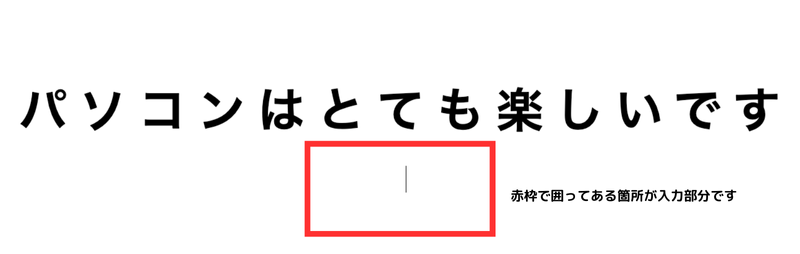
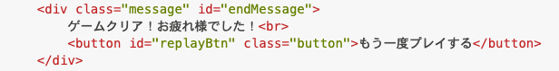

<!DOCTYPE html>
<html lang="ja">
<head>
    <meta charset="UTF-8">
    <meta http-equiv="X-UA-Compatible" content="IE=edge">
    <meta name="viewport" content="width=device-width, initial-scale=1.0">
    <link rel="stylesheet" href="../style.css">
    <title>10.タイピングゲーム</title>
</head>
<body>
<h1>タイピングゲームを作ろう！</h1>
<p>前回までの学習で、タイピングゲーム作成に必要な知識を学習してきました！<br>
今回からいよいよタイピングゲームを作成していきます！</p>

<h2><a href="../タイピングゲーム/index.html" target="_blank" rel="noopener noreferrer">見本はこちら</a></h2>

<h2><b>JavaScriptのコードの完成形を載せておくので、書く順番が分からなくなったら参考にしてください。</b></h2>

``` js
// script.js
const questions = [
    'スタートプログラミング',
    'プログラミングスクール',
    'ミンクル',
    'エンジニアになりたいな',
    'ゲームを作れるようになる！',
    '今はスクラッチを勉強中です',
    'いろんなところに教室があります',
    'タイピングの練習をがんばるぞ！',
    '検定問題にもチャレンジしています',
    'パソコンはとても楽しいです'
];

const entered = document.getElementById('entered');
const remained = document.getElementById('remained');
const inputText = document.getElementById('inputText');
const game = document.getElementById('game');
const message = document.getElementById('message');
const endMessage = document.getElementById('endMessage');
const timerElement = document.getElementById('timer');

let currentKey;
let currentText;
let timer;
let countTimer = 30; 

const setQuestion = () => {
    
    currentKey = Math.floor( Math.random() * questions.length );
    currentText = questions[ currentKey ];

    questions.splice(currentKey, 1);
    
    entered.textContent = '';
    remained.textContent = currentText;
    
    inputText.value = '';
};

const displayEndMessage = (messageText) => {
    clearInterval(timer);
    game.classList.add('hidden');
    message.classList.remove('hidden');
    endMessage.innerHTML = `${messageText}<br><button id='replayBtn' class='button'>もう一度プレイする</button>`;
    document.getElementById('replayBtn').addEventListener('click', () => {
        window.location.reload();
    });
};

const startTimer = () => {
    timer = setInterval(() => {
        countTimer--;
        timerElement.textContent = `${countTimer}秒`;

        if (countTimer <= 0) {
            displayEndMessage("タイムアップ！もう一度挑戦してね！");
        }
    }, 1000);
};

document.addEventListener('input', () => {
    const input = inputText.value;

    if (currentText.startsWith(input)) {
        entered.textContent = input;
        remained.textContent = currentText.slice(input.length);

        inputText.classList.add('correct');
        inputText.classList.remove('incorrect');

        if (input === currentText) {
            if (questions.length <= 0) {
                displayEndMessage("ゲームクリア！お疲れ様でした！");
            } else {
                setQuestion(); 
            }
        }
    } else {
        inputText.classList.add('incorrect');
        inputText.classList.remove('correct');
    }
});

setQuestion();
startTimer();

``` 
<p><b>それでは、早速作っていきましょう！</b></p>

<hr>
<h2><b>HTML</b></h2>
<p>①まずは、HTMLのコードを準備します。<br>
IDやclassがたくさん振ってありますが、そのIDを取得して操作する場面で解説をしていきます。</p>

<p>今は一つ一つのIDやclassの意味は分からなくても良いので、HTMLのコードを書いていきましょう！</p>

``` html
<!-- index.html -->
<div id="game" class="text-container">
    <div id="timer" class="timer">30秒</div>
    <label for="inputText">
        <div class="question">
            <span id="entered" class="marker"></span>
            <span id="remained"></span>
        </div>
        <input type="text" class="text" id="inputText" autofocus>
    </label>
</div>

<div id="message" class="text-container hidden">
    <div class="message" id="endMessage">
        ゲームクリア！お疲れ様でした！<br>
        <button id="replayBtn" class="button">もう一度プレイする</button>
    </div>
</div>
```
<hr>
<h2><b>CSS</b></h2>
<p>②次に、cssで見た目を整えていきます。<br>
今回はcssの学習ではないため、コードの中身を覚えたりチェックする必要はありません。</p>

<p>コードはそのままコピーして貼り付けてください。</p>

``` css
/* style.css */
.text-container {
    width: 100vw;
    height: 100vh;
    display: flex;
    flex-direction: column;
    justify-content: center;
    align-items: center;
}
.text-container label {
    width: 100%;
    height: 100%;
    display: flex;
    flex-direction: column;
    justify-content: center;
    align-items: center;
}
.question {
    display: flex;
    font-size: 4vw;
    font-weight: bold;
    letter-spacing: 0.25em;
    text-align: center;
}
.marker {
    background: #91dbf1;
}
.text {
    width: 100%;
    border: none;
    margin-top: 2rem;
    font-size: 2vw;
    letter-spacing: 0.1em;
    text-align: center;
}
.text:focus, .text:focus-visible {
    border: none;
    outline: none;
}
.message {
    display: block;
    margin-top: 2rem;
    font-size: 1.5rem;
    text-align: center;
}
.button {
    margin-top: 1rem;
    font-size: 1rem;
    cursor: pointer;
}
.hidden {
    display: none;
}
.correct {
    color: black;
}
.incorrect {
    color: red;
}
.timer {
    font-size: 2rem;
    margin-top: 1rem;
}
``` 

<p>コードを記述後、リロードして確認してみましょう！<br>
画像のようになっていれば上手くコードが記述出来ています。</p>

<hr>

<h2><b>JavaScript</b></h2>
<p>③次は、いよいよJavaScriptでタイピングゲームの動きの部分を作成していきます。<br>
まずは、今回タイピングする文章の部分を作成していきましょう！</p>

``` js
// script.js
const questions = [
    'スタートプログラミング',
    'プログラミングスクール',
    'ミンクル',
    'エンジニアになりたいな',
    'ゲームを作れるようになる！',
    '今はスクラッチを勉強中です',
    'いろんなところに教室があります',
    'タイピングの練習をがんばるぞ！',
    '検定問題にもチャレンジしています',
    'パソコンはとても楽しいです'
];
``` 
<p>それでは、上記コードの意味を解説していきます。</p>

``` js
// script.js
const questions = [
   
];
``` 
<p>この部分は、タイピングする文章を格納するための配列を定義しています。<br>
分かりやすく説明すると<code>questions</code>という名前の配列を作成しているということになります。<p>

<p>配列で作ることで、複数の文章を効率よく管理し、操作を簡単にすることが出来ます。<p>

``` js
// script.js
    'スタートプログラミング',
    'プログラミングスクール',
    'ミンクル',
    'エンジニアになりたいな',
    'ゲームを作れるようになる！',
    '今はスクラッチを勉強中です',
    'いろんなところに教室があります',
    'タイピングの練習をがんばるぞ！',
    '検定問題にもチャレンジしています',
    'パソコンはとても楽しいです'
``` 
<p>この配列には、タイピングゲームで使用する文章が格納されています。<br>
各文章はシングルコーテーション（''）で囲まれており、これは文字列を表しています。</p>

<p>配列の中では、各文章がカンマ（,）で区切られ、複数の文章を1つの変数にまとめて格納しています。</p>
</p>

<p>タイピングゲームでは、この配列からランダムに1つの文章が選ばれ問題が出題されていきます。</p>


<hr>
<p>④次は、タイピングゲームで必要なHTMLの要素をJavaScript側から取得してきましょう！<br>
先程のコードの続きに記述してください。</p>

``` js
// script.js
const entered = document.getElementById('entered');
const remained = document.getElementById('remained');
const inputText = document.getElementById('inputText');
const game = document.getElementById('game');
const message = document.getElementById('message');
const endMessage = document.getElementById('endMessage');
const timerElement = document.getElementById('timer');
```

<p>このコードでは、JavaScriptからHTML要素にアクセスし、<code>getElementById</code> で特定の ID を持つHTML要素を取得しています。</p>

<p>それでは、上記コードの意味を解説していきます。</p>

``` js
// script.js
const entered = document.getElementById('entered');
``` 
<p>タイピング中に、ユーザーが入力した部分のテキストを表示する要素を指しています。<br>
この<code>span</code>要素は、ユーザーが入力するたびにリアルタイムで更新されます。</p>


``` js
// script.js
const remained = document.getElementById('remained');
``` 
<p>まだ入力していない部分の問題文を表示する要素です。<br>
この <code>span</code>要素に、残りの文字列がリアルタイムで表示され、入力が進むにつれてテキストが減っていきます。</p>

``` js
// script.js
const inputText = document.getElementById('inputText');
``` 
<p>ユーザーが実際に入力するための <code>input</code> 要素で、タイピングゲームで文字を入力するためのテキストボックスです。</p>

``` js
// script.js
const game = document.getElementById('game');
``` 
<p>タイピングゲーム全体を管理するための要素です。</p>

``` js
// script.js
const message = document.getElementById('message');
``` 
<p>ゲーム終了時に表示されるメッセージ部分です。<br>
タイムアップやゲームクリアの際に、この <code>div</code>要素が表示され、ユーザーに結果を知らせます。</p>

``` js
// script.js
const endMessage = document.getElementById('endMessage');
``` 
<p>ゲーム終了後の具体的なメッセージ（タイムアップ）を表示する要素です。</p>

``` js
// script.js
const timerElement = document.getElementById('timer');
``` 
<p>残り時間をリアルタイムで表示するための要素です。<br>
この  <code>div</code> 要素には、タイマーの秒数が表示され、カウントダウンしていきます。</p>

<h2><b>「どのHTML要素に何のIDが付いていて、何のためにそのIDを取得しているのか」を説明したのですが、<br>
IDを付ける箇所もHTMLも自分で好きなように変更が出来るため、この作り方はあくまで一例になります！</b></h2>

<h2><b>「今回はこのようなやり方で作るんだな」という認識で大丈夫なので、深く理解する必要はありません！</b></h2>

<hr>
<p>⑤次は、問題番号を格納する変数やタイマーを管理する変数を作成していきましょう！<br>
先程のコードの続きに記述してください。</p>

``` js
// script.js
let currentKey;
let currentText;
let timer;
let countTimer = 30; 
``` 
<p>それでは、上記コードの意味を解説していきます。</p>

<p>先頭の<code>let</code>は変数の宣言を意味しています。</p>

<p><code>currentKey</code> は、現在の問題文の番号を格納するための変数です。<br>
後ほど、ランダムに選ばれた問題の番号がこの変数に保存されます。</p>

<p><code>currentText</code> は、現在表示されている問題文自体を保持する変数です。
後ほど、ランダムに選ばれた問題文がこの変数に格納され、ユーザーが入力するべきテキストとして使われます。</p>

<p><code>timer</code>は、タイマーを管理するための変数です。<br>
後ほど、<code>setInterval</code>関数を使って、この変数で時間のカウントダウンを管理します。</p>

<p><code>countTimer</code>ゲームのタイマーを30秒に設定する変数です。<br>
残り時間をリアルタイムで表示するために使われます。ゲーム開始時には30秒から始まり、カウントダウンしていきます。</p>


<hr>
<p>⑥次は、問題をランダムにセットする関数を作成していきましょう！<br>
先程のコードの続きに記述してください。</p>

``` js
// script.js
const setQuestion = () => {
    currentKey = Math.floor( Math.random() * questions.length );
    currentText = questions[ currentKey ];

    questions.splice(currentKey, 1);

    entered.textContent = '';
    remained.textContent = currentText;

    inputText.value = '';
};
``` 
<p>それでは、上記コードの意味を解説していきます。</p>

``` js
// script.js
const setQuestion = () => {
  
};
``` 
<p>ここでは、<code>setQuestion</code>という名前の関数をアロー関数を使って定義しています。</p>

``` js
// script.js
currentKey = Math.floor( Math.random() * questions.length );
``` 

<p>このコードでは、ランダムに問題を選ぶ処理が行われています。</p>

<p><code>Math.random()</code> は、0 以上 1 未満のランダムな小数を生成する関数です。<br>
例えば、0.25 や 0.97 などが生成されます。</p>

<p><code>questions.length</code> は、<code>questions</code> 配列の要素数を表します。<br>
今回は配列の中に 10 個の要素があるため、<code>questions.length</code> は 10 になります。</p>

<p>つまり、<code>Math.floor(Math.random() * questions.length)</code> では、<br>
0.25 や 0.97 などの「0 以上 1 未満」のランダムな小数に <code>questions.length</code>（今回は 10）を掛けています。</p>

<p>例えば、<code>Math.random()</code> が 0.25 であれば、<code>0.25 * 10</code> で 2.5、<br>
0.97 であれば <code>0.97 * 10</code> で 9.7 となります。</p>

<p><code>Math.floor()</code> は小数点以下を切り捨てて、整数を返す関数です。<br>
そのため、2.5 であれば「2」、9.7 であれば「9」という整数が返ってきます。</p>

<p>そして、返ってきた整数を<code>currentKey</code>という変数に格納しています。 </p>
<p>簡単にまとめると、ランダムに生成された数値を使って、配列の要素を選ぶ範囲を決めているということです。</p>

``` js
// script.js
currentText = questions[currentKey];
``` 
<p><code>questions</code>配列の中の<code>currentKey</code>番目を取得し、<br>
それを<code>currentText</code>に格納しています。</p>

<p><code>currentKey</code>には先程説明した通り、0から9までのいずれかの数値が格納されています。</p>

<p>つまり、<code>questions</code>という配列の中にある情報の中から、<br>
ランダムに選ばれた要素を<code>currentText</code>に格納しているということです。</p>

``` js
// script.js
questions.splice(currentKey, 1);
``` 
<p>このコードでは、選ばれた問題を配列の中から削除する処理をしています。</p>
<p><code>splice()</code>というメソッドは、配列に対して要素を追加、削除、または置き換えることが出来ます。</p>

<p><code>(currentKey, 1)</code>は、currentKey番目の要素を1つ削除するという意味になります。<br>
そのため、<code>currentKey</code>に「5」が格納されていれば、<code>questions</code>配列の5番目の要素を削除するということになります。</p>

<p>このようにして、一度選ばれた問題が再び出題されないように、配列から順次削除しています。</p>

``` js
// script.js
entered.textContent = '';
``` 
<p>このコードでは、ユーザーがこれまでに入力したテキストが表示されていた<code>entered</code>要素をリセットしています。</p>

``` js
// script.js
remained.textContent = currentText;
``` 

<p>選ばれた問題文が<code>currentText</code>に格納されているので、その問題を<code>remained</code>に表示します。<br>
これにより、次にユーザーが入力するべき問題文が画面に表示されます。</p>

``` js
// script.js
 inputText.value = '';
``` 
<p>このコードでは、<code>inputText</code> というテキスト入力欄の内容をリセットしています。</p>

<p><code>inputText.value = '';</code> というコードによって、<code>inputText</code> 要素の値が空文字 <code>''</code> に設定され、<br>
ユーザーがこれまで入力した内容がクリアされます。</p>

<p>つまり、入力フィールドが空の状態に戻り、次の問題に対して新たに入力を始める準備が整います。</p>


<p><code>entered.textContent = '';</code>は、見た目に表示されている、入力済みのテキストを消去します。<br>
これにより、前の問題に対する入力結果が画面から消えます。</p>

<p><code>inputText.value = '';:</code>は、テキストボックスの中身（ユーザーが実際に入力したもの）を消去します。<br>
これにより、次の問題に対して新しく入力できるようにリセットされます。</p>

<p>このように、<code>entered.textContent = '';</code> が見た目をクリアし、<code>inputText.value = ''; </code>が<br>
テキストボックスの中のデータ（中身）をクリアする役割を担っています。</p>

<h2><b>これで問題をランダムにセットする関数が出来たので、<br>
コードの一番下に<code>setQuestion()</code>と書いて、問題を表示させてみましょう！</b></h2>

<p>問題がランダムに表示されることが確認できたら、<code>setQuestion()</code>は一度消しておいてください。</p>

<hr>
<p>⑦次は、タイマーが0になった時やゲームがクリアされた時にメッセージを表示する関数を作成していきましょう！<br>
先程のコードの続きに記述してください。</p>

``` js
// script.js
const displayEndMessage = (messageText) => {
    clearInterval(timer);
    game.classList.add('hidden');
    message.classList.remove('hidden');
    endMessage.innerHTML = `${messageText}<br><button id='replayBtn' class='button'>もう一度プレイする</button>`;
    document.getElementById('replayBtn').addEventListener('click', () => {
        window.location.reload();
    });
};
``` 
<p>それでは、上記コードの意味を解説していきます。</p>

``` js
// script.js
const displayEndMessage = (messageText) => {
   
};
```
<p>ここでは、<code>setQuestion</code>という名前の関数をアロー関数を使って定義しています。</p>
<p><code>setQuestion</code>関数の引数<code>messageText</code>には、後ほど設定する文字列が入るのですが
<br>後で解説するので今はそのまま進んでもらって大丈夫です！</p>

``` js
// script.js
clearInterval(timer);
```
<p>ここでは、ゲーム内で動作しているタイマーを停止しています。<br>
具体的には、<code>setInterval</code>で開始されたタイマーを<code>clearInterval()</code>を使って止める処理です。</p>

<p>タイマーのプログラムは後ほど出てくるので、今は「この1文でタイマーを止めている」ということを覚えておきましょう。<br>

``` js
// script.js
game.classList.add('hidden');
```
<p>ここでは、ゲーム画面全体（<code>game</code>）要素を隠す処理をしています。</p>
<p><code>classList.add</code>はクラスを追加するという命令で、今回は<code>hidden</code>というクラスを追加しています。</p>

<p><code>hidden</code>というクラスには、cssで<code>display: none;</code>を<br>
当てているので、要素が隠れるという処理になります。</p>

<p>つまり、ゲームが終了したら問題文や入力欄を隠すという処理をここで行っているということになります。</p>

``` js
// script.js
message.classList.remove('hidden');
```
<p>ここでは、ゲーム終了メッセージを表示する処理をしています。</p>

<p><code>classList.remove</code>はクラスを削除するという命令で、<br>
今回は<code>message</code>要素についている<code>hidden</code>というクラスを削除しています。</p>

<p><code>hidden</code>というクラスには、cssで<code>display: none;</code>を<br>
当てているので、それが削除される＝要素が表示されるようになります。</p>

<p>表示される<code>message</code>要素は画像の箇所になります。</p>



<p>これにより、ゲーム終了時に終了メッセージが表示されるようになります！</p>

``` js
// script.js
endMessage.innerHTML = `${messageText}<br><button id='replayBtn' class='button'>もう一度プレイする</button>`;
```
<p>ここでは、ゲーム終了時に表示するメッセージと再プレイボタンを画面に表示する処理をしています。</p>

<p><code>endMessage</code>は、以前取得してきたHTML要素を示しています。</p>
<p><code>innerHTML</code>は、HTMLタグを含めて要素内の内容を設定・取得できるプロパティです。<br>
<b>ただし、セキュリティ上の都合でほとんど使うことはないので、今回のみ使うという認識で大丈夫です。</b></p>

<p><code>${messageText}</code> は、テンプレートリテラルを使用しており、<br>
バッククォート<code>``</code>で囲むことで、文字列の中に変数や式を埋め込むことができます。</p>

<p><code>messageText</code>には、後ほど設定する文字列が入るのですが、後で解説するので今はそのまま進んでもらって大丈夫です！</p>

<p><code>br</code>は改行タグです。</p>

<p><code>button id='replayBtn' class='button'> もう一度プレイする」</code>というコードでは<br>
再プレイボタンを作成しています。</p>

<p>ややこしく見えるかもしれませんが、<code>button</code>タグにIDとclassを付けて、<br>
「もう一度プレイする」というテキストを設定しているだけです。</p>

<p><b>まとめると、ゲーム終了時のメッセージと再プレイボタンを動的に表示させるための処理をしているということになります！</b></p>

``` js
// script.js
document.getElementById('replayBtn').addEventListener('click', () => {
       
});
```
<p>このコードは、再プレイボタン<code>replayBtn</code>がクリックされたときに実行される処理を設定する部分です。<br>
具体的には、<code>addEventListener()</code>を使ってクリックイベントをボタンに追加しています。</p>


``` js
// script.js
window.location.reload();
```
<p>このコードは、JavaScriptで現在のページを再読み込みするためのメソッドです。</p>

<p>つまり、ゲームが終了した後に「もう一度プレイする」ボタンをクリックすることでページがリロードされて<br>
もう一度最初からプレイできるようになっています。</p>

<h2><b>これでタイマーが0になった時やゲームがクリアされた時に<br>
メッセージを表示する関数が出来ました！</b></h2>

<hr>
<p>⑧次は、ゲーム実行時にカウントダウンされていくタイマーの関数を作成していきましょう！<br>
先程のコードの続きに記述してください。</p>

``` js
// script.js
const startTimer = () => {
    timer = setInterval(() => {
        countTimer--;
        timerElement.textContent = `${countTimer}秒`;

        if (countTimer <= 0) {
            displayEndMessage("タイムアップ！もう一度挑戦してね！");
        }
    }, 1000);
};
```
<p>それでは、上記コードの意味を解説していきます。</p>

``` js
// script.js
const startTimer = () => {
   
};
```
<p>このコードでは、アロー関数を使って<code>startTimer</code>という関数を定義しています。</p>

``` js
// script.js
timer = setInterval(() => {

}, 1000);
```

<p><code>setInterval()</code> は、指定した時間間隔（ミリ秒単位）ごとに特定の処理を繰り返し実行するための関数です。</p>

<p>1000 は 1秒（1000ミリ秒）を意味しているため、今回は1秒ごとに中の処理が実行されます。</p>

<p><code>setInterval()</code>という関数の実行時に「タイマーID」というものが返されるのですが、
このタイマーIDを<code>clearInterval()</code>に渡すことで、繰り返し処理を停止することが出来ます。</p>

<p>そのため、そのIDを<code>timer</code>という変数に保存しておく必要があるので、上記のように
<code>setInterval()</code>が返す値を<code>timer</code>という変数に保存しています。<p>


<p>タイマーを止める処理<code>clearInterval()</code>の説明は⑦で出てきているので、忘れてしまった場合は見返してみましょう！</p>

``` js
// script.js
countTimer--;
```
<p>これはタイマーの秒数を1ずつ減らす処理です。<br>
<code>countTimer</code> は最初に 30 で設定されているので、この部分で 1秒ごとに<code> countTimer</code> が減っていきます。</p>

<p><code>countTimer</code>の値を30に設定するコードは⑤で書いています。<p>

<p><code> -- </code>は、JavaScriptにおける「デクリメント演算子」と呼ばれるもので、変数の値を1ずつ減らすために使用されます。<p>

``` js
// script.js
timerElement.textContent = `${countTimer}秒`;
```

<p>これは画面に残り時間（タイマー）を表示する部分です。<br>
<code>timerElement</code>は以前IDで取得してきたHTML要素を指していて、<code>textContent</code> を使ってその要素に残り時間を表示しています。</p>


<p><code>`${countTimer}秒`</code>は、テンプレートリテラルを使用して文字列の中に変数を入れています。<br>
<code>テンプレートリテラル</code>では、バッククォート<code>``</code>を使って文字列を囲みます。</p>

<p>テンプレートリテラル内の ${} の中に <code>countTimer</code> という変数を入れているので<br>
その変数の現在の値が表示されます。</p>

<p>つまり、変数<code>countTimer</code>が1秒ずつ減っていくのでその情報を取得して<br>
文字として画面に表示させている処理がこのコードになります。</p>

``` js
// script.js
if (countTimer <= 0) {

}
```

<p>このコードは、もしタイマーが0以下になったら〜という条件文になります。</p>

``` js
// script.js
displayEndMessage("タイムアップ！もう一度挑戦してね！");
```

<p>このコードは、<code>displayEndMessage</code>という関数を呼び出しています。<br>
引数に「"タイムアップ！もう一度挑戦してね！"」という文字列が入っています。</p>

<p>つまり、タイマーが0以下になったらタイムアップのメッセージを呼び出すために<br>
<code>displayEndMessage</code>という関数を呼び出しているということになります。</p>

<h2><b>これでタイマーの関数が作成出来ました！</b></h2>


<hr>
<p>⑨次は、プレイヤーがテキスト入力を行う部分を作成していきましょう！<br>
先程のコードの続きに記述してください。</p>

``` js
// script.js
document.addEventListener('input', () => {
    const input = inputText.value;

    if (currentText.startsWith(input)) {
        entered.textContent = input;
        remained.textContent = currentText.slice(input.length);

        inputText.classList.add('correct');
        inputText.classList.remove('incorrect');

        if (input === currentText) {
            if (questions.length <= 0) {
                displayEndMessage("ゲームクリア！お疲れ様でした！");
            } else {
                setQuestion(); 
            }
        }
    } else {
        inputText.classList.add('incorrect');
        inputText.classList.remove('correct');
    }
});
```

<p>それでは、上記コードの意味を解説していきます。</p>

``` js
// script.js
document.addEventListener('input', () => {
    
});
```

<p>ここでは、<code>input</code>イベントが設定されています。<br>
<code>input</code>イベントは、入力フォーム（<code>inputText</code>）に文字が入力されるたびに発生します。</p>

``` js
// script.js
const input = inputText.value;
```
<p><code>inputText.value</code> は、プレイヤーが入力したテキストを取得しています。<br>
その値を<code>input</code>という変数に格納しています。つまり、プレイヤーが今入力している文字列がこの<code>input</code>に入ります。</p>

``` js
// script.js
if (currentText.startsWith(input)) {

} 
```
<p>ここでは、プレイヤーの入力が現在の問題の文字列（<code>currentText</code>）と一致しているかどうかを確認しています。</p>

<p><code>startsWith</code> は、JavaScriptの文字列メソッドの一つで、<br>
ある文字列が特定の文字列で始まっているかどうかを確認するために使われます。</p>

<p>例えば、問題が「スタートプログラミング」の場合、プレイヤーが「ス」と入力していれば、一致しているので処理が進みます。<br>
一致しない場合は次の else 部分に進みます。</p>

<p>つまり、<code>currentText.startsWith(input)</code> は、<code>currentText</code>の最初の部分が
プレイヤーの入力（<code>input</code>）と一致しているかどうかをチェックするメソッドです。</p>

``` js
// script.js
entered.textContent = input;
```
<p>このコードは、プレイヤーが入力した文字をリアルタイムで画面上に表示するためのものです。<br>
<code>entered</code> はこれまでに入力した正しい文字を表示する領域であり、<code>textContent</code> でその内容が更新されます。</p>

``` js
// script.js
remained.textContent = currentText.slice(input.length);
```
<p>ここでは、プレイヤーがまだ入力していない部分の文字列を取り出して、画面に表示する処理です。</p>

<p><code>remained</code>は事前に取得されたHTML要素で、プレイヤーがまだ入力していない、残りの文字列を表示するための要素です。</p>

<p><code>textContent</code> は、HTML要素内に表示されるテキストの内容を操作するプロパティです。<br>
<code>remained.textContent </code>では、<code>remained </code>要素のテキストを更新しています。</p>

<p><code>currentText </code>は、現在の問題の文字列を保持しています。<br>
例えば、「スタートプログラミング」が問題だったと仮定して説明を続けていきます。</p>

<p><code>slice(input.length)</code> は、文字列の一部を取り出すメソッドです。<br>
<code>slice() </code>の引数に開始位置を指定すると、その位置から文字列を切り取ります。</p>

<p><code>input.length</code> は、プレイヤーが入力した文字列の長さを表しています。<br>
例えば、プレイヤーが「スタート」を入力した場合、input.length は 4 になります（"スタート" の文字数）。</p>

<p>まとめると、<code>currentText.slice(input.length)</code> は、<code>input.length</code> の位置から文字列を切り取って返します。</p>

<p>もっと簡単に説明すると「正しく打てている部分とまだ打ててない部分をプログラムで分けている」ということになります。</p>

``` js
// script.js
inputText.classList.add('correct');
``` 

<p>ここでは、正しく文字を入力した場合に<code>classList.add()</code>でクラスを付けて、正しく打てた部分を黒色に変える処理をしています。<br>
実際に色を変える処理はcssで行っています。</p>

``` css
/* style.css */
.correct {
    color: black;
}
``` 

<p><code>inputText</code> は、事前に<code>document.getElementById() </code>などで取得された入力フィールド（テキストボックス）を指しています。</p>

``` js
// script.js
inputText.classList.remove('incorrect');
``` 

<p>ここでは、正しく文字を入力した場合に<code>classList.remove()</code>で<code>incorrect</code>というクラスを削除しています。</p>

<p><code>incorrect</code>というクラスが付いた時には、文字を赤色にするという命令がcssで書かれています。</p>

``` css
/* style.css */
.incorrect {
    color: red;
}
```
<p>つまり、その<code>incorrect</code>というクラスを取り外すことで文字が赤色ではなくなり、<br>
正しく打てているということが視覚的に分かるようになっています。</p>

``` js
// script.js
if (input === currentText) {
   
}
``` 

<p>ここでは、プレイヤーが入力した文字列<code>input</code>が、現在の問題の文字列<code>currentText</code>と<br>
完全に一致しているかをチェックしています。</p>

<p><code>input === currentText</code> は、入力内容が問題文とまったく同じである場合に<code> true </code>となり、<br>その場合のみ次の処理が実行されます。</p>

<p>例えば、<code>currentText</code> が「スタートプログラミング」で、プレイヤーがそれをすべて正しく入力したとき、この条件は <code>true </code>になり次の処理に移ります。</p>

``` js
// script.js
if (questions.length <= 0) {
    displayEndMessage("ゲームクリア！お疲れ様でした！");
} 
``` 
<p>ここでは、現在の問題を解き終わった後、残りの問題があるかどうかをチェックしています。</p>

<p><code>questions</code>は問題が入っている配列で、配列の長さが0より小さければ<br>
（つまり全ての問題を時間内に打ち終わって配列の要素が空になったら）<code>displayEndMessage</code>関数を呼び出します。</p>

<p>また、関数の引数に「"ゲームクリア！お疲れ様でした！！"」という文字列が入っているので<br>
関数の実行時に、この文字列が引数として渡されます。</p>

<p>つまり、全ての問題を打ち終わったらメッセージを呼び出すために<br>
<code>displayEndMessage</code>という関数を呼び出しているということになります。</p>

``` js
// script.js
else {
        setQuestion(); 
    }
``` 
<p><code>else</code>は、ではなければ〜という意味なので、もし残りの問題がある場合は<br>
次の問題に進むために<code>setQuestion</code>関数を呼び出して次の問題をセットしています。</p>

<p>つまり、<b>「問題がまだ残っていたら問題をセットして、問題がなくなればゲームクリアのメッセージを
表示させる</b>」という処理を行っています。</p>

``` js
// script.js
else {
        inputText.classList.add('incorrect');
        inputText.classList.remove('correct');
    }
``` 
<p>このコードは、プレイヤーが間違った入力をした場合の処理を行っています。</p>

<p>間違って文字を入力した場合は文字を赤色にしたいので、<code>classList.add()</code>で<code>incorrect</code>という<br>クラスを付けて、文字を赤色にしています。</p>

<p>また、それと同時に、<code>classList.remove</code>で<code>correct</code>という
<br>クラスを外すことで、文字が黒色になることを防いでいます。</p>

<p><code>inputText.classList.add('incorrect')</code> だけで赤色にすることはできますが、<br>
<code>correct</code> クラスが残っているとスタイルが競合する可能性があるため、<code>classList.remove</code>を実行しています。</p>

<h2><b>これでテキスト入力のプログラムが出来ました！</b></h2>

<hr>
<p>⑨最後に、問題を呼び出す関数とタイマーの関数を実行していきましょう！<br>
先程のコードの続きに記述してください。</p>

``` js
// script.js
setQuestion();
startTimer();
``` 

<p>ここでは、これまでに作成した関数を呼び出しています。<code>setQuestion()</code> は問題をセットし、<br><code>startTimer()</code> は時間を測るためのタイマーを開始します。</p>

 <p>関数の呼び出しは、関数の定義よりも後に書く必要があるので注意が必要です。<br>
 JavaScriptでは、関数の定義が実行される前にその関数を呼び出すとエラーになります。</p>
 
 <h2><b>これで全てのプログラムが完成しました！<br>
 実際にゲームで遊んでみましょう！</b></h2>

<hr>
<h2><b>練習問題</b></h2>

<p>①タイピングゲームの問題文を変えてみよう！<br>
（自分の好きな問題に変えてOKです）</p>

<p>②タイピングゲームの問題文を5問に減らし、タイマーを15秒に設定しよう！</p>

<p>③正しい文字が打てなかった場合の文字の色を青に変更してみよう！</p>

<p>④ゲームクリアのメッセージとゲーム終了のメッセージを変えてみよう！<br>
（自分の好きな言葉に変えてOKです）</p>


<!-- 折り畳み展開ポインタ -->
 <div onclick="obj=document.getElementById('open').style; obj.display=(obj.display=='none')?'block':'none';">
    <a style="cursor:pointer;">▼ 解答はこちらをクリックすると見れます</a>
    </div>
    <!--// 折り畳み展開ポインタ -->  
    <!-- 折り畳まれ部分 -->
    <div id="open" style="display:none;clear:both;">  
    <!--ここの部分が折りたたまれる＆展開される部分になります。
    自由に記述してください。-->

``` js
// 練習問題①
// script.js
const questions = [
    'エンジニア',
    '広島県広島市',
    '子ども向けスクール',
    'パソコン',
    '3Dゲームの作成',
    'ホームページの作成',
    'スクラッチ',
    'タイピングゲーム',
    'マインクラフトでプログラミング',
    '自分のパソコンを持っています'
];
```

``` js
// 練習問題②
// script.js
const questions = [
    'エンジニア',
    '広島県広島市',
    '子ども向けスクール',
    'パソコン',
    '3Dゲームの作成',
];

let countTimer = 15; 
```

``` css
// 練習問題③
/* style.css */
.incorrect {
    color: blue;
}
```

``` js
// 練習問題④
// script.js
if (countTimer <= 0) {
    displayEndMessage("惜しい！次は成功目指して頑張ってね！");
}

if (questions.length <= 0) {
    displayEndMessage("すごい！時間内に全て打つことが出来たね！");
}
```
<!--// 折り畳まれ部分 -->
</div>


