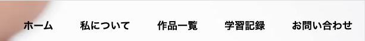
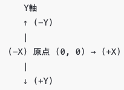

**```カリキュラム11```**

<!DOCTYPE html>
<html lang="ja">
<head>
    <meta charset="UTF-8">
    <meta http-equiv="X-UA-Compatible" content="IE=edge">
    <meta name="viewport" content="width=device-width, initial-scale=1.0">
    <link rel="stylesheet" href="../style.css">
    <title>11.ハンバーガーメニュー</title>
</head>
<body>
<h1>ハンバーガーメニューを作成してみよう！</h1>
<p>今回の学習より、webサイト制作でよく使われるJavaScriptの技術を学習していきます！<br>
最終的には、見本のような動きのあるサイトを作成していきます！</p>

<h2><a href="../jsポートフォリオ/index.html" target="_blank" rel="noopener noreferrer">見本はこちら</a></h2>

<p>今回の学習では、ハンバーガーメニューと呼ばれる部分の作成をしていきましょう！</p>

<h2><b>「11.ポートフォリオ編集用」というフォルダの中に入っているファイルを編集して使ってください。</b></h2>

<hr>

<h2><b>ハンバーガーメニューとは？</b></h2>
<p>ハンバーガーメニューとは、スマートフォンやタブレットなどの小さい画面でよく使われるデザインの一つです。<br>
下の画像のようなアイコンのことをハンバーガーメニューと言います。</p>

<p>このアイコンをタップすると、メニューが表示され、ホームページや他のページへのリンクが現れます。</p>


<p>これまで学習してきたHTMLとCSSだけでは、画面が小さくなった時にメニューの部分の横並びを<br>
継続することが難しくなってしまい、結果的にメニューを縦にしたり文字を小さくしたりと文字が見えにくくなってしまいました。</p>


<p>しかし、このハンバーガーメニューを使用すれば小さい画面でもメニューを隠せるので、デザインをすっきり見せることが出来ます。</p>

<p>スマホやタブレットのような小さい画面では本当によく使われるデザインになるので、しっかり作れるように学習をしていきましょう！</p>
<hr>

<h2><b>HTML</b></h2>
<p>①まずは、HTMLのコードを準備します。<br>
コードを記述する場所は、下記画像を参考にしてください。<p>


``` html
<!-- index.html -->
<div class="humburger">
    <span></span>
    <span></span>
    <span></span>
</div>
 
<div class="box">
    <div class="humburger_ul">
        <ul>
            <li><a href="index.html">ホーム</a></li>
            <li><a href="about.html">私について</a></li>
            <li><a href="production.html">作品一覧</a></li>
            <li><a href="learning.html">学習記録</a></li>
            <li><a href="contact.html">お問い合わせ</a></li>
        </ul>
    </div>
</div>
```
<p>それでは、上記コードの意味を解説していきます。</p>

``` html
<!-- index.html -->
<div class="humburger">
    <span></span>
    <span></span>
    <span></span>
</div>
``` 

<p>この部分では、ハンバーガーメニューのアイコン部分を作っています。</p>

``` html
<!-- index.html -->
<div class="humburger">
  
</div>
``` 
<p>まず、ハンバーガーメニューのアイコン全体を囲むdivタグを用意しています。<br>
クラス名は分かりやすくするために<code>humburger</code>にしています。</p>

``` html
<!-- index.html -->
<span></span>
<span></span>
<span></span>
``` 

<p>この<code>span</code>タグは、ハンバーガーメニューの横線1本を表現するための「線」です。<br>
<code>span</code>タグを3つ並べることで、ハンバーガーメニューの3本線の見た目を作ります。</p>

<p>タグ内にテキストはありませんが、CSSで横線の太さや色を指定することで「線」を作っていきます。</p>

``` html
<!-- index.html -->
<div class="box">
    <div class="humburger_ul">
        <ul>
            <li><a href="index.html">ホーム</a></li>
            <li><a href="about.html">私について</a></li>
            <li><a href="production.html">作品一覧</a></li>
            <li><a href="learning.html">学習記録</a></li>
            <li><a href="contact.html">お問い合わせ</a></li>
        </ul>
    </div>
</div>
``` 
<p>この部分では、ハンバーガーメニューのメニュー部分を作っています。<br>
もう少し詳しく説明すると、画像のようにハンバーガーメニューが開かれた時の部分を作成しています。</p>


``` html
<!-- index.html -->
<div class="box">
   
</div>
``` 

<p>この部分は、ハンバーガーメニュー全体を囲むdivタグです。<br>
<code>box</code>というクラスに対してcssを当てて、メニューの表示・非表示を切り替えます。</p>

``` html
<!-- index.html -->
<div class="humburger_ul">
    <ul>
        <li><a href="index.html">ホーム</a></li>
        <li><a href="about.html">私について</a></li>
        <li><a href="production.html">作品一覧</a></li>
        <li><a href="learning.html">学習記録</a></li>
        <li><a href="contact.html">お問い合わせ</a></li>
    </ul>
</div>
``` 

<p>この部分は、実際のメニュー項目のコードです。<br>
<code>humburger_ul</code>というクラスに対してcssを当ててメニューの位置を調整するために、divタグを用意しています。</p>

<p>中に<code>li</code>タグが入っていますが、ここがメニューの部分になります。<br>
言い換えると、これまでheaderに表示していたメニューがここに入るということになります。</p>

<h2><b>これでHTMLの記述は終了です！次はcssを記述していきましょう！</b></h2>
<hr>

<h2><b>CSS</b></h2>
<p>②次に、CSSのコードを準備します。<br>
コードを記述する場所は、下記画像を参考にしてください。<p>


``` css
/* style.css */
.box{
    display: none;
}
``` 

<p>それでは、上記コードの意味を解説していきます。</p>
<p>ここでは、boxというクラスが付いた箇所（ハンバーガーメニューが開いた時の画面全体を覆う白い背景）を<br><code> display: none;</code>という命令を使って非表示にしてします。</p>

<p>今回作成しているハンバーガーメニューは画面サイズが960px以下になった時に（タブレットサイズ以下）<br>
表示させたいので、pcサイズや画面サイズが960px以下の時には非表示にしておく必要があります。</p>

<p>そのため、pcサイズの時は <code>display: none;</code>を使ってハンバーガーメニューを非表示にしています。</p>

<hr>
<p>③次に、画面サイズが960px以下になった時にハンバーガーメニューを表示させるための<br>
cssを記述していきましょう！</p>

<p><code>@media (max-width:960px) {}</code>というレスポンシブ対応のコードが<br>
すでにcssに記述してあるので、その中に書いていきましょう！</p>

``` css
/* style.css */
.menu{
    display: none;
}

.humburger{
    position: fixed;
    top: 0;
    right: 0;
    width: 50px;
    height: 50px;
    background-color: black;
    z-index: 2;
}

.humburger span{
    position: absolute;
    width: 30px;
    height: 2px;
    background-color: #fff;
    transition: 0.5s;
    margin-left: 10px;
}

.humburger span:nth-of-type(1){
    top: 15px;
}

.humburger span:nth-of-type(2){
    top: 25px;
}

.humburger span:nth-of-type(3){
    top: 35px;
}

.humburger.open span:nth-of-type(1){
    transform:translateY(10px) rotate(45deg);
}

.humburger.open span:nth-of-type(2){
    opacity: 0;
}

.humburger.open span:nth-of-type(3){
    transform:translateY(-10px) rotate(-45deg);
}

.box{
    display: block;
    position: fixed;
    top: 0;
    bottom: 0;
    left: 0;
    right: 0;
    background-color: #fff;
    color: black;
    z-index: 1;
    opacity: 0;
    pointer-events: none;
    transition: 0.5s;
}

.box.open{
    opacity: 1;
    pointer-events: auto;
}

.humburger_ul{
    width: 90%;
    margin: 0 auto;
    font-size: 1rem;
    text-align: center;
}

.humburger_ul ul{
    padding-left: 0;
    margin-top: 50%;
}

.humburger_ul li{     
    list-style: none;
    margin-bottom: 20px;
    font-size: 2rem;
}

.humburger_ul a{
    color: black;
    text-decoration: none;
}
```
<p>それでは、上記コードの意味を解説していきます。</p>

``` css
/* style.css */
.menu{
    display: none;
}
```
<p>ここでは、<code>menu</code>というクラスが付いた箇所を<code>display: none;</code>を使って非表示にしています。</p>

<p><code>menu</code>というクラスは、headerの中で作成しているメニューの箇所になるので、<br>
つまりは元々headerにあったメニューの部分(画像の箇所)を隠すためにこのコードが必要ということになります。</p>



``` css
/* style.css */
.humburger{
    position: fixed; /* ハンバーガーメニューを画面に固定 */
    top: 0;　/* 上から0の位置にする（これで上に固定） */
    right: 0;　/* 右から0の位置にする（これで右端に固定） */
    width: 50px;　/* 横幅を50pxに設定 */
    height: 50px;　/* 縦幅を50pxに設定 */
    background-color: black;　/* 背景色を黒にする */
    z-index: 2;　/* ハンバーガーメニューが他の要素より前に来るように設定 */
}
```
<p>ここでは、ハンバーガーメニューを画面の右上に固定させています。<br>
<code>position: fixed;</code>を使って固定しているところがポイントです。</p>

``` css
/* style.css */
.humburger span{
    position: absolute; /* 各横線の位置をhumburger内で自由に配置する設定。 */
    width: 30px; /* 横幅を30pxに設定 */
    height: 2px; /* 縦幅を2pxに設定 */
    background-color: #fff; /* 背景色を白にする */
    transition: 0.5s; /* ハンバーガーメニューのアニメーションをスムーズにするための時間（0.5秒 */
    margin-left: 10px; /* 左側に10pxの余白を空ける */
}
```

<p>ここでは、ハンバーガーメニューの線（spanタグ）のレイアウトを調整しています。<br>
<code>position: absolute;</code>を使ってspanタグのレイアウトを調整しているところがポイントです。</p>
</p>

```css
/* style.css */
.humburger span:nth-of-type(1){
    top: 15px;
}

.humburger span:nth-of-type(2){
    top: 25px;
}

.humburger span:nth-of-type(3){
    top: 35px;
}
```

<p>ここでは、ハンバーガーメニューの線（spanタグ）の位置を調整しています。</p>

<p><code>span:nth-of-type()</code>では、<code>span</code>タグの何番目の線に対して命令を当てるかということを指定しています。</p>

<p><code>span:nth-of-type(1)</code>では、1つ目の<code>span</code>タグに対して上から15pxの位置に線を調整したいため
<code>top: 15px;</code>という命令を当てています。</p>

<p><code>span:nth-of-type(2)</code>では、2つ目の<code>span</code>タグに対して上から15pxの位置に線を調整したいため
<code>top: 25px;</code>という命令を当てています。</p>

<p><code>span:nth-of-type(3)</code>では、3つ目の<code>span</code>タグに対して上から15pxの位置に線を調整したいため
<code>top: 35px;</code>という命令を当てています。</p>


```css
/* style.css */
.humburger.open span:nth-of-type(1){
    transform:translateY(10px) rotate(45deg);
}

.humburger.open span:nth-of-type(2){
    opacity: 0;
}

.humburger.open span:nth-of-type(3){
    transform:translateY(-10px) rotate(-45deg);
}
```

<p>ここでは、ハンバーガーメニューのアニメーション（×に変化させる動き）を作っています。</p>

<p>後ほどJavaScriptで「ハンバーガーメニューがクリックされたら<code>opan</code>というクラスを付ける」という命令を書いていきます。<br>
ここでは、<code>.humburger</code>に<code>open</code>というクラスが設定された時の動き、つまりハンバーガーメニューがクリックされた時のアニメーションを作成しています。</p>

<p>まず、<code>span</code>タグの1つ目（線の1本目）に対して<code>transform:translateY(10px) rotate(45deg);</code>という命令を当てていますが<code>、transform</code>は要素の位置や回転傾きを変更するCSSプロパティになります。</p>

<p><code>translateY(10px)</code>は要素を縦方向(Y軸)に10px移動するという命令になります。</p>
<p><code>rotate(45deg)</code>は要素を時計回りに45度回転させるという命令になります。</p>


<p>次に、<code>span</code>タグの2つ目（線の2本目）に対して<code>opacity: 0;</code>という命令を当てていますが<code>opacity: 0;</code>は要素を透明にする（つまり非表示にする）という命令になります。</p>

<p>最後に、<code>span</code>タグの3つ目（線の3本目）に対して<code>transform:translateY(-10px) rotate(-45deg);</code>という命令を当てていますが、これは1本目の線と反対になる動きを行っています。</p>

<p>これらを組み合わせることで、線が指定した位置や角度で動くようになります。</p>

<p>また、コンピュータの画面では、左上が原点 (0, 0) になります。<br>
そして、画面を下に進むほどY座標が大きくなり、右に進むほどX座標が大きくなります。<br>
これは、コンピュータが画面を左上から右下に向かって描画しているためです。この考え方を覚えておきましょう！</p>



```css
/* style.css */
.box{
    display: block; /* boxを表示可能な状態にする */
    position: fixed; /* メニューを画面全体に固定。 */
    top: 0; /* 要素の上端を画面の上端に合わせる */
    bottom: 0; /* 要素の下端を画面の下端に合わせる */
    left: 0; /* 要素の左端を画面の左端に合わせる */
    right: 0; /* 要素の右端を画面の右端に合わせる */
    background-color: #fff; /* 背景色を白に設定 */
    color: black; /* 文字の色を黒に設定 */
    z-index: 1; /* 要素の重なり順序を指定（ハンバーガーメニューより後ろになるように設定） */
    opacity: 0; /* 要素を完全に透明にする */
    pointer-events: none; /* 初期状態では透明でクリックできない設定 */
    transition: 0.5s; /* メニューの表示アニメーションの時間を0.5秒に設定。 */
}
```

<p>ここでは、ハンバーガーメニューが開いた時の画面全体を覆う白い背景を作っています。</p>

<p>ここでは、<code>display: block;</code>を使って表示可能な状態にしていますが、同時にopacity: 0;を設定しているため、見えない状態にしています。<br>
また、<code>pointer-events: none;</code>によって、背景がクリックされないようになっています。</p>

<p>これにより、背景はHTML上に存在しているものの、透明かつ操作できない状態になります。</p>

<p><code>display: block;</code>を使用して背景を表示可能にしておきながら、<code>opacity: 0;</code>で視覚的には非表示にすることで、後からスムーズに表示（フェードイン）できるようになっています。<br>
この仕組みを活用して、ハンバーガーメニューの開閉アニメーションを実現しています！</p>

```css
/* style.css */
.box.open{
    opacity: 1; /* 要素の透明度を1にする（完全に表示する） */
    pointer-events: auto; /* 要素が通常通りイベント（クリック、ホバーなど）を受け付ける */
}
```
<p>ここでは、boxに<code>open</code>というクラスが付いた時（ハンバーガーメニューがクリックされた時）の処理を記述しています。</p>

<p>クリックされると元々設定していた白い背景を表示させたいので、<code>opacity: 1;</code>として要素を表示させています。</p>

```css
/* style.css */
.humburger_ul{
    width: 90%; /* 横幅を90%に設定 */
    margin: 0 auto; /* 要素を中央にする */
    font-size: 1rem; /* 文字の大きさを1rem(16px)に設定 */
    text-align: center; /* テキストを中央に寄せる */
}

.humburger_ul ul{
    padding-left: 0; /* 左側の余白を0にする */
    margin-top: 50%;　/* 上側の余白を50%空ける */
}

.humburger_ul li{     
    list-style: none; /* リストの黒点をなくす */
    margin-bottom: 20px; /* 下側の余白を20px空ける */
    font-size: 2rem; /* 文字の大きさを2rem(32px)に設定 */
}

.humburger_ul a{
    color: black;  /* 文字の色を黒にする */
    text-decoration: none; /* aタグにデフォルトで付いている下線をなくす */
}
```

<p>ここでは、ハンバーガーメニューを開いた時のメニュー部分のレイアウトを整えています。</p>


<h2><b>これでCSSの記述は終了です！最後はJavaScriptを記述していきましょう！</b></h2>

<hr>
<h2><b> JavaScript</b></h2>
<p>③最後に、 JavaScriptのコードを記述していきます！<br>
まずは、script.jsという名前のファイルを作成し、JavaScriptを読み込むためのコードをhtmlのheadタグの中に書きましょう！<p>

``` html
<!DOCTYPE html>
<html lang="ja">
<head>
    <meta charset="UTF-8">
    <meta http-equiv="X-UA-Compatible" content="IE=edge">
    <meta name="viewport" content="width=device-width, initial-scale=1.0">
    <link rel="stylesheet" href="style.css">
    <!-- ↓ JavaScriptのファイルを読み込ませるためのコード -->
    <script src="script.js" defer></script>
    <title>PORTFOLIO</title>
</head>
``` 


<p>ファイルの準備が出来たら、以下のコードをscript.jsのファイルに記述していきましょう！</p>


``` js
/* script.js */
const humburger = document.querySelector(".humburger");
const box = document.querySelector(".box");

humburger.addEventListener("click", () => {
humburger.classList.toggle("open");
box.classList.toggle("open");
});
``` 

<p>それでは、上記コードの意味を解説していきます。</p>

``` js
/* script.js */
const humburger = document.querySelector(".humburger");
const box = document.querySelector(".box");
``` 

<p>この部分では、<code>document.querySelector();</code>を使用して<br>
<code>humburger</code>というクラスと<code>box</code>というクラスが付いた要素を取得しています。</p>


``` js
/* script.js */
humburger.addEventListener("click", () => {
humburger.classList.toggle("open");
box.classList.toggle("open");
});
``` 

<p>この部分では、ハンバーガーメニューがクリックされた時に「開く」「閉じる」動作を実現するための処理を行っています。
</p>

``` js
/* script.js */
humburger.addEventListener("click", () =>
``` 
<p>ここで、「<code>humburger</code>がクリックされたら〜」という処理をしており、</p>


``` js
/* script.js */
humburger.classList.toggle("open");
``` 
<p><code>humburger</code>に対して、<code>classList.toggle("open")</code>を指定しているので、<br>
「<code>open</code>というクラスがなければ付ける、あれば取り外す」という処理をしています。</p>

<p><code>humburger</code>に対して<code>open</code>というクラスが付くと<br>
ハンバーガーメニューが開くプログラムを設定しているので、線が動くようになってハンバーガーメニューが '×' の形に変化します。</p>


``` js
/* script.js */
box.classList.toggle("open");
``` 
<p>この部分も同様に、<code>box</code>に対して、<code>classList.toggle("open")</code>を指定しているので、<br>
「<code>open</code>というクラスがなければ付ける、あれば取り外す」という処理をしています。</p>

<p><code>box</code>に対して<code>open</code>というクラスが付くと<br>
後ろの白い背景が現れるようにcssで設定してあります。</p>

<h2><b>これでJavaScriptの記述は終了です！<br>
実際にハンバーガーメニューをクリックして動きを確認してみましょう！</b></h2>

<hr>
<h2><b>練習問題</b></h2>
<p>①ハンバーガーメニューの線（span）の色を黄色に変更してみよう！</p>

<hr>
<p>②ハンバーガーメニューを開いた時の背景のboxの色をgray、メニューの文字の色を白色に変更してみよう！</p>

<hr>
<p>③ハンバーガーメニューを左上に配置してみよう！</p>

<hr>
<p>④背景のboxが開く時間を1秒に変更しよう！</p>


<!-- 折り畳み展開ポインタ -->
 <div onclick="obj=document.getElementById('open').style; obj.display=(obj.display=='none')?'block':'none';">
    <a style="cursor:pointer;">▼ 解答はこちらをクリックすると見れます</a>
    </div>
    <!--// 折り畳み展開ポインタ -->  
    <!-- 折り畳まれ部分 -->
    <div id="open" style="display:none;clear:both;">  
    <!--ここの部分が折りたたまれる＆展開される部分になります。
    自由に記述してください。-->

 ``` css
// 練習問題① 
/* style.css */
.humburger span{
    background-color: yellow;
}
```

 ``` css
// 練習問題②
/* style.css */
.box{
    background-color: gray;
}

.humburger_ul a{
    color: white;
}
```

 ``` css
// 練習問題③
/* style.css */
 .humburger{
    position: fixed;
    top: 0;
    left: 0;
}
```

 ``` css
// 練習問題④
/* style.css */
.box{
    transition: 1s;
}
```