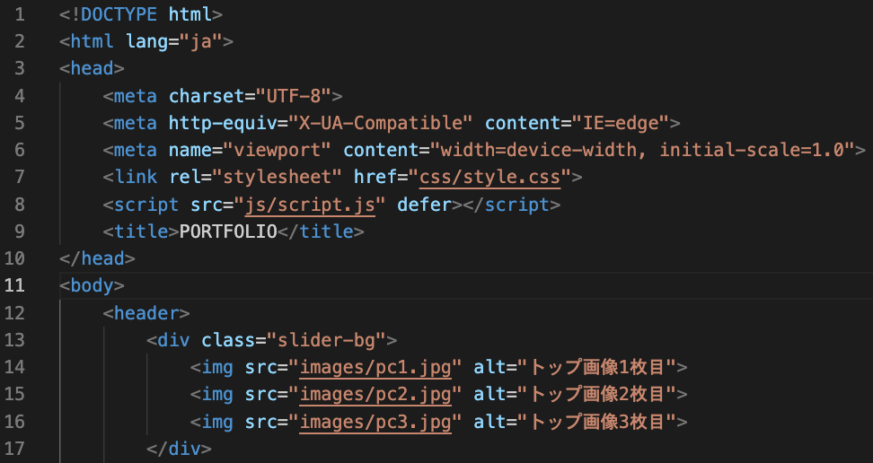
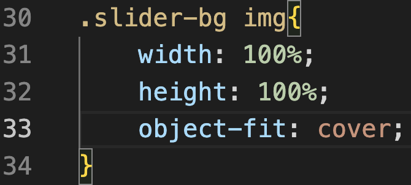
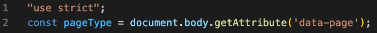

**```カリキュラム12```**

<!DOCTYPE html>
<html lang="ja">
<head>
    <meta charset="UTF-8">
    <meta http-equiv="X-UA-Compatible" content="IE=edge">
    <meta name="viewport" content="width=device-width, initial-scale=1.0">
    <link rel="stylesheet" href="../style.css">
    <title>12.スライダー</title>
</head>
<body>
<h1>写真が自動で切り替わるスライダーを作成してみよう！</h1>
<p>今回の学習では、写真が自動で切り替わる「スライダー」と呼ばれる部分の作成をしていきましょう！</p>

<h2><a href="../jsポートフォリオ/index.html" target="_blank" rel="noopener noreferrer">見本はこちら</a></h2>

<h2><b>「12.ポートフォリオ編集用」というフォルダの中に入っているファイルを編集してコード書いていくので、下記リンクよりフォルダごとダウンロードしてください。</b></h2>

<h2><a href="https://drive.google.com/drive/folders/1SE-N2RqSsZbXKfiBa8OJ9yEChmyhRRHJ" target="_blank" rel="noopener noreferrer">ダウンロードはこちら</a></h2>

<hr>

<h2><b>HTML</b></h2>
<p>①まずは、HTMLで画像を入れていきます。<br>
コードを記述する場所は、下記画像を参考にしてください。<p>



``` html
<!-- index.html -->
 <div class="slider-bg">
    
    
    
</div>
```
<p>ここでは、トップページでスライドさせる写真を3枚用意しています。<br>
画像はimagesフォルダの中に入っているので、そちらを使用してください。</p>

<hr>

<p>②次に、このスライダーを適用させる範囲をhtmlで記述していきます。</p>

<p>これまでのようにJavaScriptにコードを記述するやり方だと、全てのページにコードが反映されてしまいエラーになってしまいます。<br>
例えば、トップページだけにある「スライダー」に関するコードが他のページで実行されると、スライダーが存在しないためエラーになります。</p>

<p>これを防ぐため、特定のページだけにJavaScriptを適用する方法が必要です。<br>
今回はindex.htmlだけにしかスライダーがないので、index.htmlだけにスライダーを適用させていきます。</p>

<p>方法として、<code>data-page="index" </code>という属性をbodyタグに追加することで、「このページはトップページです」という情報をJavaScriptに伝えることができます。<br>
このようにして、JavaScriptはトップページかどうかを判別し、必要なコードだけを実行できます。</p>


``` html
<!-- index.html -->
<body data-page="index">
```

<h2><b>これでHTMLの記述は終了です！次はCSSを記述していきましょう！</b></h2>
<hr>

<h2><b>CSS</b></h2>

<p>③次に、cssでスライダーの視覚的な部分（画像の配置や切り替え効果）を制御する処理を書いていきます。<br>
画像のようにcssがすでに書かれているので、続きから記述しましょう！</p>



``` css
/* style.css */
.slider-bg img {
    width: 100%;
    height: 100%;
    object-fit: cover; /*画像の縦横比を保ったまま、画像を表示*/
    position: absolute; /*画像同士が重なり合うように設定*/
    opacity: 0; /*画像を完全に透明にする（非表示）*/
    transition: opacity 1s; /*opacity（透明度）の変化を1秒間かけてスムーズに行います*/
}

.slider-bg img.active {
    opacity: 1; /*activeというクラスが付いた画像を完全に表示します（透明度を100%にする）*/
}
``` 
<p>ここで実現させたいこととして、<br>
①初期状態では、opacity: 0; の設定によりすべての画像が非表示。<br>
②JavaScriptによって、特定の画像に .active クラスが付けられると、その画像だけ opacity: 1; で表示される。<br>
③CSSの transition: opacity 1s; により、画像がフェードインするアニメーション効果が付く。<br>
という流れになります。</p>

<p>「どのタイミングでクラスを付けたり外したりするか」ということはJavaScriptで記述するので、
今は流れを理解しておきましょう！</p>

<h2><b>これでCSSの記述は終了です！最後にJavaScriptを記述していきましょう！</b></h2>
<hr>

<h2><b>JavaScript</b></h2>

<p>④まず、HTMLのbodyタグに設定されたカスタム属性<code>data-page</code>を読み取り、その値を基に現在のページがどの種類であるかを判定します。</p>

<p>以下のコードはscript.jsの上から2行目に記述してください。</p>


``` js
// script.js
const pageType = document.body.getAttribute('data-page');
```

<p><code>document.body.getAttribute('data-page');</code>は、HTMLのbodyタグに設定された<br><code>data-page</code>属性の値（例: "index"）を取得するコードです。</p>

<p>
そして、取得した情報を<code>pageType</code>という定数に保存しています。<br>
この<code>pageType</code>の値を利用して、ページごとに異なる処理を実行することができます。
</p>
<hr>

<p>⑤次に、どのページにスライダー機能を実装するのかということを<code>if</code>文を用いて記述します。<br>
前回の学習でハンバーガーメニューのコードを書いているので、そのコードの下に書いていきましょう。</p>

``` js
// script.js
if (pageType === 'index') {
}
```
<p><code>if (pageType === 'index')</code> の条件は、<code>pageType</code>が<code>"index"</code>である場合に処理を実行するという意味です。</p>

つまり、このコードを使うことでスライダー機能をindex.html（トップページ）でのみ動作させることができます。</p>
<hr>

<p>⑥最後に、写真が自動で切り替わるスライダーを実装していきます。<br>
今回の実装では、以下の3つのステップで進めます。</p>
<p>1. 画像を取得 - スライダー内に表示する画像を用意します。<br>
2. 画像を表示 - 最初の画像だけを画面に表示します。<br>
3. 画像を切り替え - 3秒ごとに次の画像に切り替わる仕組みを作ります。</p>
<p>これにより、写真が順番に自動で切り替わる動きを実現します！</p>

<p>⑤で書いたコードの中に、以下のコードを書いていきましょう！<p>

``` js
// script.js
if (pageType === 'index') {
const SliderImages = document.querySelectorAll('.slider-bg img');
let currentIndex = 0;

SliderImages[currentIndex].classList.add('active');

const changeSlide = () => {
    SliderImages[currentIndex].classList.remove('active');
    currentIndex = (currentIndex + 1) % SliderImages.length; 
    SliderImages[currentIndex].classList.add('active');
};
setInterval(changeSlide, 3000);
}
```
<p>それでは、上記コードを解説していきます。<p>

``` js
// script.js
const SliderImages = document.querySelectorAll('.slider-bg img');
```
<p>上記コードでは、<code>querySelectorAll</code>を使用して<code>slider-bg</code>というクラスが付いたdivタグの中にある画像（img）を取得し、<br>取得した情報を変数<code>SliderImages</code>に保存しています。<p>

<p>つまり、スライドさせる画像の情報をここで取得しているということになります。<p>

``` js
// script.js
let currentIndex = 0;
``` 
<p><code>currentIndex</code>という変数を用意し、初期値を0にしています。<br>
この変数を使って、現在表示している画像の位置を管理していきます。<p>

``` js
// script.js
SliderImages[currentIndex].classList.add('active');
``` 

<p>このコードを直訳すると、「<code>SliderImages</code>の<code>currentIndex</code>番目に対して、<code>active</code>というクラスを付ける」という意味になります。</p>

<p>まず、<code>SliderImages</code>には<code>querySelectorAll</code>を使用して取得した画像の情報が入っています。<br>
その画像の<code>currentIndex</code>番目に対してクラスを付けるのですが、現在<code>currentIndex</code>には初期値の0が入っています。</p>

<p>よって、「画像の0番目（つまり1枚目）に対して<code>active</code>というクラスを付ける」という命令になります。<br>
このクラスを付けることで、CSSで設定されたスタイル（画像を表示するための<code>opacity: 1</code>）が適用され、1枚目の画像が画面に表示される仕組みです。</p>

``` js
// script.js
const changeSlide = () => {

};
``` 
<p>このコードは、関数 <code>changeSlide</code>を宣言しています。<br>
この関数はスライダーの画像を切り替えるための処理を記述する場所になります。</p>

``` js
// script.js
SliderImages[currentIndex].classList.remove('active');
``` 
<p>このコードを直訳すると、「<code>SliderImages</code>の<code>currentIndex</code>番目に対して、<code>active</code>というクラスを取り外す」という意味になります。</p>

<p>もう少し簡単に説明すると、現在表示されている画像を取得して、その画像からactiveクラスを取り外すという命令になります。</p>

<p><code>active</code>クラスを取り外すことで、CSSで設定されたスタイル（画像を表示するための<code>opacity: 1</code>）が適用されなくなり、画像が非表示になる仕組みです。</p>


``` js
// script.js
currentIndex = (currentIndex + 1) % SliderImages.length; 
``` 
<p>このコードは、スライダーで次の画像に移動するための計算を行っています。</p>

<p><code>(currentIndex + 1)</code>は、現在表示されている画像のインデックス（<code>currentIndex</code>）を1増やします。</p>

<p><code>SliderImages.length</code>は、スライダー内の画像の総数を表します。</p>

<p>次に表示する画像を決定するために、<code>(currentIndex + 1) % SliderImages.length</code> を使って、画像の総数を超えないように余りを計算しています。</p>

<p>%は、モジュロ演算子と呼ばれ、 割り算の余りを計算する演算子です。</p>


``` js
// 例）
5 % 3;  //  結果は 2（5 ÷ 3 の余り）
10 % 4; //  結果は 2（10 ÷ 4 の余り）
9 % 3; // 結果は 0（9 ÷ 3 の余りはなし）
``` 

<p>例えば、画像が3枚ある場合、インデックスは以下のように繰り返します。</p>

<ul>
<li>現在のインデックスが 0<br>
(0 + 1) % 3 = 1 → 次は 1（2枚目の画像）</li>

<li>現在のインデックスが 1<br>
(1 + 1) % 3 = 2 → 次は 2(3枚目の画像）</li>

<li>現在のインデックスが 2<br>
(2 + 1) % 3 = 0 → 次は 0（最初に戻る）</li>
</ul>


<p>このようにして、画像が順番に切り替わり、最後の画像の後は最初の画像に戻る仕組みを実現しています。</p>


``` js
// script.js
SliderImages[currentIndex].classList.add('active');
``` 

<p>ここで、選択された画像に<code>active</code>クラスを付けることで画像を表示させています。</p>

``` js
// script.js
setInterval(changeSlide, 3000);
``` 
<p>このコードの役割は、<code>changeSlide</code>関数を3秒ごと（3000ミリ秒ごと）に繰り返し実行することです。<br>
これにより、3秒ごとに次の画像に切り替わるようになります。</p>

<h2><b>これで全てのコードの記述が終わり、スライダーが完成しました！</b></h2>


<hr>
<h2><b>練習問題</b></h2>
<p>ボタンを追加して、ユーザーが手動で次のスライドに移動できるように機能を拡張してください。</p>

<p><b>仕様</b></p>
<p>・新しくindex.htmlとscript.jsのファイルを作成<br>
・index.htmlにスライダー用の画像を3枚追加（画像は何でも大丈夫です）<br>
・次のスライドに移動するためのボタンをHTMLに追加<br>
・ボタンがクリックされたときに、activeクラスを付けたり外したりするコードをJavaScriptで記述<br>
・cssは下記コードをそのままコピーして使用してください
</p>

``` css
/* style.css */
.slider-bg{
    position: absolute;
    top: 0;
    left: 0;
    width: 100%;
    height: 100%;
    overflow: hidden;
    z-index: -1;
}

.slider-bg img {
    width: 100%;
    height: 100%;
    object-fit: cover; 
    position: absolute;
    opacity: 0; 
    transition: opacity 1s ease; 
}

.slider-bg img.active {
    opacity: 1; 
}
``` 

<h2><a href="./12.練習問題見本/index.html" target="_blank" rel="noopener noreferrer">見本はこちら</a></h2>

<!-- 折り畳み展開ポインタ -->
 <div onclick="obj=document.getElementById('open').style; obj.display=(obj.display=='none')?'block':'none';">
    <a style="cursor:pointer;">▼ 解答はこちらをクリックすると見れます</a>
    </div>
    <!--// 折り畳み展開ポインタ -->  
    <!-- 折り畳まれ部分 -->
    <div id="open" style="display:none;clear:both;">  
    <!--ここの部分が折りたたまれる＆展開される部分になります。
    自由に記述してください。-->

```html
<!-- index.html -->
<!DOCTYPE html>
<html lang="ja">
<head>
    <meta charset="UTF-8">
    <meta http-equiv="X-UA-Compatible" content="IE=edge">
    <meta name="viewport" content="width=device-width, initial-scale=1.0">
    <link rel="stylesheet" href="style.css">
    <script src="script.js" defer></script>
    <title>PORTFOLIO</title>
</head>
<body>
    <div class="slider-bg">
        
        
        
    </div>

    <button id="nextButton">次の画像にいく</button>
</body>
</html>
```

```js
// script.js
"use strict";

const SliderImages = document.querySelectorAll('.slider-bg img');
let currentIndex = 0;

SliderImages[currentIndex].classList.add('active');

const nextButton = document.getElementById('nextButton')

nextButton.addEventListener('click',() =>{
    SliderImages[currentIndex].classList.remove('active');
    currentIndex = (currentIndex + 1) % SliderImages.length; 
    SliderImages[currentIndex].classList.add('active');
});
```