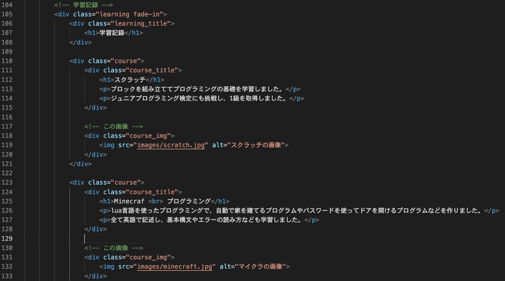
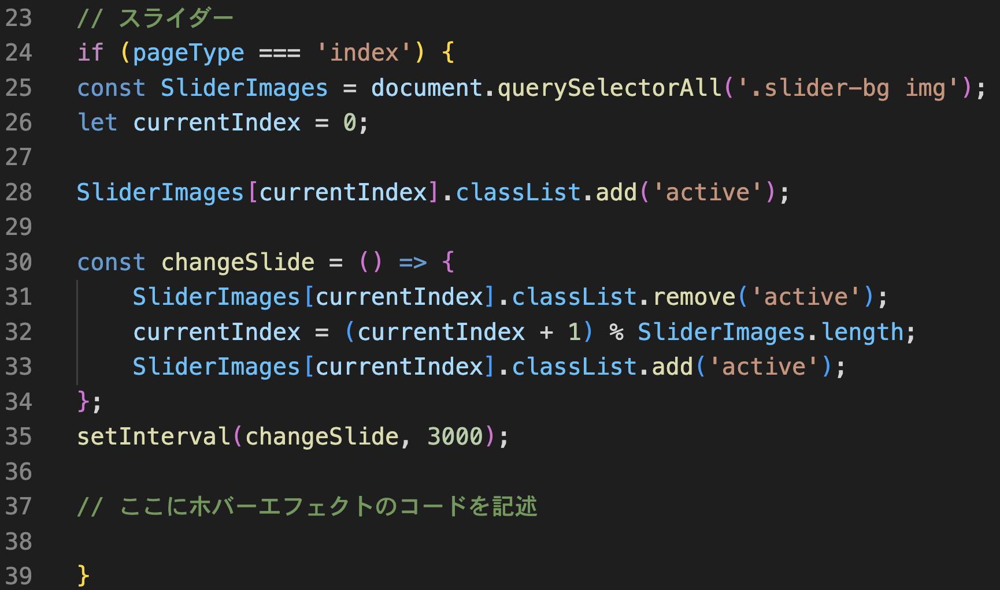
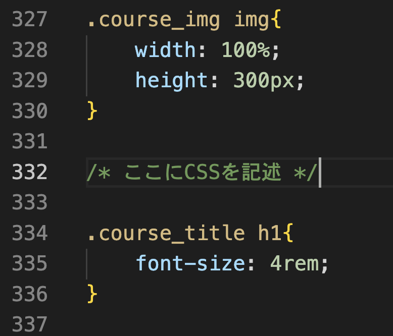

**```カリキュラム13```**

<!DOCTYPE html>
<html lang="ja">
<head>
    <meta charset="UTF-8">
    <meta http-equiv="X-UA-Compatible" content="IE=edge">
    <meta name="viewport" content="width=device-width, initial-scale=1.0">
    <link rel="stylesheet" href="../style.css">
    <title>13.スクロール・ホバーエフェクト</title>
</head>
<body>
<h1>自動スクロールとホバーエフェクトを実装してみましょう！</h1>
<p>今回の学習では、矢印マークを押すと自動で一番上までスクロールする機能と、マウスをホバーした時に画像が拡大する機能を作成していきます！</p>

<p>（ホバーエフェクトはindex.htmlの「学習記録」の画像に対して実装しています）</p>

<h2><a href="../jsポートフォリオ/index.html" target="_blank" rel="noopener noreferrer">見本はこちら</a></h2>

<h2><b>「13.ポートフォリオ編集用」というフォルダの中に入っているファイルを編集してコード書いていくので、下記リンクよりフォルダごとダウンロードしてください。</b></h2>

<h2><a href="https://drive.google.com/drive/folders/1ybL4sAXsioLhNg0NAhP7PqDtJiypHg1a" target="_blank" rel="noopener noreferrer">ダウンロードはこちら</a></h2>
<hr>

<h2><b>自動スクロール</b></h2>
<p>①まずは、矢印マークを押すと自動で一番上までスクロールする機能を作成していくのでHTMLでコードを記述していきます。</p>

<p>コードを記述する場所は、下記画像を参考にしてください。</p>


``` html
<!-- index.html -->
<div class="arrow">
    <p>↑</p>
</div>
```
<p>ここでは、矢印マークをHTMLで記述しています。<br>
この矢印マークは画像で用意しても良いのですが、今回はHTMLで用意しています。</p>
<h2><b>これでHTMLの記述は終わりました！次はCSSを記述していきましょう！</b></h2>
<hr>

<p>②次に、CSSで矢印に色を付けていきます。<br>
今回はCSSの学習がメインではないため、一つ一つを完璧に理解する必要はありません。<p>

<p>下記コードで「矢印の大きさや色を変えてレイアウトを調整しているんだな」という認識で大丈夫です！<br>
コードを記述する場所は、下記画像を参考にしてください。</p>


``` css
/* style.css */
.arrow {
    position: fixed; /* 画面の決まった位置に固定 */
    bottom: 20px; /* 画面下から20pxの位置に配置 */
    right: 20px; /* 画面右から20pxの位置に配置 */
    background-color: #333; /* 背景色を暗いグレーに設定 */
    color: #fff; /* テキストの色を白に設定 */
    border-radius: 50%; /* 丸みを50%にする（要素を丸にする） */
    width: 50px; /* 幅を50pxに設定 */
    height: 50px; /* 高さを50pxに設定 */
    display: flex; /* フレックスボックスレイアウトを使用 */
    justify-content: center; /* コンテンツを水平方向に中央寄せ */
    align-items: center; /* コンテンツを垂直方向に中央寄せ */
    cursor: pointer; /* カーソルをポインタに変更（クリック可能なことを示す） */
}

.arrow p {
    margin: 0; /* 余白をなくす */
    font-size: 20px; /* フォントサイズを20pxに設定 */
    font-weight: bold; /* フォントを太字に設定 */
}

.arrow:hover {
    opacity: 0.9; /* ホバー時に少し透明にする */
}
```
<h2><b>これでCSSの記述は終わりました！最後にJavaScriptを記述していきましょう！</b></h2>
<hr>

<p>③最後に、「矢印をクリックすると一番上でまで自動でスクロールする」という処理をJavaScriptで記述していきます。<br>
コードを記述する場所は、下記画像を参考にしてください。</p>


``` js
// script.js
const arrow = document.querySelector('.arrow')

arrow.addEventListener('click', () => {
    window.scrollTo({
        top: 0,
        behavior: 'smooth'
    });
});
``` 
<p>それでは、上記コードの意味を解説していきます。</p>

``` js
// script.js
const arrow = document.querySelector('.arrow')
``` 
<p>このコードは、<code>document.querySelector</code> を使って、クラス名が <code>arrow</code> の要素を取得し、<br>その要素を <code>arrow</code> という変数に代入しています。</p> 

<p>これから矢印ボタンを押したときの動作を作るため、まずはHTMLの矢印要素を取得して準備しているということです。</p>

``` js
// script.js
arrow.addEventListener('click', () => {

});
``` 

<p>このコードは、<code>arrow</code> 要素に対して「クリックイベント」を設定して、クリックされたときに指定された処理（関数）を実行するためのものです。</p>

``` js
// script.js
window.scrollTo({
    top: 0, 
    behavior: 'smooth' 
});
``` 

<p>このコードは、<code>window.scrollTo()</code> メソッドを使って、ページを一番上（トップ）までスムーズにスクロールさせるためのものです。</p>

<p><code>window.scrollTo()</code>は、ブラウザウィンドウを指定した位置までスクロールさせるメソッドです。</p>
<p><code>top: 0 </code>はページの一番上を意味し、ページを上端にスクロールさせます。</p>
<p><code>behavior: 'smooth'</code> はスクロールの動作を滑らかにするオプションです。<code>'smooth'</code> と指定することで、ページをスムーズにスクロールします。<br>
これがない場合、スクロールは一瞬で行われてしまいます。</p>

<h2><b>これで全てのコードの記述が終わり、自動スクロールが完成しました！<br>
次はマウスをホバーした時に画像が大きくする機能を作ってみましょう！</b></h2>
<hr>

<h2><b>ホバーエフェクト</b></h2>
<p>①まずは、JavaScriptで「画像にマウスを乗せたときに特定のクラスを追加し、マウスを離したときにそのクラスを外す」という動作を実装していきます。<br>
考え方として、「マウスが載ったらクラスを付けて画像を大きくする、マウスが外れたらクラスを外して画像を元のサイズにする」ということになります。</p>

<p>今回実装する画像は、トップページの「学習記録」の中にある3枚の画像です。<br>
(下記画像の部分です）<p>



<p>このコードは index.html にだけ適用されるようにしたいので、ページが index.html の場合にのみ動作するように<br>
<code>if (pageType === 'index')</code>の中に記述していきます。</p>
<p>コードを記述する場所は、下記画像を参考にしてください。</p>



``` js
// script.js
const images = document.querySelectorAll('.course_img img');

for (let i = 0; i < images.length; i++) {
    images[i].addEventListener('mouseover', () => {
    images[i].classList.add('hovered'); 
    });

    images[i].addEventListener('mouseout', () => {
    images[i].classList.remove('hovered');
    });
}
``` 

<p>それでは、コードの意味を解説していきます。</p>


``` js
// script.js
const images = document.querySelectorAll('.course_img img');
```
<p>このコードは、<code>document.querySelectorAll</code>を使って、指定した CSS セレクタ<code>（.course_img img）</code>に一致するすべての  要素を取得しています。</p>

このセレクタは、クラス <code>course_img </code>内にあるすべての画像（img）を対象としています。<br>
そして、取得した画像要素を <code>images</code> という変数に格納し、あとでその画像に対して操作を行えるようにしています。</p>

``` js
// script.js
for (let i = 0; i < images.length; i++) {

}
```
<p>この<code>for</code>文は、<code>images</code>配列に含まれるすべての画像に対して処理を繰り返し実行するための構文です。</p>

<p>ここでは、<code>images.length</code>（画像の枚数）分、ループが回ることになります。<br>
例えば、3つの画像があれば、ループは3回実行されます。</p>

``` js
// script.js
images[i].addEventListener('mouseover', () => {
images[i].classList.add('hovered'); 
});
```

<p>このコードは、各画像に対して「マウスオーバー（ホバー）」イベントを設定し、画像にクラス<code>hovered</code>を追加する処理を行っています。</p>

<p><code>images[i]</code>は、配列内の各画像要素を順番に指します。</p>
<p><code>addEventListener('mouseover', () => { ... });</code>は、マウスポインタが対象の要素（ここでは画像）に乗ったときに実行されるイベントリスナーです。</p>
<p><code>images[i].classList.add('hovered')</code>はマウスが載った画像に対して<code>hovered</code>というクラスを付けるという命令になります。</p>


``` js
// script.js
images[i].addEventListener('mouseout', () => {
images[i].classList.remove('hovered');
});
```

<p>このコードは、各画像に対して「マウスアウト」イベントを設定し、画像からクラス<code>hovered</code>を削除する処理を行っています。</p> <p><code>images[i]</code>は、配列内の各画像要素を順番に指します。</p> <p><code>addEventListener('mouseout', () => { ... })</code>は、マウスポインタが対象の要素（この場合は画像）から外れたときに実行されるイベントリスナーです。</p> <p><code>images[i].classList.remove('hovered')</code>は、マウスが画像から外れたときにその画像から<code>hovered</code>というクラスを削除する命令です。</p>

<h2><b>これでJavaScriptの記述が終わりました！<br>
次はhoveredクラスが付いたときに画像を大きくする処理をCSSで記述していきましょう！</b></h2>
<hr>

<p>②それでは、hoveredクラスが付いた時のCSSを記述していきます。
CSSを記述する場所は画像を参考にしてください。</p>



``` css
/* style.css */
.course_img img.hovered {
    transform: scale(1.1); 
}
``` 
<p>このCSSは、<code>.course_img img</code>というセレクタに対して、<code>hovered</code>クラスが追加された場合のスタイルを指定しています。</p> <p><code>.course_img img</code>は、<code>course_img</code>クラス内にあるすべての画像（<code>&lt;img&gt;</code>）を対象としています。</p> <p><code>hovered</code>は、先ほどのJavaScriptでマウスオーバー時に追加されたクラスです。このクラスが追加された画像に対して、次のスタイルが適用されます。</p> <p><code>transform: scale(1.1);</code>は、画像を少し大きくするためのCSSのプロパティです。<code>scale(1.1)</code>は、画像のサイズを1.1倍に拡大することを意味します。</p> <p>つまり、このスタイルは、画像にマウスがホバーした時に、画像のサイズが10%大きくなる効果を与えます。</p>

<h2><b>これでホバーエフェクトの実装が出来ました！</b></h2>


<hr>
<h2><b>練習問題</b></h2>
<p>画像にマウスをホバーしたときに、その画像が半透明になるエフェクトを実装しましょう。</p>

<p><b>仕様</b></p>
<p>・新しくindex.html・style.css・script.jsのファイルを作成<br>
・index.htmlに、3枚画像を表示するためのHTMLコードを記述<br>
・style.cssに、画像がホバーされたときに半透明になるエフェクトを追加<br>
・script.jsに、画像にマウスオーバーしたときに特定のクラスを追加し、マウスが離れたときにそのクラスを削除する動作を実装
</p>

<h2><a href="./13.練習問題見本/index.html" target="_blank" rel="noopener noreferrer">見本はこちら</a></h2>

<!-- 折り畳み展開ポインタ -->
 <div onclick="obj=document.getElementById('open').style; obj.display=(obj.display=='none')?'block':'none';">
    <a style="cursor:pointer;">▼ 解答はこちらをクリックすると見れます</a>
    </div>
    <!--// 折り畳み展開ポインタ -->  
    <!-- 折り畳まれ部分 -->
    <div id="open" style="display:none;clear:both;">  
    <!--ここの部分が折りたたまれる＆展開される部分になります。
    自由に記述してください。-->

```html
<!-- index.html -->
<!DOCTYPE html>
<html lang="ja">
<head>
    <meta charset="UTF-8">
    <meta http-equiv="X-UA-Compatible" content="IE=edge">
    <meta name="viewport" content="width=device-width, initial-scale=1.0">
    <link rel="stylesheet" href="style.css">
    <script src="script.js" defer></script>
    <title>PORTFOLIO</title>
</head>
<body>
    <div class="images">
        
        
        
    </div>
</body>
</html>
```

```css
/* style.css */
.images img{
    width: 50%;
}

.images img.hovered {
    opacity: 0.5; 
}
```

```js
// script.js
"use strict";

const images = document.querySelectorAll('.images img');
console.log(images);

for (let i = 0; i < images.length; i++) {
    images[i].addEventListener('mouseover', () => {
    images[i].classList.add('hovered'); 
    });

    images[i].addEventListener('mouseout', () => {
    images[i].classList.remove('hovered');
    });
}
```