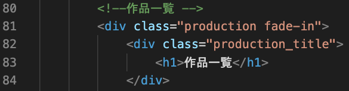
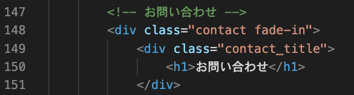
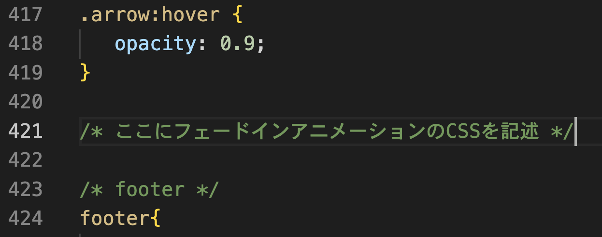

**```カリキュラム14```**

<!DOCTYPE html>
<html lang="ja">
<head>
    <meta charset="UTF-8">
    <meta http-equiv="X-UA-Compatible" content="IE=edge">
    <meta name="viewport" content="width=device-width, initial-scale=1.0">
    <link rel="stylesheet" href="../style.css">
    <title>14.フェードインアニメーション</title>
</head>
<body>
<h1>フェードインアニメーションを実装してみましょう！</h1>
<p>今回の学習では、要素が下からふわっと出てくるフェードインアニメーションの実装方法を学習します！<br>
透明度（opacity）を0から1に変化させ、位置を少し下から上に移動させることで、ふわっとした動きを作り出します!</p>

<h2><a href="../jsポートフォリオ/index.html" target="_blank" rel="noopener noreferrer">見本はこちら</a></h2>

<h2><b>「14.ポートフォリオ編集用」というフォルダの中に入っているファイルを編集して使ってください。</b></h2>

<hr>

<h2><b>HTML</b></h2>
<p>①最初は要素を非表示にし、フェードインアニメーションを使って徐々に表示させるということを実装するために、<br>
HTMLのdivタグに対して<code>fade-in</code>クラスを追加していきます。</p>

<p>「後ほどこのクラスに対して何かするんだな」という認識で今は大丈夫です！<br>
コードを記述する場所は、下記画像を参考にしてください。<p>

<br>
<br>
<br>
<br>

```html
<!-- index.html -->
 <div class="about_profile fade-in"> 
```

```html
<!-- index.html -->
<div class="production fade-in">
```

```html
<!-- index.html -->
<div class="learning fade-in">
```

```html
<!-- index.html -->
<div class="contact fade-in">
```

<h2><b>これでHTMLの記述は終わりました！次はJavaScriptを記述していきましょう！</b></h2>
<hr>

<h2><b> JavaScript</b></h2>
<p>②次に、JavaScriptで要素が表示されるタイミングを監視し、フェードインアニメーションを実行していきます。</p>

<p>簡単に説明すると、要素に<code>fade-in</code>というクラスが付いたものが画面内に表示されたときに、<br><code>show</code>というクラスを追加して、フェードインの効果（ふわっと出てくる）を実装するということになります。</p>

<p>コードを記述する場所は、下記画像を参考にしてください。</p>


``` js
// script.js
const target = document.querySelectorAll(".fade-in");

document.addEventListener("scroll", () =>{
    
for (let i = 0; i < target.length; i ++){
        const getDistance = target[i].getBoundingClientRect().top + target[i].clientHeight * 0.5
        if(window.innerHeight > getDistance){
            target[i].classList.add('show');
        }
    }
})
``` 
<p>それでは、上記コードの意味を解説していきます。</p>

``` js
// script.js
const target = document.querySelectorAll(".fade-in");
``` 

<p>このコードは、<code>document.querySelectorAll</code> を使って、クラス名が <code>fade-in</code> の要素を全て取得し、<br>その要素を <code>target</code> という変数に代入しています。</p> 

<p><code>fade-in</code> クラスが付いているすべての要素を対象に、スクロール時に処理を実行するために取得しています。</p>

``` js
// script.js
document.addEventListener("scroll", () =>{
    
})
``` 
<p>このコードは、<code>addEventListener</code> メソッドを使って、<code>scroll</code>イベントが発生したときに実行する処理を設定しています。<br><code>scroll</code> イベントは、ユーザーがページをスクロールするたびに発生します。</p>

``` js
// script.js
for (let i = 0; i < target.length; i ++){

}
``` 
<p><code>let i = 0</code>;は、ループのカウンターとなる変数「i」を0に初期化しています。<br>
「i」 は、処理を何回繰り返したかを数える役割を果たします。

<code>i < target.length;</code>は、ループを続ける条件を指定しています。<br>
<code>target.length </code>は、要素の数（targetの長さ）を表しているので、今回の場合は4回ということになります。

<code>i++</code>は、ループが1回終了するごとに<code> i </code>の値を1つ増やすことを意味します。<br>
たとえば、最初は<code> i = 0 </code>ですが、ループが1回実行されると <code>i </code>が 1 になり、<code>i</code> が 4 になると条件が満たされなくなり、ループが終了します。

そのため、上記コードを簡単に説明すると「iがtarget.length未満（今回は4未満）のときに繰り返し処理を行う」という意味になります。</p>

``` js
// script.js
const getDistance = target[i].getBoundingClientRect().top + target[i].clientHeight * 0.5
``` 

<p>このプログラムでは、画面の一番上からの距離と要素の高さを取得し、どのくらいスクロールされているのかを判定しています。</p>

<p><code>getBoundingClientRect().top</code> というメソッドを使うと、各要素がパソコン画面の一番上からどのくらい離れているか（距離）を取得することができます。</p>

<p>今回は、変数<code>target</code> に格納されている要素について、その中の各要素が画面の一番上からどれくらいの距離にあるのかを調べたいので、<br>
<code>target[i].getBoundingClientRect().top </code>を使って、個々の要素の位置を取得します。</p>

<p>また、<code>target[i].clientHeight * 0.5</code> では、<code>clientHeight</code> で要素の高さを取得し、それに 0.5 を掛けて、要素の高さの半分の値を計算しています。</p>

<p>これらを足し合わせる（+）することで「要素の中心がパソコン画面の上端からどのくらいの距離にあるのか」を求めています。<br>
これは、後で「もし要素が半分くらい画面内に見えたら処理を行う」というプログラムを書く際に必要になる数値です。</p>

<p>そして、これらの計算結果を変数 <code>getDistance</code> に代入しています。</p>

``` js
// script.js
if(window.innerHeight > getDistance){
    target[i].classList.add('show');
}
``` 
<p>ここでは、if文を使って「もし画面の半分くらい要素が見えたらclassを付ける」というプログラムを実装しています。</p>

<p><code>window.innerHeight</code> は、ブラウザの高さを取得します。<br>
<code>getDistance </code>は、前の行で計算した要素の中央位置の距離です。この条件式では、ブラウザの高さが要素の中央位置よりも大きいかどうか」を確認しています。</p>

<p>つまり、要素の中央が画面内に現れたかどうかをチェックしていることになります。</p>

<p>スクロールをしていき、各要素が画面の半分ほど見えると、<code>target</code>の<code>i</code>番目、<br>
つまりそれぞれの要素に<code>show</code>というclassを付けてあげます。</p>

<p>最後に、<code>show</code>というclassが付いたら要素をふわっと表示させる命令をcssで書けば完成です！</p>

<h2><b>これでJavaScriptの記述は終わりました！最後にCSSを記述していきましょう！</b></h2>
<hr>

<h2><b>CSS</b></h2>
<p>③最後に、<code>show</code>というclassが付いた時のプログラムを記述します。<br>
CSSを記述する場所は画像を参考にしてください。</p>



```css
/* style.css */
.fade-in {
    opacity: 0; 
    transform: translateY(50px); 
    transition: opacity 0.6s,transform 0.6s; 
}

.fade-in.show {
    opacity: 1; 
    transform: translateY(0); 
}
```
<p>それでは、上記コードの意味を解説していきます。</p>

```css
/* style.css */
.fade-in {

}
```
<p><code>fade-in</code>クラスに対してスタイルを設定していきます。</p>

```css
/* style.css */
opacity: 0;
```
<p>要素の透明度を0（完全に見えない）に設定します。最初は要素が見えないようにします。<br> つまり、最初に付けたクラス <code>fade-in</code> の部分は最初は透明にしておき、スクロールするとふわっと出てくるように見えるように設定しています。</p> 

```css
/* style.css */
transform: translateY(50px);
```
<p>このプロパティは、要素をY軸（縦方向）に50px下に移動させます。これにより、要素がページ下に隠れているように見えます。</p>

```css
/* style.css */
transition: opacity 0.6s, transform 0.6s;
```
<p>CSS の transition プロパティを使用して、要素の変化にアニメーションを適用するための記述です。</p> <p><code>opacity 0.6s</code> は、opacity（透明度）が変化する際に、0.6 秒かけて滑らかに変化することを意味します。<br> 一瞬で変わるのではなく、0.6 秒かけて自然に変化させたい場合に使用します。</p> <p><code>transform 0.6s</code> は、要素を垂直方向に移動させる変化を 0.6 秒かけて滑らかに行うことを意味します。</p>

```css
/* style.css */
.fade-in.show {
  
}
```
<p><code>fade-in</code>クラスに<code>show</code>クラスが追加された場合のスタイルを設定します。</p>

```css
/* style.css */
opacity: 1; 
```
<p><code>show</code>というクラスが付いたら要素を表示させたいので、透明度を1（完全に見える状態）にします。<p>

```css
/* style.css */
transform: translateY(0); 
```

<p>要素が垂直方向に0px移動し、元の位置に戻ることを意味します。<br>
これにより、最初は50px下にあった要素が、スクロールなどでアクティブになったタイミングで元の位置にふわっと戻るように見えます。</p>

<h2><b>これでフェードインアニメーションの実装が出来ました！</b></h2>

<hr>
<h2><b>練習問題</b></h2>
<p>画面をスクロールした時に写真がふわっと出てくるフェードインアニメーションを実装してみましょう！</p>

<p><b>仕様</b></p>
<p>・新しくindex.html・style.css・script.jsのファイルを作成<br>
・index.htmlとstyle.cssに以下のコードをコピーして使用（続きは自分で記述）<br>
・style.cssに、画像がふわっと出てくるアニメーションを実装<br>
・script.jsに、要素が画面の半分まで来たら「show」というクラスを付ける命令を実装
</p>

<h2><a href="./14.練習問題見本/index.html" target="_blank" rel="noopener noreferrer">見本はこちら</a></h2>

```html
<!-- index.html -->
<div class="box fade-in">
    <h1>これはパソコンの画像です</h1>
    
</div>

<div class="box fade-in">
    <h1>これはパソコンの画像です</h1>
    
</div>

<div class="box fade-in">
    <h1>これはパソコンの画像です</h1>
    
</div>
```

```css
/* style.css */
.box{
    text-align: center;
}

.box img{
    width: 50%;
}
```


<!-- 折り畳み展開ポインタ -->
 <div onclick="obj=document.getElementById('open').style; obj.display=(obj.display=='none')?'block':'none';">
    <a style="cursor:pointer;">▼ 解答はこちらをクリックすると見れます</a>
    </div>
    <!--// 折り畳み展開ポインタ -->  
    <!-- 折り畳まれ部分 -->
    <div id="open" style="display:none;clear:both;">  
    <!--ここの部分が折りたたまれる＆展開される部分になります。
    自由に記述してください。-->

```html
<!-- index.html -->
<!DOCTYPE html>
<html lang="ja">
<head>
    <meta charset="UTF-8">
    <meta http-equiv="X-UA-Compatible" content="IE=edge">
    <meta name="viewport" content="width=device-width, initial-scale=1.0">
    <link rel="stylesheet" href="style.css">
    <script src="script.js" defer></script>
    <title>PORTFOLIO</title>
</head>
<body>
    <div class="box fade-in">
        <h1>これはパソコンの画像です</h1>
        
    </div>

    <div class="box fade-in">
        <h1>これはパソコンの画像です</h1>
        
    </div>

    <div class="box fade-in">
        <h1>これはパソコンの画像です</h1>
        
    </div>
</body>
</html>
```

```css
/* style.css */
.box{
    text-align: center;
}

.box img{
    width: 50%;
}

.fade-in {
    opacity: 0; 
    transform: translateY(50px); 
    transition: opacity 0.6s,transform 0.6s; 
}

.fade-in.show {
    opacity: 1; 
    transform: translateY(0); 
}
```

```js
// script.js
"use strict";

const target = document.querySelectorAll(".fade-in");

document.addEventListener("scroll", () =>{
    
for (let i = 0; i < target.length; i ++){
        const getDistance = target[i].getBoundingClientRect().top + target[i].clientHeight * 0.5
        if(window.innerHeight > getDistance){
            target[i].classList.add('show');
        }
    }
})
```