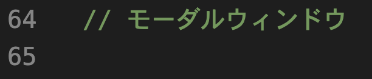
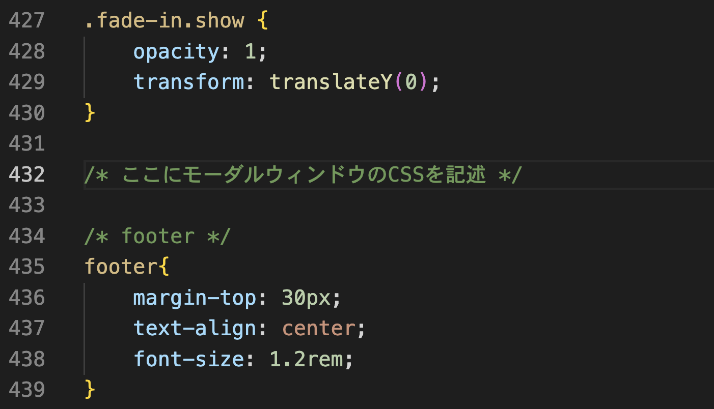

**```カリキュラム15```**

<!DOCTYPE html>
<html lang="ja">
<head>
    <meta charset="UTF-8">
    <meta http-equiv="X-UA-Compatible" content="IE=edge">
    <meta name="viewport" content="width=device-width, initial-scale=1.0">
    <link rel="stylesheet" href="../style.css">
    <title>15.モーダルウィンドウ</title>
</head>
<body>
<h1>モーダルウィンドウを実装してみましょう！</h1>
<p>モーダルウィンドウは、ユーザーが特定の操作を行ったときに、画面上にポップアップするウィンドウです。<br>
例えば、画像をクリックしたときにその画像が大きく表示されるといった動作がモーダルウィンドウで実現できます。</p>

<p>この機能をJavaScriptとCSSを使って実装する方法学習しましょう！</p>

<h2><a href="../jsポートフォリオ/learning.html" target="_blank" rel="noopener noreferrer">見本はこちら</a></h2>

<h2><b>「15.ポートフォリオ編集用」というフォルダの中に入っているファイルを編集してコード書いていくので、下記リンクよりフォルダごとダウンロードしてください。</b></h2>

<h2><a href="https://drive.google.com/drive/folders/1EZQmsz7vQkqokUffZesuEsMFHNuS-_Tf" target="_blank" rel="noopener noreferrer">ダウンロードはこちら</a></h2>

<hr>

<h2><b>HTML</b></h2>
<p>①モーダルウィンドウを表示するために、HTMLでは<code>&lt;dialog&gt;</code>タグを使用します。<br>
このタグは、画面上にポップアップする要素を定義します。モーダル内には、画像やテキストなど、表示したい内容を配置します。</p>

<p>また、画像をクリックした際にモーダルが表示されるよう、画像には<code>clickable</code>というクラスを設定します。</p>

<p>そのため、learning.htmlのmainタグの中身を以下のように書き換えましょう！<br>
(<code>&lt;dialog&gt;</code>を書くのと<code>clickable</code>を付け加えていきます)<p>

```html
<!-- learning.html -->
<main>
    <div class="learning_page">
        <div class="learning_title">
            <h1>学習記録</h1>
        </div>

        <!-- スクラッチ -->
        <div class="learnings">
            <h1>スクラッチ</h1>
            <div class="learning_img">
                 
                
            </div>

            
            <!-- モーダル -->
            <dialog class="modal">
                
            </dialog>

            <div class="learning_text">
                <p>ブロックを組み立ててプログラミングの基礎を学習しました。<br>
                ジュニアプログラミング検定という検定にも挑戦し、1級を取得しました。</p>
                <p>スクラッチは命令が日本語で書いてあり、それがブロック形式になっているので<br>
                プログラミングを習い始めたばかりの私でも、抵抗なくプログラミングに取り組むことが出来ました。</p>
            </div>
        </div>

        <!-- マイクラ -->
        <div class="learnings">
            <h1>Minecrafプログラミング</h1>
            <div class="learning_img">
                
                
            </div>
            

            <div class="learning_text">
                <p>lua言語を使ったプログラミングで、自動で家を建てるプログラムや<br>
                    パスワードを使ってドアを開けるプログラムなどを作りました。</p>

                <p>全て英語で記述し、構文の書き方やエラーの読み方なども学習しました。</p>
                <p>エラーが英語で書いてあるのでかなり苦戦しましたが、誤字脱字によるエラーが<br>
                   多かったので、正しくコードを打つ大切さを学びました。</p>
            </div>
        </div>

          <!-- html -->
          <div class="learnings">
            <h1>HTML&CSS</h1>
            <div class="learning_img">
                
                
            </div>
            

            <div class="learning_text">
                <p>HTMLとCSSという技術を使用し、ホームページを作る学習をしました。<br>
                   簡単なサイト制作や模写を通して、ホームページ制作における基礎を学習しました。</p>

                <p>Webクリエイター能力認定試験にも挑戦し、合格することが出来ました。</p>
            </div>
        </div>
    </div>
</main>
```

<p>それでは、新たに書き加えたコードの解説をしていきます。</p>

```html
<!-- index.html -->
<div class="learning_img">
     
    
</div>

<div class="learning_img">
    
    
</div>

<div class="learning_img">
    
    
 </div>
```
<p>この部分では、全ての画像に<code>clickable</code>というクラスを付けています。<br>
これは、後ほどJavaScriptで<code>clickable</code>というクラスが付いているHTML要素を取得するために付けています。</p>

```html
<!-- index.html -->
<dialog class="modal">
    
</dialog>
```

<p>dialog 要素を使ってモーダルウィンドウ（ポップアップ）を定義しており、img 要素をその中に表示させる構造になっています。</p>

<p>モーダル機能を使用することで、そのウィンドウ内の操作しかできないようにし、他のページ要素にはアクセスできなくなります。</p>

<p>まとめると、このコードはモーダルウィンドウの中に画像を表示するための構造になっており、CSSやJavaScriptを使ってモーダルを開閉したり、画像を表示したりする処理を行うために準備しているということになります。</p>


<h2><b>これでHTMLの記述は終わりました！次はJavaScriptを記述していきましょう！</b></h2>
<hr>

<h2><b> JavaScript</b></h2>
<p>②次に、JavaScriptでモーダルウィンドウを表示するタイミングを監視し、クリックイベントに基づいてモーダルが開閉されるようにします。<br>具体的には、クリックされた画像の `src` 属性を取得して、モーダルウィンドウ内の画像に表示します。</p>

<p>コードを記述する場所は、下記画像を参考にしてください。</p>



``` js
// script.js
if (pageType === 'learning') {
    const images = document.querySelectorAll('.clickable');
    const modal = document.querySelector('.modal');
    const modalImage = modal.querySelector('.modal-content');
    
    for (let i = 0; i < images.length; i++) {
        images[i].addEventListener('click', () => {
            modalImage.src = images[i].src; 
            modal.showModal();             
        });
    }
    
    modal.addEventListener('click', (e) => {
        if (e.target === modal) {
            modalImage.src = ''; 
            modal.close();       
        }
    });
}
``` 
<p>それでは、上記コードの意味を解説していきます。</p>

``` js
// script.js
if (pageType === 'learning') {

}
``` 

<p>if (pageType === 'learning') の条件は、pageTypeが"learning"である場合に処理を実行するという意味です。

つまり、このコードを使うことでモーダルウィンドウの機能をlearning.html（学習記録のページ）でのみ動作させることができます。</p> 

``` js
// script.js
const images = document.querySelectorAll('.clickable');
``` 
<p>このコードは、 HTML内の<code>clickable</code>クラスを持つすべての要素（主に画像要素）を取得して、<code>images</code> という定数に保存している という意味になります。</p>

``` js
// script.js
const modal = document.querySelector('.modal');
``` 

<p>このコードは、HTML内の<code>modal</code>クラスを持つ唯一の要素を取得し、<code>modal</code>という定数に保存しているという意味になります。<br>
<code>modal</code>クラスはページ内に1つしかないと想定しているため、最初の1つの要素だけを取得する<code>querySelector()</code>が使われています。</p>

``` js
// script.js
const modalImage = modal.querySelector('.modal-content');
``` 

<p>このコードは、前に取得したモーダルウィンドウの要素（modal）内で、<code>.modal-content </code>クラスを持つ画像要素 を探し、その要素を <code>modalImage </code>という定数に保存しているという意味です。<br>この後、<code>modalImage </code>を使って、モーダル内に表示する画像を動的に変更することができます。</p>


``` js
// script.js
for (let i = 0; i < images.length; i++) {

}
``` 
<p><code>let i = 0;</code>は、ループのカウンターとなる変数「i」を0に初期化しています。<br>
「i」 は、処理を何回繰り返したかを数える役割を果たします。

<code>i < images.length;</code>は、ループを続ける条件を指定しています。<br>
<code>images.length</code> は、画像の数（imagesの長さ）を表しているので、今回の場合は6回ということになります。

<code>i++</code>/は、ループが1回終了するごとに i の値を1つ増やすことを意味します。<br>
たとえば、最初は <code>i = 0</code> ですが、ループが1回実行されると <code>i </code>が 1 になり、<code>i </code>が 6 になると条件が満たされなくなり、ループが終了します。

そのため、上記コードを簡単に説明すると「iがimages.length未満（今回は6未満）のときに繰り返し処理を行う」という意味になります。</p>

``` js
// script.js
images[i].addEventListener('click', () => {

});
``` 

<p>このコードは、画像の<code> i </code>番目がクリックされたときに、指定した関数（アロー関数内の処理）を実行するための記述です。<br>
具体的には、<code>images[i]</code> の画像がクリックされると、その画像に対して設定した処理が実行されます。</p>


``` js
// script.js
modalImage.src = images[i].src; 
``` 
<p>このコードは、モーダル内に表示する画像のソース（src）を、クリックした画像のソースに変更するための記述です。</p>

<p><code>images[i]</code> は、クリックされた画像の<code> i</code> 番目の要素を指します。</p>

<p><code>images[i].src</code> は、その画像の src 属性（画像のパス）を取得します。<br>
つまり、クリックした画像が持っている画像ファイルのURLを取得します。</p>

<p><code>modalImage.src</code> は、モーダルウィンドウ内で表示される画像の src 属性を指します。<br>
モーダル内に表示される画像のソースを変更するために、この値を更新しています。</p>

<p>つまり、このコードが実行されると、クリックされた画像と同じ画像がモーダル内に表示されることになります。</p>

``` js
// script.js
modal.showModal();            
``` 
<p>このコードは、モーダルウィンドウを表示するためのメソッドです。</p>

<p>modal は、HTML内で定義された <code>dialog</code>要素を指します。この要素は通常、画面上には表示されていません。</p>

<p><code>showModal()</code> メソッドは、<code>dialog</code>要素をモーダルウィンドウとして表示させるために使います。<br>
このメソッドが呼ばれると、モーダルが画面に表示され、通常の操作（ページ内の他の要素へのクリックなど）はできなくなります。</p>

<p>簡単に言うと、このコードを実行すると、モーダルウィンドウが画面にポップアップ表示され、ユーザーが他の要素を操作できなくなる状態になります。</p>

``` js
// script.js
modal.addEventListener('click', (e) => {

}         
``` 
<p>このコードは、<code>modal</code>（モーダルウィンドウ）という要素がクリックされたときの処理を記述しています。</p>

<p><code>(e)</code>はイベントオブジェクトで、クリックされた際の情報（どこをクリックしたか、どの要素がクリックされたかなど）を取得しています。</p>

``` js
// script.js
if (e.target === modal) {
   
}       
``` 
<p>このコードは、もしクリックされた要素<code>（e.target）</code>がモーダルウィンドウそのものであれば〜という意味になります。</p>

<p><code>e.target</code>は、クリックされた要素を指します。<br>クリックイベントが発生した際、ユーザーが実際にクリックしたHTML要素がこのプロパティに格納されます。</p>

<p>つまり、<code>e</code>の中にはクリックされた情報（モーダルウィンドウ）の情報が入っており、「モーダルウィンドウがクリックされたかどうか」を判定しているという意味になります。</p>

``` js
// script.js
modalImage.src = '';     
``` 
<p>このコードは、モーダル内に表示されている画像のsrc（ソース）を空にする処理です。<br>
このコードで、モーダルを閉じる前に画像をクリアにして、次回開いたときに前回の画像が残らないようにしています。</p>

``` js
// script.js
modal.close();        
``` 
<p>このコードは、モーダルウィンドウを閉じるためのメソッドを実行するコードです。<br>
モーダルが表示されている状態から、このメソッドを呼び出すとモーダルが画面から消えます。</p>

<h2><b>これでJavaScriptの記述は終わりました！最後にCSSを記述していきましょう！</b></h2>
<hr>

<h2><b>CSS</b></h2>
<p>③最後に、モーダルウィンドウの細かいレイアウトをCSSで調整していきます。<br>
CSSを記述する場所は画像を参考にしてください。</p>



```css
/* style.css */
.modal {
    display: none; /* モーダルが非表示のとき（デフォルト状態） */
    border: none; /* 枠線なし */
    justify-content: center; /* コンテンツを横方向の中央に配置 */
    align-items: center; /* コンテンツを縦方向の中央に配置 */
}

.modal[open] {
    display: block; /* モーダルが表示されているときの状態（<dialog>要素のopen属性が付与されている場合） */
}

.modal-content {
    width: 700px; /* モーダル内のコンテンツ（画像など）の幅を700pxに固定 */
    height: 500px; /* モーダル内のコンテンツ（画像など）の高さを500pxに固定 */
    object-fit: contain; /* 画像が縦横比を維持しつつ、コンテナ内に収まるように調整 */
}

dialog::backdrop {
    background-color: rgba(0, 0, 0, 0.5); /* モーダルの背景を半透明の黒で覆い、画面全体をぼかす効果を付ける*/
}
```
<p>今回CSSではレイアウトの調整だけなので、大事なところだけ解説をします。</p>

```css
/* style.css */
.modal[open] {
    display: block; 
}
```
<p><code>open</code>は、HTMLの<code>dialog</code>要素に関連する属性です。<br>
この属性は、モーダルが「表示されている状態」か「非表示の状態」かを制御します。</p>

<p>open属性は、この<code>dialog</code>要素が「表示されている状態」にあることを示します。<br>
つまり、上記のコードは「モーダルが表示されているときに<code> display: block; </code>が適用され、<code> display: none; </code>が解除されて画像を表示させる」という意味になります。</p>

<h2><b>これでモーダルウィンドウの実装が出来ました！</b></h2>

<hr>
<h2><b>練習問題</b></h2>
<p>画像をクリックしたときにその画像が大きく表示されるモーダルウィンドウを実装してみましょう！</p>

<p><b>仕様</b></p>
<p>・新しくindex.html・style.css・script.jsのファイルを作成<br>
・index.htmlに画像を3枚表示するコードを記述（画像は何でもOK)<br>
・画像に付与するclassは「clickable」というクラス名にする<br>
・style.cssは以下のコードをコピーして使用<br>
・script.jsに、画像がクリックされた時の処理を記述
</p>

<h2><a href="./15.練習問題見本/index.html" target="_blank" rel="noopener noreferrer">見本はこちら</a></h2>


```css
/* style.css */
.box{
    text-align: center;
}

.box img{
    width: 50%;
}

.modal {
    display: none; 
    border: none; 
    justify-content: center; 
    align-items: center; 
}

.modal[open] {
    display: block; 
}

.modal-content {
    width: 700px; 
    height: 500px; 
    object-fit: contain; 
}

dialog::backdrop {
    background-color: rgba(0, 0, 0, 0.5); 
}
```


<!-- 折り畳み展開ポインタ -->
 <div onclick="obj=document.getElementById('open').style; obj.display=(obj.display=='none')?'block':'none';">
    <a style="cursor:pointer;">▼ 解答はこちらをクリックすると見れます</a>
    </div>
    <!--// 折り畳み展開ポインタ -->  
    <!-- 折り畳まれ部分 -->
    <div id="open" style="display:none;clear:both;">  
    <!--ここの部分が折りたたまれる＆展開される部分になります。
    自由に記述してください。-->

```html
<!-- index.html -->
<!DOCTYPE html>
<html lang="ja">
<head>
    <meta charset="UTF-8">
    <meta http-equiv="X-UA-Compatible" content="IE=edge">
    <meta name="viewport" content="width=device-width, initial-scale=1.0">
    <link rel="stylesheet" href="style.css">
    <script src="script.js" defer></script>
    <title>PORTFOLIO</title>
</head>
<body>
    <div class="box">
        
    </div>

    <div class="box">
        
    </div>

    <div class="box">
        
    </div>

    <dialog class="modal">
        
    </dialog>
</body>
</html>
```

```css
/* style.css */
.box{
    text-align: center;
}

.box img{
    width: 50%;
}

.modal {
    display: none; 
    border: none; 
    justify-content: center; 
    align-items: center; 
}

.modal[open] {
    display: block; 
}

.modal-content {
    width: 700px; 
    height: 500px; 
    object-fit: contain; 
}

dialog::backdrop {
    background-color: rgba(0, 0, 0, 0.5); 
}
```

```js
// script.js
"use strict";

const images = document.querySelectorAll('.clickable');
const modal = document.querySelector('.modal');
const modalImage = modal.querySelector('.modal-content');
    
for (let i = 0; i < images.length; i++) {
    images[i].addEventListener('click', () => {
        modalImage.src = images[i].src; 
        modal.showModal();             
    });
}
    
modal.addEventListener('click', (e) => {
    if (e.target === modal) {
        modalImage.src = ''; 
        modal.close();       
    }
});
```